  

# CLEANOPS
### An AI-Driven Decision Support System for Municipal Waste Management and Operational Optimization

**Graduation Project &middot; Academic Year 2026&ndash;2027 &middot; Team 21**  
**Egyptian E-Learning University (EELU) &middot; Faculty of Computers and Information Technology &middot; Fayoum Center**

*Supervised by:*  
**Dr. Yasser Abdelhamid Abdelfattah** &nbsp;&bull;&nbsp; **Eng. George Hany Milad**

 

&nbsp;

&nbsp;

  

> **Core System Definition:** CleanOps is an intelligent decision-support platform designed to transform public municipal waste reports into prioritized, actionable, and verified cleaning operations. CleanOps is **not** a physical cleaning contractor and **not** a robotics service; it is a software intelligence layer that streamlines municipal intake, suppresses duplicate reports via spatial clustering, and enforces a closed verified-resolution loop.

 

 

## THE CLEANOPS PROJECT HUB

CleanOps engineering, architectural governance, and deliverable lifecycles are coordinated through a centralized project management portal built specifically to orchestrate team development.

 

  

 

### [ &rarr; OPEN CLEANOPS PROJECT MANAGEMENT HUB &larr; ](https://cleanops-hq.pages.dev/)
*Direct Portal Access: `https://cleanops-hq.pages.dev/`*

 

* **Work Organization:** Centralized structure organizing work packages, deliverable deadlines, and milestones.
* **Task Management:** Role-scoped views facilitating coordination across all team members.
* **Technical Documentation:** Authoritative repository of architectural decision records and system specifications.
* **Progress Visibility:** Real-time visibility into deliverable submission status, active reviews, and milestone readiness.

> **Methodological Note:** The **Project Hub** (`cleanops-hq.pages.dev`) is the *dedicated project-management environment* used by the team to govern development. **CleanOps** is the *software product* being engineered.

 

 

## 01 &middot; PROJECT OVERVIEW

Conventional municipal cleaning departments frequently operate through fragmented intake channels, resulting in duplicate queues and subjective dispatching. CleanOps establishes an integrated software pipeline connecting citizens, machine intelligence, operational field teams, and municipal supervisors into one unified lifecycle.

 

  

 

* **Digital Ingestion:** Citizens submit geotagged reports with visual proof, precise GPS coordinates, and initial waste categorization.
* **Automated Triage:** Deep learning vision models evaluate uploaded imagery to classify waste categories without manual triage bottlenecks.
* **Algorithmic Prioritization:** Incidents are scored dynamically through an objective multi-factor scoring formula.
* **Governed Dispatch:** Artificial intelligence produces priority recommendations; authoritative human municipal operators always make the final dispatch call.
* **Verified Resolution:** Cleaning crews submit photographic completion evidence before work orders are closed, providing citizens with transparent proof.

 

 

## 02 &middot; THE PROBLEM

Conventional public cleaning processes suffer from systemic communication breakdowns that cause delayed response times and resource misallocation:

 

  

 

* **Data Asymmetry & Fragmentation:** Submissions arrive across disconnected channels—analog logs, fragmented hotlines, and messaging apps—preventing systemic oversight.
* **Queue Flooding via Duplicates:** A single visible waste accumulation triggers dozens of redundant independent reports, flooding dispatch backlogs.
* **Subjective Prioritization:** Work orders are handled arbitrarily or chronologically rather than evaluating severity, environmental hazards, or spatial density.
* **Absence of Verification:** Tickets are marked resolved administratively with zero verifiable proof that the site was remediated.

 

 

## 03 &middot; THE SOLUTION

CleanOps organizes scattered reporting channels into a centralized, deterministic operational pipeline:

 

  

 

* **Standardized Intake:** A unified digital channel capturing verified GPS coordinates, image proof, and waste attributes.
* **Predictive Classification:** Immediate image analysis classifying waste type and estimating severity without manual backlog.
* **Intelligent Hotspots:** Spatial clustering that automatically groups repeated complaints into a single consolidated operational case.
* **Closed-Loop Auditability:** Mandatory before/after photo verification closing the feedback loop directly with the reporting citizen.

 

 

## 04 &middot; COMPUTATIONAL VISION &amp; TRIAGE

CleanOps uses computer vision as an automated analysis layer that inspects citizen photographic evidence immediately upon submission to extract structured metadata.

 

  

 

* **Automated Feature Extraction:** Deconstructs uploaded photographs into visual feature layers to detect waste presence and classify materials.
* **Preliminary Severity Estimation:** Estimates volume and environmental hazard levels to seed the downstream prioritization engine.
* **Decision Support Interface:** Formulates structured advisory recommendations for operational dispatchers.

> [!IMPORTANT]
> **Human-in-the-Loop Governance:** CleanOps strictly enforces responsible AI standards: **AI assists the decision; a human operator always makes the final call.** Machine models provide recommendations and transparent rankings, but municipal operators maintain full authority over resource dispatch.

 

 

## 05 &middot; PRIORITY ENGINE

CleanOps replaces arbitrary dispatch queues with an objective, transparent mathematical prioritization framework evaluated across four documented dimensions:

 

  

 

* **Severity Coefficient (AI):** Visual classification of waste urgency (hazardous accumulation vs. routine dry litter).
* **Temporal Escalation (Age):** Elapsed time since initial submission, ensuring older reports escalate systematically.
* **Historical Recurrence:** Multiplier applied when a location exhibits repeated, chronic waste dumping patterns.
* **Spatial Density (GIS):** Concentration factor reflecting the volume of open reports within a localized geographic radius.

 

 

## 06 &middot; GEOSPATIAL CLUSTERING INTELLIGENCE

A core technological differentiator of CleanOps is native spatial intelligence, preventing redundant crew dispatches to identical geographic coordinates:

 

  

 

* **Proximity Clustering:** Incoming submissions sharing overlapping geographic radiuses are identified automatically.
* **Case Consolidation:** Rather than deploying separate units to the same street corner, redundant reports merge into a unified **Hotspot Incident**.
* **Zero Queue Flooding:** Field teams receive a single consolidated work order while citizens receive real-time updates linked to the shared parent case.

 

 

## 07 &middot; FIELD OPERATIONS LIFECYCLE

CleanOps tracks each operational incident through an immutable progression of operational states:

 

  

 

* `REPORTED`: Geotagged submission received and ingested digitally into persistence.
* `PRIORITIZED`: Scored through the 4-factor formula and queued for operator evaluation.
* `ASSIGNED`: Dispatched by the municipal operator to the designated cleaning unit.
* `IN PROGRESS`: Cleaning crew arrives at target GPS coordinates and begins site remediation.
* `EVIDENCE SUBMITTED`: Field crew captures and uploads mandatory photographic completion proof.
* `VERIFIED`: Final inspection confirmed; ticket closed and immutable audit record preserved.

 

 

## 08 &middot; CLOSED VERIFICATION LOOP

Conventional reporting channels leave citizens uninformed with no confirmation that action occurred. CleanOps closes the accountability loop completely:

 

  

 

* **Mandatory Completion Evidence:** Field teams cannot close an assignment without uploading photographic proof taken directly on-site.
* **Direct Citizen Transparency:** The reporting citizen receives an authenticated notification displaying verified before-and-after photographic evidence.
* **Auditable Municipal History:** Creates an immutable operational record of municipal response times and verified cleaning performance.

 

 

## 09 &middot; SYSTEM ARCHITECTURE

CleanOps is designed around an integrated multi-tier system architecture ensuring clear separation of concerns across presentation, edge routing, computational intelligence, and secure persistence:

 

  

 

* **Presentation Layer:** Decoupled interfaces for citizen reporting, municipal operator dispatch, and field crew work orders.
* **Edge / API Layer:** Routing fabric managing authentication, state transitions, and business logic execution.
* **Intelligence Layer:** Computational pipeline executing automated waste classification, spatial clustering, and priority scoring.
* **Persistence &amp; Security Layer:** Secure storage for report imagery, authenticated completion proof, and immutable operational audit logs with strict Row-Level Security (RLS).

 

 

## 10 &middot; PROJECT LEADERSHIP

### Ebraam Ibrahim Sobhey
**Team Leader &middot; Student ID: 2302597**  
*Faculty of Computers and Information Technology &middot; Fayoum Center*

* **Project Management Infrastructure:** Architected and maintains the dedicated **CleanOps Project Hub** (`cleanops-hq.pages.dev`) governing development workflows, work packages, task coordination, and milestones.
* **Technical Direction:** Leads architectural decisions, schema design, and technical integration across all tracks.
* **Academic Liaison:** Serves as the primary contact representing the team to Project Supervisors Dr. Yasser Abdelhamid Abdelfattah and Eng. George Hany Milad.

 

 

## 11 &middot; PROJECT TEAM COMPOSITION

CleanOps is developed by **Team 21**, consisting of 10 undergraduate engineering students from the Faculty of Computers and Information Technology, Fayoum Center:

 

  

 

| # | Student ID | Full Name | Official Role |
| :---: | :---: | :--- | :---: |
| **01** | **2302597** | **Ebraam Ibrahim Sobhey** | **Team Leader** |
| **02** | **2302000** | **George Mohsen Fawzy** | **Member** |
| **03** | **2300316** | **Ebraam Ehab Nieam** | **Member** |
| **04** | **2301913** | **Beshoy George Thabet** | **Member** |
| **05** | **2302064** | **Mariam Ayman Atalla** | **Member** |
| **06** | **2302072** | **Meray Shenoda Sobhy** | **Member** |
| **07** | **2302770** | **Mariam Ramadan Mohamed** | **Member** |
| **08** | **2302091** | **Demiana Malak Yacoub** | **Member** |
| **09** | **2300338** | **Menna Ahmed Mohammed** | **Member** |
| **10** | **2300313** | **Catherine Fayez Sobhy** | **Member** |

 

 

## 12 &middot; ACADEMIC CONTEXT

Submitted in partial fulfillment of the requirements for the Bachelor's Degree in Computers and Information Technology:

 

  

 

### Egyptian E-Learning University (EELU)
**Faculty of Computers and Information Technology**  
**Fayoum Center &middot; Academic Year 2026&ndash;2027**

**Project Designation:** Team 21  
**Official Project Title:**  
*"An AI-Powered Application for Waste Reporting &amp; Smart Cleaning Management"*

 

### Under the Supervision of:

**Dr. Yasser Abdelhamid Abdelfattah**  
*Project Supervisor*

**Eng. George Hany Milad**  
*Project Co-Supervisor / Teaching Assistant*

 

 

## 13 &middot; TECHNOLOGICAL DIFFERENTIATORS

CleanOps addresses the structural gaps of conventional public reporting through four documented engineering differentiators:

1. **Objective Priority Scoring:** Replaces arbitrary queue order with a mathematical formula balancing severity, age, recurrence, and spatial density.
2. **Geospatial Hotspot Clustering:** Automatically clusters proximate reports into unified incidents, eliminating duplicate work orders and preventing wasted crew deployments.
3. **Closed Verified-Resolution Loop:** Mandates field crews to upload photographic completion evidence before ticket closure, directly notifying the citizen.
4. **Human-in-the-Loop Governance:** Enforces responsible AI standards: artificial intelligence assists the decision; an authorized human operator always makes the final call.

 

 

## 14 &middot; CONCLUSION &amp; PROJECT VISION

 

  

 

### CLEANOPS
**INTELLIGENT URBAN INFRASTRUCTURE &middot; DECISION SUPPORT PLATFORM**

**TEAM 21 &middot; GRADUATION PROJECT 2026&ndash;2027**  
**Egyptian E-Learning University &middot; Faculty of Computers and Information Technology &middot; Fayoum Center**

 

*"From citizen reports to verified action."*

 

---

[CleanOps Project Hub](https://cleanops-hq.pages.dev/) &nbsp;&bull;&nbsp; [System Overview](#01--project-overview) &nbsp;&bull;&nbsp; [Team Roster](#11--project-team-composition) &nbsp;&bull;&nbsp; [Academic Supervisors](#12--academic-context)

