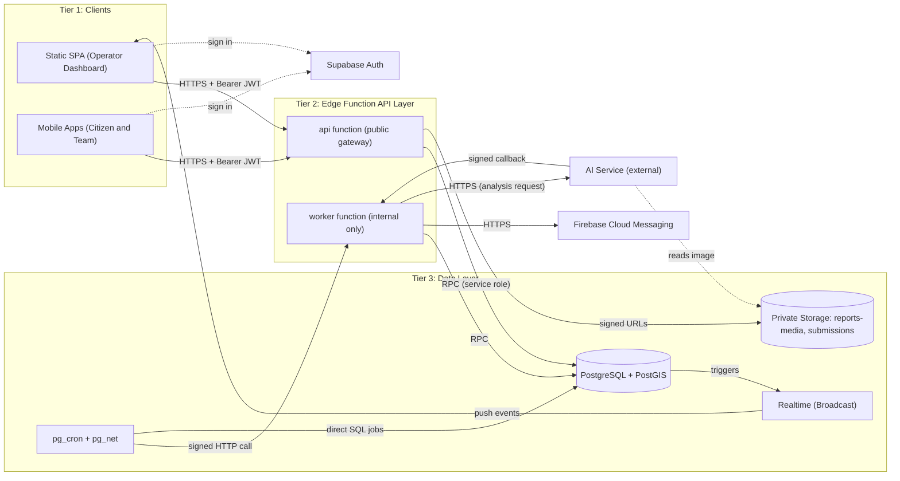
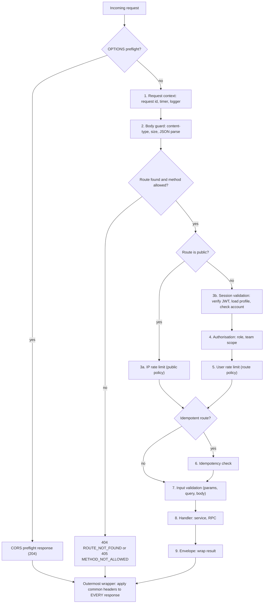
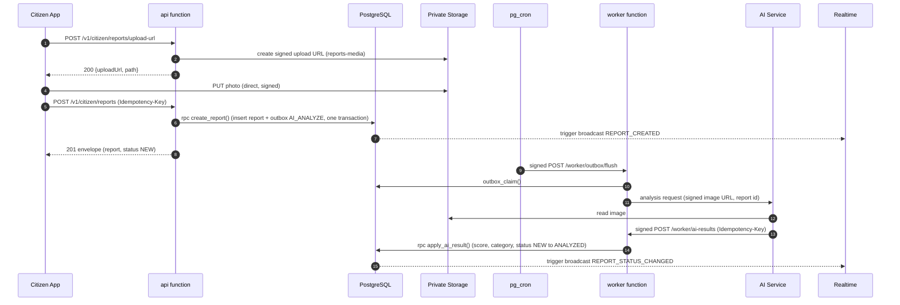
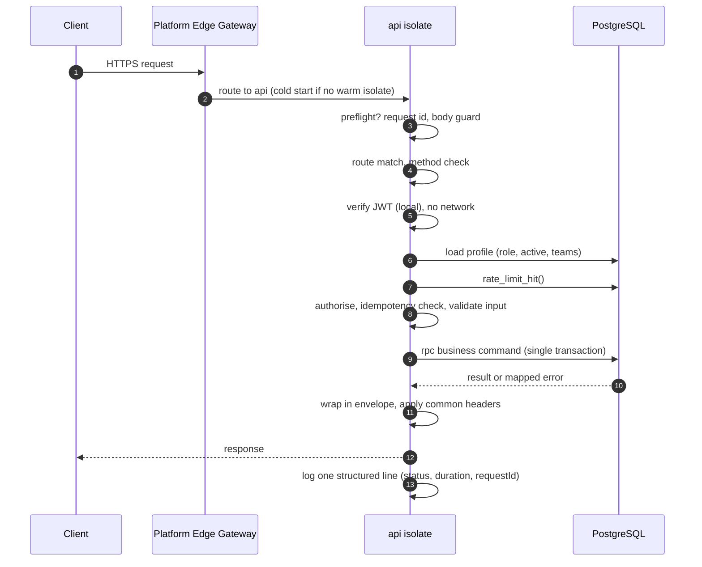

# Backend Serverless Architecture & API Gateway Design

**Supabase Edge Function API Architecture**

| | |
|---|---|
| **Project** | CleanOps / CleanStreet AI: Smart Citizen-Requested Street Cleaning and Waste Management Platform |
| **Task** | Backend Serverless Architecture & API Gateway Design |
| **Package** | P02 Design & Preparation → System Architecture |
| **Owner** | George Mohsen (per task card) |
| **Date** | 3 October 2026 |
| **Status** | Draft for Team Leader review — revised to resolve autonomous-review findings |
| **Governing decisions** | ADR-001-ARCH-3TIER (applied in full), ADR-007-NO-DIRECT-SQL (applied in full, see [Section 16.4](#164-adr-007-conformance)) |
| **Source documents** | *CleanStreet AI Proposal (Updated)*: Sections 9, 13, 14, 15, 16, 17, 19 |

---

## Table of Contents

1. [Purpose, Scope and ADR Conformance](#1-purpose-scope-and-adr-conformance)
2. [Requirements Traceability](#2-requirements-traceability)
3. [Architecture Overview](#3-architecture-overview)
4. [Edge Function Layout](#4-edge-function-layout)
5. [Routing Conventions](#5-routing-conventions)
6. [Middleware Pipeline](#6-middleware-pipeline)
7. [Middleware Specifications](#7-middleware-specifications)
8. [Standard JSON Response Envelope](#8-standard-json-response-envelope)
9. [Error Standards and Status Taxonomy](#9-error-standards-and-status-taxonomy)
10. [Inter-Service Invocation Patterns](#10-inter-service-invocation-patterns)
11. [Invocation Lifecycle](#11-invocation-lifecycle)
12. [Configuration, Secrets and Environments](#12-configuration-secrets-and-environments)
13. [Security Summary](#13-security-summary)
14. [Non-Functional Requirements](#14-non-functional-requirements)
15. [Observability and Testing](#15-observability-and-testing)
16. [Assumptions, Risks and Open Questions](#16-assumptions-risks-and-open-questions)
17. [Implementation Backlog](#17-implementation-backlog)

---

## 1. Purpose, Scope and ADR Conformance

This document defines the **API layer** of the platform: how HTTP requests reach business logic, how they are authenticated, rate-limited and answered, and how the serverless components talk to each other. It is the shared contract that every backend module (reports, dispatch, telemetry, analytics, admin) must follow.

### 1.1 In scope

- Edge Function deployment units, directory structure and module layering.
- Request routing and URL conventions.
- Middleware: request context, CORS, body guard, **session validation**, authorisation, **rate limiting**, idempotency, service-to-service authentication.
- The **standard JSON response envelope** and the **error status taxonomy**.
- **Inter-service invocation patterns** and the **invocation lifecycle**.

### 1.2 Out of scope

- The business rules of individual domains (dispatch, SLA, priority scoring). They are specified in their own architecture documents and plug into the conventions defined here.
- Frontend implementation, AI model internals, database schema beyond the infrastructure tables this design needs.

### 1.3 ADR-001-ARCH-3TIER conformance

ADR-001 (status: active) structures the platform into three decoupled tiers and requires that **all business logic and endpoints are stateless Supabase Edge Functions communicating with PostgreSQL**.

| ADR-001 requirement | How this design satisfies it |
|---|---|
| **Frontend:** static SPA | The API is consumed over HTTPS by a static SPA and the mobile apps. No server-rendered pages. CORS is allow-listed to the SPA origin ([7.2](#72-cors)) |
| **API layer:** serverless Supabase Edge Functions (`/api`) | One public gateway function named **`api`** and one internal function named **`worker`** ([4.1](#41-deployment-units)). No other runtime hosts business logic |
| **Data layer:** PostgreSQL + private storage bucket (`reports-media` / `submissions`) | All state lives in PostgreSQL and the private buckets. Files move only through **short-lived signed URLs** issued by the API ([10.3](#103-pattern-catalogue)) |
| *No continuous stateful application server* | No long-lived process, no in-memory sessions, queues, locks or counters. Rate limits, idempotency and job queues are **database-backed** ([3.2](#32-statelessness-rules)) |
| Clients isolated from direct database credentials | Browsers and mobile apps never receive a database credential or service key. They hold only a user session token. The **service-role key exists only as an Edge Function secret** ([12](#12-configuration-secrets-and-environments), [13](#13-security-summary)) |
| Zero-cost scaling, no VPS operations | Autoscaling comes from the platform. Cost depends on invocation volume, so [Section 14.2](#142-invocation-budget-and-cost) quantifies it |

### 1.4 ADR-007-NO-DIRECT-SQL conformance (summary)

ADR-007 (status: active) forbids autonomous agents and external workers from executing arbitrary SQL directly, and requires all such interactions to go through **typed Edge Function RPC endpoints authenticated with a shared machine secret**. The full conformance mapping, including how this design's header scheme relates to the header name used in the ADR text, is in [Section 16.4](#164-adr-007-conformance). The short version: nothing outside PostgreSQL's own trusted internals (`pg_cron`, `worker`, the AI service) ever sends raw SQL — every external or machine write goes through a typed, authenticated RPC call ([10.3](#103-pattern-catalogue), pattern P2).

---

## 2. Requirements Traceability

| # | Requirement (from task description / deliverable) | Section |
|---|---|---|
| T1 | Edge Function **directory structure** / layout | [4](#4-edge-function-layout) |
| T2 | **Request routing** / routing conventions | [5](#5-routing-conventions) |
| T3 | **Session validation middleware** | [7.4](#74-session-validation) |
| T4 | **Rate-limiting enforcement** | [7.6](#76-rate-limiting) |
| T5 | **CORS** middleware | [7.2](#72-cors) |
| T6 | **Standard JSON response envelope** | [8](#8-standard-json-response-envelope) |
| T7 | **Error status taxonomy** / error standards | [9](#9-error-standards-and-status-taxonomy) |
| T8 | **Inter-service invocation patterns** per ADR-001 and ADR-007 | [10](#10-inter-service-invocation-patterns), [16.4](#164-adr-007-conformance) |
| T9 | **Invocation lifecycle** | [11](#11-invocation-lifecycle) |
| T10 | Security, privacy and RBAC alignment (proposal §17) | [7.4](#74-session-validation), [7.5](#75-authorisation), [13](#13-security-summary) |

---

## 3. Architecture Overview

### 3.1 Component view



**Note on `CR -->|"direct SQL jobs"| PG`:** this edge is `pg_cron` calling **PL/pgSQL functions it schedules itself inside the database it runs in** — not an external agent or worker sending ad-hoc SQL over the network. ADR-007 governs *external* and *agent* callers; `pg_cron`'s in-database scheduled calls are addressed explicitly in [16.4](#164-adr-007-conformance) so this diagram is not read as a loophole.

### 3.2 Statelessness rules

An Edge Function isolate may be created, reused or destroyed by the platform at any time, and several isolates run concurrently. Therefore **correctness must never depend on memory that survives between requests.**

| Concern | Stateful-server habit (forbidden) | Stateless replacement (required) |
|---|---|---|
| Sessions | Server-side session store | Self-contained **JWT** issued by Supabase Auth, validated on every request ([7.4](#74-session-validation)) |
| Rate limiting | In-memory counters | **Atomic counter in PostgreSQL** ([7.6](#76-rate-limiting)) |
| Duplicate-request protection | In-memory request cache | **`api_idempotency` table** ([7.7](#77-idempotency)) |
| Background work / queues | In-process queue, `setInterval` | **Transactional outbox** table + `pg_cron` + `worker` function ([10](#10-inter-service-invocation-patterns)) |
| Scheduled jobs | `setInterval`, `@Scheduled`-style timers | **`pg_cron`** calling SQL functions or the `worker` ([10.3](#103-pattern-catalogue)) |
| Real-time push | WebSocket server held by the app | **Realtime Broadcast** fired by database triggers |
| Locks / ordering | Mutex, singleton | **Row locks and unique indexes** inside PostgreSQL |
| File handling | Local disk | **Private storage buckets** via signed URLs |
| Configuration | Mutable globals | Environment variables and a database config table |

**Allowed in-memory data:** only *pure caches that can be lost without changing behaviour* (for example, the JWT public-key set, or a configuration value with a short TTL). A lost cache must only cost latency, never correctness.

### 3.3 Key design decisions

| ID | Decision | Alternatives considered | Rationale |
|---|---|---|---|
| D-1 | **One public gateway function (`api`)** with an internal router, plus one internal `worker` function | One function per endpoint; one function per domain | ADR-001 names a single `/api` layer. One entrypoint means middleware (CORS, auth, limits, envelope) is written **once** and cannot be forgotten on a new endpoint. Trade-off: larger bundle and slower cold start, so dependencies are kept small and rare modules are lazily imported |
| D-2 | **`verify_jwt = false` at the platform gateway; validate the JWT in our own middleware** | Keep platform-level JWT verification | Platform rejections do not use our response envelope. Our own middleware lets routes be **public or protected individually**, returns envelope-conformant `401`s, and lets us add account checks |
| D-3 | **Routing with Hono** on Deno | Hand-written `URL` matching; Oak | Small, runs on Edge runtimes, supports middleware composition and typed context |
| D-4 | **Business logic in typed service modules; multi-step atomic writes in PostgreSQL functions called through RPC** | Multiple client calls from the function | A function invocation cannot hold a database transaction across several HTTP calls. Putting atomic steps in one PL/pgSQL function gives all-or-nothing behaviour and row locking |
| D-5 | **Database-backed rate limiting** (fixed-window counter) | Redis / Upstash; in-memory limiter | Isolates share no memory, so a shared store is mandatory. PostgreSQL is already in the stack, so no new dependency or cost. Trade-off: one extra query per request |
| D-6 | **Custom JSON envelope** with stable machine-readable error codes | RFC 7807 Problem Details | The task requires a standard envelope. One shape for success and failure is simplest for the SPA and mobile clients |
| D-7 | **Signed-request authentication (HMAC) for machine callers, carrying the ADR-007 machine-secret identity in a dedicated header** | Shared static bearer token; user JWTs | Prevents replay and tampering and keeps machine credentials separate from user sessions. See [7.8](#78-service-to-service-authentication) for how this maps onto ADR-007's naming |
| D-8 | **Transactional outbox for side effects** (push notifications, AI requests) | Fire-and-forget calls inside the request | Side effects survive isolate shutdown and upstream outages, and can be retried safely |

---

## 4. Edge Function Layout

### 4.1 Deployment units

| Function | Audience | Auth | Purpose |
|---|---|---|---|
| **`api`** | SPA and mobile apps | User JWT (validated in middleware) | Public gateway. All user-facing endpoints |
| **`worker`** | `pg_cron` / `pg_net`, AI service, `api` (optional) | **Machine-secret + HMAC-signed request** ([7.8](#78-service-to-service-authentication)) | Internal endpoints: outbox processing, AI callbacks, maintenance jobs. Not reachable with a user token. No CORS |

Splitting `worker` from `api` keeps machine-to-machine endpoints off the public, browser-facing surface and lets them have a different auth model, rate policy and timeout.

### 4.2 Repository structure

```
supabase/
├── config.toml                      # per-function settings (verify_jwt, entrypoints)
├── migrations/                      # forward-only SQL (schema, RPC functions, triggers, cron)
├── seed.sql
└── functions/
    ├── _shared/                     # NOT deployed on its own (underscore prefix)
    │   ├── config/
    │   │   └── env.ts               # typed, validated environment access (fails fast)
    │   ├── http/
    │   │   ├── envelope.ts          # ok(), fail(), meta builder
    │   │   ├── errors.ts            # ERROR_CATALOG, AppError
    │   │   ├── pg-errors.ts         # PostgreSQL / RPC error to AppError mapping
    │   │   ├── cors.ts              # origin allow-list, preflight
    │   │   ├── common-headers.ts    # headers applied to EVERY response
    │   │   └── pagination.ts        # page / cursor parsing and meta
    │   ├── middleware/
    │   │   ├── request-context.ts   # request id, timer, logger
    │   │   ├── body-guard.ts        # content-type and size limits, JSON parsing
    │   │   ├── session.ts           # JWT validation and profile load
    │   │   ├── authorize.ts         # role and scope guards
    │   │   ├── rate-limit.ts        # database-backed limiter
    │   │   ├── idempotency.ts       # Idempotency-Key handling
    │   │   └── hmac.ts              # signed machine-to-machine requests (X-Bot-Secret + HMAC)
    │   ├── db/
    │   │   ├── clients.ts           # service client factory (never exported to routes)
    │   │   └── rpc.ts               # typed wrappers around supabase.rpc()
    │   ├── clients/
    │   │   ├── fcm.ts               # push notification client
    │   │   ├── ai.ts                # AI service client
    │   │   └── storage.ts           # signed URL helpers
    │   ├── observability/
    │   │   └── logger.ts            # structured JSON logger
    │   └── route.ts                 # defineRoute(): declarative route registration
    ├── api/
    │   ├── index.ts                 # Deno.serve entrypoint (outermost wrapper)
    │   ├── app.ts                   # Hono app, global middleware, route mounting
    │   ├── deno.json                # pinned imports
    │   └── modules/                 # one folder per domain
    │       ├── health/
    │       ├── me/
    │       ├── citizen-reports/
    │       ├── operator/            # map, reports, dispatch, teams, sla
    │       ├── team/                # tasks, telemetry
    │       ├── supervisor/
    │       └── admin/
    │           ├── routes.ts        # HTTP binding only
    │           ├── schemas.ts       # Zod request / response schemas
    │           └── service.ts       # business orchestration
    └── worker/
        ├── index.ts
        ├── deno.json
        └── jobs/
            ├── outbox-flush.ts
            ├── ai-results.ts        # AI callback ingestion
            └── maintenance.ts
tests/
├── unit/                            # envelope, errors, hmac, cors, pagination
├── integration/                     # against local supabase stack
└── security/                        # token tampering, rate-limit bursts, CORS
```

### 4.3 Module layering rules

```
routes.ts  →  service.ts  →  db/rpc.ts, clients/*
(HTTP)        (business)      (infrastructure)
```

1. **`routes.ts`** only binds HTTP to a service: declares the route, validates input, calls the service, returns `ok(...)`. No business rules.
2. **`service.ts`** holds business orchestration. It knows nothing about `Request`/`Response`. It throws `AppError` for expected failures.
3. **`db/rpc.ts`** is the only place that calls `supabase.rpc()`. Services never construct raw database clients.
4. Modules do not import each other's internals. Shared code goes in `_shared`.
5. The **service-role client is created inside `_shared/db`** and is never passed into route handlers. This keeps the most privileged credential away from request-handling code.

### 4.4 `config.toml` (excerpt)

```toml
[functions.api]
verify_jwt = false      # validated by our own session middleware (decision D-2)
entrypoint = "./functions/api/index.ts"

[functions.worker]
verify_jwt = false      # authenticated by machine secret + HMAC signature (decision D-7)
entrypoint = "./functions/worker/index.ts"
```

### 4.5 Dependency policy

- Pin **exact versions** in each function's `deno.json` import map (Hono, Zod, `jose`, `@supabase/supabase-js`).
- Keep the dependency set minimal. Every dependency increases cold-start time.
- Lazy-load rarely used heavy modules with dynamic `import()`.
- No Node-only packages that require native bindings.

---

## 5. Routing Conventions

### 5.1 Public URL

```
https://<project-ref>.supabase.co/functions/v1/api/v1/<audience>/<resource>
```

- `functions/v1` is the **platform** path. `api` is our function. The following **`v1` is our API version.**
- The frontend reads one config value, `API_BASE_URL`, pointing at `.../functions/v1/api`. A proxy or custom domain mapping `/api/*` to the function can be added later without changing any route.
- Inside the code, Hono is mounted with `basePath('/api')` because the platform keeps the function name in the request path.

### 5.2 Path structure

```
/v1/{audience}/{resource}[/{id}][/{sub-resource-or-action}]
```

| Audience prefix | Who may call it | Group-level guard |
|---|---|---|
| *(none)*: `/v1/health` | Anyone | Public, strict IP rate limit |
| `/v1/me` | Any authenticated user | Authenticated |
| `/v1/citizen/**` | `CITIZEN` and above | Role guard |
| `/v1/team/**` | `TEAM_MEMBER` | Role guard + team-scope check |
| `/v1/operator/**` | `OPERATOR`, `SUPERVISOR`, `ADMIN` | Role guard |
| `/v1/supervisor/**` | `SUPERVISOR`, `ADMIN` | Role guard |
| `/v1/admin/**` | `ADMIN` | Role guard |

The audience prefix makes the intended caller visible in every URL and lets the router apply a **group-level role guard in addition to the per-route guard** (defence in depth).

### 5.3 Naming and method rules

| Rule | Convention |
|---|---|
| Resources | Plural, lowercase, kebab-case nouns: `/reports`, `/cleaning-teams` |
| Path parameters | `:id` (numeric or UUID), validated by schema |
| Query parameters | camelCase: `?status=ANALYZED,ASSIGNED&sort=-createdAt&page=1&pageSize=20` |
| JSON fields | camelCase. Timestamps in **ISO-8601 UTC**. UUIDs as strings |
| `GET` | Safe and cacheable by contract. Never changes state |
| `POST` | Create, or perform a **command** on a resource (`POST /assignments/:id/accept`) |
| `PATCH` | Partial update of a resource |
| `PUT` | Full replacement (rare) |
| `DELETE` | Removal or revocation. Returns `200` with the standard envelope (`data: null`) |
| Actions | Modelled as sub-resources using `POST`, in lower-case kebab: `/start`, `/complete`, `/approve` |
| Unsupported method on known path | `405` with `Allow` header |
| Unknown path | `404 ROUTE_NOT_FOUND` |

### 5.4 Lists: filtering, sorting, pagination

| Parameter | Meaning | Rules |
|---|---|---|
| `page` | 1-based page number | Default `1` |
| `pageSize` | Items per page | Default `20`, **maximum `100`** (larger values are rejected with `422`, not silently clamped) |
| `sort` | Comma-separated fields, `-` prefix for descending | Only fields on a per-route **allow-list** |
| `cursor` | Opaque cursor for feed-style lists | Used instead of `page` where the list changes quickly |
| Filters | One query parameter per filter, comma-separated for multi-value | Unknown filter names are rejected with `422` |

Offset pagination is the default for MVP. Feed-style endpoints may use cursor pagination. The response `meta.pagination` object always states which kind was used ([8.3](#83-pagination-meta)).

### 5.5 Versioning

- The version is in the path (`/v1`).
- **Non-breaking changes** (new optional field, new endpoint) ship within `v1`.
- **Breaking changes** ship as `/v2` **alongside** `/v1`. Retired versions are announced with `Deprecation` and `Sunset` response headers before removal.
- Clients must ignore unknown JSON fields.

### 5.6 Declarative route registration (secure by default)

Every route is declared through one helper, `defineRoute()`. The **`auth` property is mandatory in the TypeScript type**, so a route cannot compile without an explicit security decision.

```ts
// functions/api/modules/operator/routes.ts
export const assignTeam = defineRoute({
  method: 'POST',
  path: '/v1/operator/reports/:id/assignments',
  auth: { roles: ['OPERATOR', 'SUPERVISOR', 'ADMIN'] },   // REQUIRED: no default
  rateLimit: 'write',                                      // policy key, see 7.6
  idempotent: true,                                        // requires Idempotency-Key
  params: z.object({ id: z.coerce.number().int().positive() }),
  body: AssignTeamSchema,
  handler: async ({ params, body, auth, ctx }) => {
    const result = await dispatchService.assignTeam({ reportId: params.id, ...body }, auth);
    return created(ctx, result);                           // 201 + standard envelope
  },
});
```

Public routes must say so explicitly: `auth: 'public'`. The registrar composes the middleware in the **fixed order** of [Section 6](#6-middleware-pipeline), so individual routes cannot reorder or skip steps. The same declarations feed a generated **route table and OpenAPI document**, which is the contract shared with the frontend and mobile teams.

### 5.7 Route catalogue (summary)

| Module | Representative routes | Auth | Rate policy |
|---|---|---|---|
| health | `GET /v1/health` | public | `public` |
| me | `GET /v1/me` | any user | `read` |
| citizen-reports | `POST /v1/citizen/reports`, `GET /v1/citizen/reports`, `GET /v1/citizen/reports/:id`, `POST /v1/citizen/reports/upload-url` | `CITIZEN`+ | `write` / `read` |
| operator | `GET /v1/operator/map/reports`, `GET /v1/operator/reports`, `POST /v1/operator/reports/:id/assignments`, `GET /v1/operator/sla/summary` | `OPERATOR`+ | `read` / `heavy` / `write` |
| team | `GET /v1/team/tasks`, `POST /v1/team/telemetry`, `POST /v1/team/assignments/:id/complete` | `TEAM_MEMBER` | `read` / `telemetry` / `write` |
| supervisor | `GET /v1/supervisor/overrides/pending`, `POST /v1/supervisor/overrides/:id/approve` | `SUPERVISOR`+ | `read` / `write` |
| admin | `GET /v1/admin/sla/policies`, `PUT /v1/admin/sla/policies/:tier` | `ADMIN` | `read` / `write` |
| **worker** (internal) | `POST /worker/outbox/flush`, `POST /worker/ai-results`, `POST /worker/maintenance/:job` | Machine secret + HMAC | `internal` |

The full endpoint list of each domain lives in that domain's architecture document. Every endpoint must follow the conventions in this document.

---

## 6. Middleware Pipeline

### 6.1 Order

Middleware order is fixed and applied by the platform wrapper and the route registrar. Each step either passes control onward or **short-circuits with a standard error**.



**Rationale for the order**

- **Preflight first**: browsers send `OPTIONS` without credentials, so it must be answered before authentication.
- **Body guard before auth**: oversized or malformed bodies are rejected cheaply before any database work.
- **Authorisation before the user rate limit**: the limiter spends a database call, and forbidden requests should not consume it. Failed authentication attempts are rate-limited separately by IP ([7.6.4](#764-authentication-failure-throttling)).
- **Validation after authorisation**: unauthenticated callers learn nothing about the expected input.
- **Common headers last, in the outermost wrapper**: so that even `404`, `405`, `429` and unhandled `500` responses carry CORS, request-id and security headers. Without this, the browser hides the error body from the SPA.

### 6.2 Entry point

```ts
// functions/api/index.ts
import { app } from './app.ts';
import { preflight } from '../_shared/http/cors.ts';
import { resolveRequestId } from '../_shared/middleware/request-context.ts';
import { applyCommonHeaders } from '../_shared/http/common-headers.ts';

Deno.serve(async (req: Request): Promise<Response> => {
  const requestId = resolveRequestId(req);          // accept a valid inbound id, otherwise generate
  const pre = preflight(req, requestId);            // OPTIONS answered before any other work
  if (pre) return pre;

  let res: Response;
  try {
    res = await app.fetch(req, { requestId });      // Hono app, global + route middleware
  } catch (err) {
    res = unhandledToResponse(err, requestId);      // last-resort 500 in standard envelope
  }
  return applyCommonHeaders(req, res, requestId);   // CORS, X-Request-Id, security headers
});
```

---

## 7. Middleware Specifications

### 7.1 Request context

| Item | Behaviour |
|---|---|
| Request ID | Accept inbound `X-Request-Id` **only if it matches `^[A-Za-z0-9._-]{8,64}$`**, otherwise generate a UUID. Echoed on every response and every log line |
| Timer | Records start time; duration is logged and returned in `meta` |
| Logger | Child logger carrying `requestId`, `method`, `path` (without query string values), later enriched with `userId` and `role` |
| Deadline | `REQUEST_DEADLINE_MS` (default 20,000). Passed to outbound calls as an `AbortSignal`. Must be **below the platform's wall-clock limit** (verify the current limit in the Supabase documentation) |

### 7.2 CORS

The SPA is a browser client on a different origin from the function, so CORS is required. Mobile apps are not browsers and are unaffected.

| Setting | Value |
|---|---|
| Allowed origins | Exact-match allow-list from `CORS_ALLOWED_ORIGINS` (comma-separated), for example the production SPA origin and `http://localhost:5173` for development. Preview-deployment subdomains may be allowed only by an **anchored** pattern, never a bare wildcard |
| Wildcard `*` | **Never**, even though no cookies are used. Bearer tokens are sensitive |
| Allowed methods | `GET, POST, PUT, PATCH, DELETE, OPTIONS` |
| Allowed request headers | `authorization, content-type, idempotency-key, x-request-id, apikey, x-client-info` (the last two are sent by the Supabase client library) |
| Exposed response headers | `x-request-id, ratelimit-limit, ratelimit-remaining, ratelimit-reset, retry-after` |
| Preflight response | `204`, with `Access-Control-Max-Age: 600` |
| Credentials | `Access-Control-Allow-Credentials` is **not** set (no cookies are used) |
| `Vary` | `Origin` on every response |
| Disallowed origin | Preflight gets **no** CORS headers (browser blocks it). Non-browser callers are unaffected, and authentication still applies |

CORS is **not** an access-control mechanism. It protects browser users only. Authentication and authorisation remain mandatory.

### 7.3 Body guard

| Check | Failure |
|---|---|
| Methods with a body (`POST`, `PUT`, `PATCH`) must send `Content-Type: application/json` | `415 UNSUPPORTED_MEDIA_TYPE` |
| Declared and actual body size ≤ `MAX_BODY_BYTES` (default **256 KB**) | `413 PAYLOAD_TOO_LARGE` |
| Body must be valid JSON | `400 MALFORMED_REQUEST` |
| Body must be a JSON object (unless the route declares otherwise) | `400 MALFORMED_REQUEST` |

**Files never travel through the API.** Photos and completion evidence are uploaded directly by the client to private storage using signed upload URLs ([10.3](#103-pattern-catalogue)). This keeps function bodies small and avoids memory and time limits.

### 7.4 Session validation

**Goal:** establish *who the caller is* on every request, without any server-side session state.

#### 7.4.1 Token format

`Authorization: Bearer <access_token>`, where the token is the JWT issued by Supabase Auth when the user signs in.

#### 7.4.2 Validation steps

1. **Extract** the bearer token. Missing or malformed header on a protected route → `401 AUTH_MISSING_TOKEN`.
2. **Verify** the signature and claims:
   - Signature checked against the project's public key set (JWKS), or through the Auth server, per `AUTH_VERIFY_MODE`. The accepted **algorithm list is fixed in configuration**. The algorithm named in the token header is never trusted, and `none` is never accepted.
   - `iss` must equal `${SUPABASE_URL}/auth/v1`.
   - `aud` must equal `authenticated`.
   - `exp` / `nbf` checked with a small clock tolerance (5 seconds).
   - `sub` must be a UUID.
   - Failure → `401 AUTH_INVALID_TOKEN`, or `401 AUTH_TOKEN_EXPIRED` when only the expiry failed (the client should refresh and retry once).
3. **Load the application profile** from the `users` table by `sub`: `role`, `active`, and for team members the team ids. **The role comes from the database, never from token claims**, so a role change or deactivation takes effect immediately.
4. **Check the account**: `active = false` → `403 ACCOUNT_DISABLED`. This also closes the gap that a JWT stays cryptographically valid until it expires even after the user is disabled.
5. **Attach the auth context** for downstream use:

```ts
interface AuthContext {
  userId: string;          // uuid (JWT sub)
  role: 'CITIZEN' | 'TEAM_MEMBER' | 'OPERATOR' | 'SUPERVISOR' | 'ADMIN';
  teamIds: number[];       // empty unless TEAM_MEMBER
  email?: string;
  tokenExp: number;
}
```

#### 7.4.3 Reference implementation (core)

```ts
// functions/_shared/middleware/session.ts
import { jwtVerify, createRemoteJWKSet } from 'jose';

const jwks = createRemoteJWKSet(new URL(`${env.SUPABASE_URL}/auth/v1/.well-known/jwks.json`));
// the key set is a pure cache: if this isolate is recycled it is simply fetched again

export function session(): MiddlewareHandler {
  return async (c, next) => {
    const token = extractBearer(c.req.header('authorization'));
    if (!token) throw new AppError('AUTH_MISSING_TOKEN');

    let claims;
    try {
      ({ payload: claims } = await jwtVerify(token, jwks, {
        issuer: `${env.SUPABASE_URL}/auth/v1`,
        audience: 'authenticated',
        algorithms: env.JWT_ALLOWED_ALGS,        // fixed allow-list, e.g. ['ES256', 'RS256']
        clockTolerance: 5,
      }));
    } catch (e) {
      throw new AppError(e?.code === 'ERR_JWT_EXPIRED' ? 'AUTH_TOKEN_EXPIRED' : 'AUTH_INVALID_TOKEN');
    }

    const profile = await rpc.getSessionProfile(claims.sub as string);   // role, active, teamIds
    if (!profile) throw new AppError('AUTH_INVALID_TOKEN');              // valid JWT, unknown user
    if (!profile.active) throw new AppError('ACCOUNT_DISABLED');

    c.set('auth', { userId: claims.sub, role: profile.role, teamIds: profile.teamIds, tokenExp: claims.exp });
    await next();
  };
}
```

> **Project setting to confirm:** if the Supabase project still signs tokens with the legacy shared secret instead of asymmetric keys, JWKS verification will not work. In that case set `AUTH_VERIFY_MODE=auth-server`, which validates through the Auth server (one extra network call per request). Both modes implement the same `verifyToken()` interface, so nothing else changes (open question Q6).

#### 7.4.4 Token lifecycle

| Aspect | Behaviour |
|---|---|
| Lifetime | Short-lived access token. The **client library refreshes it** with the refresh token. The API never handles refresh tokens |
| Sign-out | Client discards tokens. Server-side, the token remains valid until `exp`, so **immediate revocation is done through `users.active`** (step 4) |
| Realtime | Realtime Broadcast uses the same user token with row-level policies. It does not pass through this middleware |
| Machine callers | Do not use JWTs. See [7.8](#78-service-to-service-authentication) |

### 7.5 Authorisation

Applied after authentication, driven by the route's `auth` declaration.

| Check | Rule | Failure |
|---|---|---|
| **Role guard** | Caller's role must be in `auth.roles`. The role hierarchy `ADMIN > SUPERVISOR > OPERATOR` is resolved in one function (`hasRole()`). `TEAM_MEMBER` and `CITIZEN` are separate branches | `403 FORBIDDEN_ROLE` |
| **Group guard** | The audience prefix (`/v1/operator/**`) applies the same role set to every route under it | `403 FORBIDDEN_ROLE` |
| **Ownership / scope** | Citizens may only read their own reports. Team members may only touch their own team's tasks and telemetry. Checked in the **service layer** against `auth.userId` / `auth.teamIds` | `403 FORBIDDEN_RESOURCE`. A resource the caller must not even know exists returns `404 NOT_FOUND` instead |
| **Business-policy denial** | Role is sufficient but a policy forbids the action (for example, an override that needs supervisor approval) | `403 POLICY_VIOLATION` with a rule description |

Authorisation lives in the middleware **and** in the service layer. A new route that forgets one still fails safe, and services remain safe if called from another entry point such as `worker`.

### 7.6 Rate limiting

#### 7.6.1 Why it needs a shared store

Isolates are many, short-lived and share no memory. An in-memory counter would reset on every cold start and be split across isolates, so it would not actually limit anything. The counter therefore lives in PostgreSQL and is incremented **atomically**.

#### 7.6.2 Algorithm: fixed-window counter

One row per `(bucket, window)`. An atomic `INSERT ... ON CONFLICT DO UPDATE` increments and returns the count in a single statement, so concurrent isolates cannot lose updates.

```sql
-- Counters need no durability, so the table is UNLOGGED (faster writes).
create unlogged table public.rate_limit_counters (
  bucket        text        not null,     -- e.g. 'u:<uuid>:write' or 'ip:203.0.113.7:public'
  window_start  timestamptz not null,
  hits          integer     not null default 0,
  primary key (bucket, window_start)
);

create table public.rate_limit_policies (
  policy_key        text primary key,
  limit_per_window  integer not null,
  window_seconds    integer not null,
  fail_open         boolean not null default true,   -- behaviour if the limiter itself fails
  description       text
);

create or replace function public.rate_limit_hit(p_bucket text, p_policy text)
returns table (allowed boolean, limit_value integer, remaining integer, reset_at timestamptz)
language plpgsql security definer set search_path = public as $$
declare
  v_limit  integer;
  v_window integer;
  v_start  timestamptz;
  v_hits   integer;
begin
  select limit_per_window, window_seconds into v_limit, v_window
    from rate_limit_policies where policy_key = p_policy;
  if not found then
    raise exception 'unknown rate-limit policy %', p_policy using errcode = 'CS500';
  end if;

  v_start := to_timestamp(floor(extract(epoch from now()) / v_window) * v_window);

  insert into rate_limit_counters (bucket, window_start, hits)
  values (p_bucket, v_start, 1)
  on conflict (bucket, window_start)
    do update set hits = rate_limit_counters.hits + 1
  returning hits into v_hits;

  return query select v_hits <= v_limit,
                      v_limit,
                      greatest(v_limit - v_hits, 0),
                      v_start + make_interval(secs => v_window);
end $$;

revoke all on function public.rate_limit_hit(text, text) from public, anon, authenticated;
-- cleanup (pg_cron, every 5 minutes):
--   delete from rate_limit_counters where window_start < now() - interval '1 hour';
```

**Known trade-off:** a fixed window allows up to twice the limit across a window boundary. This is acceptable for abuse protection at MVP scale. Sliding-window or token-bucket variants can replace the function later without touching any route.

#### 7.6.3 Policies (provisional, stored in the database, tunable without redeploying)

| Policy key | Applies to | Bucket key | Limit | Window | On limiter failure |
|---|---|---|---|---|---|
| `public` | Unauthenticated routes (health, etc.) | client IP | 30 | 60 s | **fail closed** |
| `auth_fail` | Failed authentication attempts | client IP | 10 | 300 s | **fail closed** |
| `read` | Ordinary `GET` | user id | 120 | 60 s | fail open |
| `heavy` | Map, hotspot, analytics queries | user id | 60 | 60 s | fail open |
| `write` | State-changing commands | user id | 30 | 60 s | fail open |
| `telemetry` | Team location batches | user id | 12 | 60 s | fail open |
| `internal` | `worker` endpoints | caller name | 600 | 60 s | fail open |

Values are **provisional** and meant to be calibrated during pilot testing. They are data, not code.

**Client IP:** taken from the platform-provided forwarding header (`x-forwarded-for`, first entry, validated as an IP address). IP limiting is a coarse defence only, because shared networks (a campus, for example) can share one address.

#### 7.6.4 Authentication-failure throttling

Every failed session validation increments `auth_fail:<ip>`. Once the limit is reached, further requests from that IP receive `429 RATE_LIMITED` before token verification work is repeated. This slows token-guessing and credential-stuffing patterns.

#### 7.6.5 Middleware behaviour

```ts
// functions/_shared/middleware/rate-limit.ts
export function rateLimit(policy: PolicyKey, bucketOf: (c: Context) => string): MiddlewareHandler {
  return async (c, next) => {
    let decision: Decision | null = null;
    try {
      decision = await rpc.rateLimitHit(`${bucketOf(c)}:${policy}`, policy);
    } catch (err) {
      c.get('log').error({ event: 'rate_limiter_failure', policy, err: String(err) });
      if (!policies[policy].failOpen) throw new AppError('SERVICE_UNAVAILABLE');   // fail closed
      // fail open: let the request through, never turn a limiter outage into an API outage
    }
    if (decision) {
      const resetIn = Math.max(1, Math.ceil((decision.resetAt.getTime() - Date.now()) / 1000));
      c.header('RateLimit-Limit', String(decision.limitValue));
      c.header('RateLimit-Remaining', String(decision.remaining));
      c.header('RateLimit-Reset', String(resetIn));
      if (!decision.allowed) {
        throw new AppError('RATE_LIMITED', { headers: { 'Retry-After': String(resetIn) }, retryable: true });
      }
    }
    await next();
  };
}
```

**Response headers** on every limited route: `RateLimit-Limit`, `RateLimit-Remaining`, `RateLimit-Reset` (seconds until the window resets). On rejection: `429` with `Retry-After`.

**Client guidance:** on `429`, wait `Retry-After` seconds, then retry with backoff. Never retry in a tight loop.

### 7.7 Idempotency

Mobile networks are unreliable, so clients retry. A retried `POST` must not create a second report or assignment.

- Routes declared `idempotent: true` **require** an `Idempotency-Key` header (a UUID generated by the client per logical action). Missing → `422 VALIDATION_FAILED`.
- Storage (database):

```sql
create table public.api_idempotency (
  user_id         uuid        not null,
  idem_key        text        not null,
  route           text        not null,
  request_hash    text        not null,     -- SHA-256 of method + path + canonical body
  status          text        not null,     -- IN_PROGRESS | COMPLETED
  response_status integer,
  response_body   jsonb,
  created_at      timestamptz not null default now(),
  primary key (user_id, idem_key)
);
-- retention: delete rows older than 24 h (pg_cron)
```

| Situation | Behaviour |
|---|---|
| New key | Insert `IN_PROGRESS`, run the handler, store the final response, return it |
| Same key, **same** request, already `COMPLETED` | **Replay the stored response** (same status and body) with header `Idempotent-Replay: true` |
| Same key, **different** request | `422 IDEMPOTENCY_KEY_REUSED` |
| Same key, still `IN_PROGRESS` | `409 REQUEST_IN_PROGRESS` (retryable) |
| Handler fails with a 5xx | The key row is released so the client can retry |

Domain-level safeguards (unique indexes, status guards inside PostgreSQL functions) remain the **final** defence. Idempotency keys are a convenience layer on top.

### 7.8 Service-to-service authentication

Used by the `worker` function. Callers are `pg_cron`/`pg_net` and the AI service — the same category of caller ADR-007 calls an "external worker" or "agent".

**Naming note (resolves the ADR-007 wording gap).** ADR-007's text names a header called `x-bot-secret` as the authentication mechanism for machine callers. This design implements that same requirement with a **stronger, two-part scheme**: a per-caller secret identified by name (`X-Caller`), plus a timestamped HMAC signature over the request (`X-Timestamp` / `X-Signature`) so the secret itself is never sent on the wire and a captured request cannot be replayed. To keep the header-level vocabulary traceable to the ADR text, the **secret-selection header is named `X-Bot-Secret-Id`** (it carries the caller identity used to look up that caller's signing secret — it is not the raw secret). The table below is explicit about this mapping so a reviewer does not need to guess.

**Request headers**

| Header | Content | Maps to ADR-007's `x-bot-secret` concept as |
|---|---|---|
| `X-Bot-Secret-Id` | Caller name (`cron`, `ai-service`) used to select that caller's secret server-side | The identity/lookup half of the shared machine secret |
| `X-Timestamp` | Unix seconds | Replay protection (not part of ADR-007's text; an addition) |
| `X-Signature` | Hex HMAC-SHA256 of `"{timestamp}.{METHOD}.{path}.{rawBody}"` using that caller's secret | The proof-of-possession half — stronger than sending the raw secret itself, since the secret never travels on the wire |
| `Idempotency-Key` | Unique id for callbacks that must not be applied twice (AI results) | n/a |

**Verification rules**

1. Reject if the timestamp differs from server time by more than **300 seconds** (replay window).
2. Recompute the signature over the **raw body bytes** and compare with a constant-time function.
3. Including the **method and path** in the signed string prevents a valid signature for one endpoint being replayed against another.
4. Each caller has its **own secret**, so one leaked secret can be rotated without affecting the others.

```ts
// functions/_shared/middleware/hmac.ts
export async function verifySigned(req: Request, rawBody: string, secrets: Record<string, string>) {
  const caller = req.headers.get('x-bot-secret-id') ?? '';
  const ts = Number(req.headers.get('x-timestamp'));
  const sig = req.headers.get('x-signature') ?? '';
  const secret = secrets[caller];
  if (!secret || !Number.isFinite(ts) || !/^[0-9a-f]{64}$/i.test(sig)) throw new AppError('AUTH_INVALID_SIGNATURE');
  if (Math.abs(Date.now() / 1000 - ts) > 300) throw new AppError('AUTH_INVALID_SIGNATURE', { message: 'Timestamp outside allowed window.' });

  const path = new URL(req.url).pathname;
  const key = await crypto.subtle.importKey('raw', enc(secret), { name: 'HMAC', hash: 'SHA-256' }, false, ['verify']);
  const ok = await crypto.subtle.verify('HMAC', key, hexToBytes(sig), enc(`${ts}.${req.method}.${path}.${rawBody}`)); // constant-time
  if (!ok) throw new AppError('AUTH_INVALID_SIGNATURE');
  return caller;
}
```

**Open item for Team Leader confirmation (added to [16.3](#163-open-questions-for-team-leader-review) as Q10):** confirm whether ADR-007's `x-bot-secret` must be implemented **literally** as a raw static secret header (simpler, matches the ADR text word-for-word, weaker against replay) or whether the HMAC-signed scheme above (functionally stronger, same purpose, header renamed to `X-Bot-Secret-Id`) satisfies the intent of the ADR. This document proceeds with the HMAC scheme and flags the naming explicitly rather than silently renaming it, so the choice is visible and reversible.

---

## 8. Standard JSON Response Envelope

Every response from `api` and `worker`, success or failure, uses one shape. Headers: `Content-Type: application/json; charset=utf-8`.

### 8.1 Success

```json
{
  "success": true,
  "data": { "id": 1042, "status": "ASSIGNED" },
  "meta": {
    "requestId": "b3f1c2d4-6a7e-4c1b-9d52-0e8a1f3b7c10",
    "timestamp": "2026-10-03T14:55:40.123Z",
    "apiVersion": "v1"
  }
}
```

- `data` is the resource, an array, or a GeoJSON object. It is `null` for commands with nothing to return (for example, `DELETE`).
- `meta.pagination` is present on list responses only ([8.3](#83-pagination-meta)).

### 8.2 Failure

```json
{
  "success": false,
  "error": {
    "code": "VALIDATION_FAILED",
    "message": "One or more fields are invalid.",
    "details": [
      { "field": "pageSize", "issue": "Must be less than or equal to 100." }
    ],
    "retryable": false
  },
  "meta": {
    "requestId": "b3f1c2d4-6a7e-4c1b-9d52-0e8a1f3b7c10",
    "timestamp": "2026-10-03T14:55:40.123Z",
    "apiVersion": "v1"
  }
}
```

### 8.3 Pagination meta

```json
"pagination": { "type": "offset", "page": 1, "pageSize": 20, "totalItems": 87, "totalPages": 5 }
```

```json
"pagination": { "type": "cursor", "pageSize": 20, "nextCursor": "eyJpZCI6MTA0Mn0", "hasMore": true }
```

### 8.4 Envelope rules

| Rule | Detail |
|---|---|
| Single shape | Clients branch on `success`, never on HTTP status alone |
| `error.code` | **Stable, machine-readable, upper snake case.** Clients switch on `code`; `message` is for humans and may change |
| `error.message` | Safe to display. **Never** contains SQL, stack traces, file paths, tokens or secrets |
| `error.details` | Optional. For validation errors, an array of `{ field, issue }`. Field paths use dot notation (`items.0.qty`) |
| `error.retryable` | `true` when repeating the *same* request may succeed (`429`, `502`, `503`, `504`, transient conflicts) |
| `meta.requestId` | Always present. Matches the `X-Request-Id` header and the server logs, which is what a user quotes when reporting a problem |
| No `204` | Empty results use `200` with `data: null` so the body is always parseable |
| JSON conventions | camelCase, ISO-8601 UTC timestamps, `null` for absent values (fields are not omitted ad hoc) |
| Response headers | `X-Request-Id`, `Cache-Control: no-store` (default for authenticated responses), `API-Version: v1`, rate-limit headers where applicable |

### 8.5 TypeScript contract (shared with frontend)

```ts
// functions/_shared/http/envelope.ts
export interface Meta {
  requestId: string;
  timestamp: string;                       // ISO-8601 UTC
  apiVersion: 'v1';
  pagination?: OffsetPagination | CursorPagination;
}
export interface SuccessEnvelope<T> { success: true;  data: T;     meta: Meta }
export interface ErrorEnvelope      { success: false; error: ApiError; meta: Meta }
export interface ApiError {
  code: ErrorCode;
  message: string;
  details?: Array<{ field?: string; issue: string }> | Record<string, unknown>;
  retryable: boolean;
}
```

The `Meta`, `SuccessEnvelope` and `ErrorEnvelope` types are exported so the frontend and mobile teams can generate matching types from the OpenAPI document.

---

## 9. Error Standards and Status Taxonomy

### 9.1 Principles

1. **One catalogue, one place.** Every error the API can return is defined in `ERROR_CATALOG` (`_shared/http/errors.ts`). Services throw `AppError(code)`. They never build responses.
2. **HTTP status describes the class of problem. `error.code` identifies the specific problem.**
3. **4xx = the client can fix it. 5xx = the server or an upstream failed.**
4. **No internal leakage.** Unexpected errors return a generic message plus the `requestId`. The detail goes to the logs only.
5. **Errors never skip the envelope** ([6.2](#62-entry-point)): unhandled exceptions, unknown routes and rate-limit rejections all use it.

### 9.2 Taxonomy

| HTTP | `error.code` | When | Retryable | Notes |
|---|---|---|:-:|---|
| **400** | `MALFORMED_REQUEST` | Body is not valid JSON or not an object; invalid encoding | No | |
| **401** | `AUTH_MISSING_TOKEN` | No bearer token on a protected route | No | `WWW-Authenticate: Bearer` |
| **401** | `AUTH_INVALID_TOKEN` | Bad signature, wrong issuer or audience, unknown user | No | `WWW-Authenticate: Bearer error="invalid_token"` |
| **401** | `AUTH_TOKEN_EXPIRED` | Token expired | After refresh | Client refreshes the token and retries once |
| **401** | `AUTH_INVALID_SIGNATURE` | `worker` request signature or timestamp invalid | No | Machine callers only |
| **403** | `FORBIDDEN_ROLE` | Role not allowed for this route | No | |
| **403** | `FORBIDDEN_RESOURCE` | Caller may not access this specific resource (scope) | No | Use `404` instead if existence must be hidden |
| **403** | `POLICY_VIOLATION` | Business policy forbids the action | No | `details` states the rule |
| **403** | `ACCOUNT_DISABLED` | User deactivated | No | |
| **404** | `NOT_FOUND` | Resource does not exist (or is hidden from the caller) | No | |
| **404** | `ROUTE_NOT_FOUND` | No such endpoint | No | |
| **405** | `METHOD_NOT_ALLOWED` | Method not supported on this path | No | `Allow` header |
| **409** | `CONFLICT_VERSION` | Stale `version`, since another user changed the resource | After refetch | Optimistic-locking failure |
| **409** | `CONFLICT_STATE` | Action invalid in the resource's current state (for example, an invalid status transition) | No | |
| **409** | `CONFLICT_DUPLICATE` | Unique constraint violated | No | |
| **409** | `REQUEST_IN_PROGRESS` | Same idempotency key still processing | Yes | |
| **413** | `PAYLOAD_TOO_LARGE` | Body exceeds limit | No | |
| **415** | `UNSUPPORTED_MEDIA_TYPE` | Content-Type is not JSON | No | |
| **422** | `VALIDATION_FAILED` | Well-formed JSON, but fields fail schema validation | No | `details` lists fields |
| **422** | `BUSINESS_RULE_VIOLATION` | Valid input that breaks a domain rule (for example, a team over capacity) | No | |
| **422** | `IDEMPOTENCY_KEY_REUSED` | Key reused with a different request | No | |
| **429** | `RATE_LIMITED` | Rate limit exceeded | **Yes** | `Retry-After` header |
| **500** | `INTERNAL_ERROR` | Unexpected server error | No* | Generic message + `requestId` |
| **502** | `UPSTREAM_ERROR` | A dependency (AI service, FCM) returned an error | Yes | |
| **503** | `SERVICE_UNAVAILABLE` | Database unavailable, limiter fail-closed, serialisation failure | Yes | `Retry-After` when known |
| **504** | `UPSTREAM_TIMEOUT` | A dependency or the database timed out | Yes | |

\* A `500` is a defect. Clients may retry idempotent requests once, but the correct response is to fix the cause.

### 9.3 Validation errors

Input is validated with **Zod** schemas declared next to each route. The first failure class returns **all** field problems at once (not one at a time):

```json
{
  "success": false,
  "error": {
    "code": "VALIDATION_FAILED",
    "message": "One or more fields are invalid.",
    "details": [
      { "field": "body.teamId", "issue": "Required." },
      { "field": "query.pageSize", "issue": "Must be less than or equal to 100." }
    ],
    "retryable": false
  },
  "meta": { "requestId": "…", "timestamp": "…", "apiVersion": "v1" }
}
```

### 9.4 Error class and catalogue

```ts
// functions/_shared/http/errors.ts
export const ERROR_CATALOG = {
  MALFORMED_REQUEST:       { status: 400, retryable: false, message: 'Request body could not be parsed.' },
  AUTH_MISSING_TOKEN:      { status: 401, retryable: false, message: 'Authentication is required.' },
  AUTH_INVALID_TOKEN:      { status: 401, retryable: false, message: 'The access token is invalid.' },
  AUTH_TOKEN_EXPIRED:      { status: 401, retryable: false, message: 'The access token has expired.' },
  AUTH_INVALID_SIGNATURE:  { status: 401, retryable: false, message: 'Request signature is invalid.' },
  FORBIDDEN_ROLE:          { status: 403, retryable: false, message: 'Your role does not allow this action.' },
  FORBIDDEN_RESOURCE:      { status: 403, retryable: false, message: 'You do not have access to this resource.' },
  POLICY_VIOLATION:        { status: 403, retryable: false, message: 'This action is not permitted by policy.' },
  ACCOUNT_DISABLED:        { status: 403, retryable: false, message: 'This account is disabled.' },
  NOT_FOUND:               { status: 404, retryable: false, message: 'The resource was not found.' },
  ROUTE_NOT_FOUND:         { status: 404, retryable: false, message: 'No such endpoint.' },
  METHOD_NOT_ALLOWED:      { status: 405, retryable: false, message: 'Method not allowed.' },
  CONFLICT_VERSION:        { status: 409, retryable: false, message: 'The resource was modified by someone else.' },
  CONFLICT_STATE:          { status: 409, retryable: false, message: 'Action not allowed in the current state.' },
  CONFLICT_DUPLICATE:      { status: 409, retryable: false, message: 'A conflicting record already exists.' },
  REQUEST_IN_PROGRESS:     { status: 409, retryable: true,  message: 'An identical request is still being processed.' },
  PAYLOAD_TOO_LARGE:       { status: 413, retryable: false, message: 'Request body is too large.' },
  UNSUPPORTED_MEDIA_TYPE:  { status: 415, retryable: false, message: 'Content-Type must be application/json.' },
  VALIDATION_FAILED:       { status: 422, retryable: false, message: 'One or more fields are invalid.' },
  BUSINESS_RULE_VIOLATION: { status: 422, retryable: false, message: 'The request violates a business rule.' },
  IDEMPOTENCY_KEY_REUSED:  { status: 422, retryable: false, message: 'Idempotency key was used with a different request.' },
  RATE_LIMITED:            { status: 429, retryable: true,  message: 'Too many requests. Please slow down.' },
  INTERNAL_ERROR:          { status: 500, retryable: false, message: 'An unexpected error occurred.' },
  UPSTREAM_ERROR:          { status: 502, retryable: true,  message: 'A dependent service returned an error.' },
  SERVICE_UNAVAILABLE:     { status: 503, retryable: true,  message: 'The service is temporarily unavailable.' },
  UPSTREAM_TIMEOUT:        { status: 504, retryable: true,  message: 'A dependent service timed out.' },
} as const;

export type ErrorCode = keyof typeof ERROR_CATALOG;

export class AppError extends Error {
  constructor(
    public readonly code: ErrorCode,
    public readonly opts: { message?: string; details?: unknown; headers?: Record<string, string>;
                            retryable?: boolean; cause?: unknown } = {},
  ) { super(opts.message ?? ERROR_CATALOG[code].message); }
  get status() { return ERROR_CATALOG[this.code].status; }
  get retryable() { return this.opts.retryable ?? ERROR_CATALOG[this.code].retryable; }
}
```

### 9.5 Mapping database errors

Business rules enforced inside PostgreSQL functions (version checks, status transitions, capacity) raise errors that the API translates. The database and the API share **one vocabulary**: the PL/pgSQL function sets the SQLSTATE family and puts the API error code in the `HINT`.

```sql
-- inside a PostgreSQL function
raise exception 'Report was modified by another user'
  using errcode = 'CS409', hint = 'CONFLICT_VERSION';
```

```ts
// functions/_shared/http/pg-errors.ts
export function mapPgError(e: { code?: string; message?: string; hint?: string }): AppError {
  // Application-authored errors (SQLSTATE class 'CS'): message is written by us, so it is client-safe.
  if (e.code?.startsWith('CS') && e.hint && e.hint in ERROR_CATALOG) {
    return new AppError(e.hint as ErrorCode, { message: e.message });
  }
  switch (e.code) {
    case '23505': return new AppError('CONFLICT_DUPLICATE');                 // unique_violation
    case '23503': return new AppError('BUSINESS_RULE_VIOLATION');            // foreign_key_violation
    case '23514': return new AppError('BUSINESS_RULE_VIOLATION');            // check_violation
    case '40001':                                                            // serialization_failure
    case '40P01': return new AppError('SERVICE_UNAVAILABLE', { retryable: true }); // deadlock_detected
    case '57014': return new AppError('UPSTREAM_TIMEOUT');                   // statement timeout
    default:      return new AppError('INTERNAL_ERROR', { cause: e });       // detail goes to logs only
  }
}
```

Only errors **authored by the team** (SQLSTATE class `CS`) may pass their message to the client. Every other database message is replaced by a generic one, because native PostgreSQL messages can reveal table and column names.

### 9.6 Global error handler

```ts
app.onError((err, c) => {
  const appErr = err instanceof AppError ? err : toAppError(err);   // ZodError → VALIDATION_FAILED, etc.
  const log = c.get('log');
  (appErr.status >= 500 ? log.error : log.warn)({
    event: 'request_error', code: appErr.code, status: appErr.status, cause: String(appErr.opts.cause ?? ''),
  });
  return errorResponse(c, appErr);       // builds the standard error envelope + headers
});
app.notFound((c) => errorResponse(c, new AppError('ROUTE_NOT_FOUND')));
```

---

## 10. Inter-Service Invocation Patterns

### 10.1 Participants

| Participant | Type | Notes |
|---|---|---|
| SPA / mobile apps | Clients | Call `api` only |
| `api` function | Edge Function | Public gateway |
| `worker` function | Edge Function | Internal. Machine secret + HMAC only |
| PostgreSQL (+ PostGIS) | Data | System of record. Hosts business-critical transactional functions, triggers and `pg_cron` |
| Private storage (`reports-media`, `submissions`) | Data | Accessed through signed URLs |
| Realtime | Platform | Pushes database-triggered events to dashboards |
| Supabase Auth | Platform | Issues user tokens |
| AI service | External | Waste detection and classification. Reads images, returns results by signed callback |
| Firebase Cloud Messaging | External | Push notifications |

### 10.2 Communication matrix

| From | To | Mechanism | Auth | Style | Timeout | Failure handling |
|---|---|---|---|---|---|---|
| SPA / mobile | `api` | HTTPS REST | User JWT | Sync | Client: 15 s | `GET` auto-retry with backoff. `POST` retried only with `Idempotency-Key` |
| `api` | PostgreSQL | RPC (service-role client, server-side only) | Service key (secret) | Sync | DB statement timeout; deadline budget | Mapped per [9.5](#95-mapping-database-errors) |
| `api` | Storage | Signed upload / download URLs | Short-lived signed URL | Sync (issue only) | n/a | Client uploads directly |
| PostgreSQL | Dashboards | Trigger → Realtime Broadcast | Private channels + row-level policy | Async push | n/a | At-most-once. Clients re-fetch on reconnect |
| `pg_cron` | PostgreSQL | Direct SQL function calls (in-database, not an external/agent caller — see [16.4](#164-adr-007-conformance)) | In-database | Scheduled | Statement timeout | Logged. Next run retries |
| `pg_cron` / `pg_net` | `worker` | HTTPS POST | **Machine secret + HMAC** (`X-Bot-Secret-Id: cron`) | Scheduled | 30 s | Missed run is retried next tick |
| `worker` | PostgreSQL | RPC | Service key | Sync | Deadline budget | Claim → process → mark ([10.4](#104-transactional-outbox)) |
| `worker` | AI service | HTTPS POST (analysis request with signed image URL) | Service credential | Async request | 10 s to accept | Retried with backoff via outbox |
| AI service | `worker` | HTTPS POST (result callback) | **Machine secret + HMAC** (`X-Bot-Secret-Id: ai-service`) + `Idempotency-Key` | Async callback | n/a | AI service retries. Callback is idempotent |
| `worker` | FCM | HTTPS (FCM HTTP v1) | Service-account credential (secret) | Sync inside worker | 5 s | Retried with backoff via outbox. Never blocks the user's request |
| `api` | `worker` | Optional best-effort poke to flush the outbox early | Machine secret + HMAC | Fire-and-forget | n/a | Safe to lose: `pg_cron` guarantees processing |

### 10.3 Pattern catalogue

| # | Pattern | Use for | Key rules |
|---|---|---|---|
| **P1** | **Synchronous request/response** | All user-facing reads and commands | Client → `api` → PostgreSQL RPC → response. At most **one** database round trip for the command itself where possible |
| **P2** | **Atomic command in the database** | Any multi-step write (assign a team, change status, apply an override) | One PL/pgSQL function = one transaction, row locks, status guards, audit rows. The Edge Function validates, authorises, calls, and maps the result. **This is the only path any caller — human or machine — uses to write to PostgreSQL; there is no route by which an external agent sends raw SQL** ([16.4](#164-adr-007-conformance)) |
| **P3** | **Transactional outbox** | Side effects that must not be lost or block the request (push notifications, AI analysis requests) | The side-effect request is written to `outbox_events` **in the same transaction** as the state change. Processed later by `worker` ([10.4](#104-transactional-outbox)) |
| **P4** | **Database-triggered push** | Live dashboard updates | Triggers publish small events to private Realtime channels. The client treats REST as the source of truth and re-fetches on reconnect |
| **P5** | **Scheduled job** | SLA evaluation, hotspot refresh, retention purges, timeouts | `pg_cron` calls SQL functions directly, or calls `worker` when HTTP access to an external service is needed |
| **P6** | **Signed callback** | AI results, any external service replying later | Machine secret + HMAC-signed request, idempotent by `Idempotency-Key`, rate-limited under `internal` |
| **P7** | **Signed URL for files** | Photo upload, completion evidence, image viewing | `api` authorises, then returns a **short-lived** signed URL for a specific path in the private bucket. Files never pass through functions |

**Rules that apply to every pattern**

1. **No synchronous function-to-function chains.** `api` never waits on `worker`, and neither calls itself. Each extra hop multiplies latency, cost and failure modes.
2. **No cycles.** The call graph in [10.2](#102-communication-matrix) is a directed acyclic graph.
3. **Propagate correlation.** Outbound HTTP carries `X-Request-Id` (and the outbox row stores it), so one user action can be traced across `api`, `worker` and the AI service.
4. **Every outbound call has a timeout** (`AbortSignal.timeout`), set below the request deadline.
5. **Every consumer is idempotent.** Delivery is at-least-once.
6. **Secrets stay server-side.** The service key and signing secrets never appear in a response, a log line or client code.
7. **Files never travel through functions** (see P7).
8. **No arbitrary SQL from any external or machine caller.** Every write any caller outside PostgreSQL's own scheduled internals makes goes through a typed RPC function (pattern P2), never a raw query string ([16.4](#164-adr-007-conformance)).

### 10.4 Transactional outbox

```sql
create table public.outbox_events (
  id               bigint generated always as identity primary key,
  topic            text        not null,                 -- 'FCM_PUSH' | 'AI_ANALYZE' | ...
  payload          jsonb       not null,
  request_id       text,                                  -- correlation id of the originating request
  status           text        not null default 'PENDING',-- PENDING | PROCESSING | DONE | FAILED
  attempts         integer     not null default 0,
  next_attempt_at  timestamptz not null default now(),
  last_error       text,
  created_at       timestamptz not null default now(),
  processed_at     timestamptz
);
create index idx_outbox_due on public.outbox_events (next_attempt_at)
  where status in ('PENDING', 'PROCESSING');

-- Claim a batch safely when several workers run at once.
create or replace function public.outbox_claim(p_limit integer default 20)
returns setof public.outbox_events
language sql security definer set search_path = public as $$
  update outbox_events e
     set status = 'PROCESSING',
         attempts = attempts + 1,
         next_attempt_at = now() + interval '2 minutes'      -- visibility timeout: a crashed worker's rows are retried
   where e.id in (
           select id from outbox_events
            where status in ('PENDING', 'PROCESSING') and next_attempt_at <= now()
            order by id
            limit p_limit
            for update skip locked)
  returning e.*;
$$;
```

**Processing loop (`worker/jobs/outbox-flush.ts`)**

1. `pg_cron` calls `POST /worker/outbox/flush` every minute (signed request).
2. Worker calls `outbox_claim(20)`. Concurrent workers never receive the same row (`FOR UPDATE SKIP LOCKED`).
3. For each event it performs the side effect (FCM push, AI request).
4. **Success** → mark `DONE`. **Failure** → set `PENDING` with exponential backoff (`next_attempt_at = now() + min(2^attempts, 3600) seconds`) and store `last_error`.
5. After **8 attempts** the event becomes `FAILED` and an `ERROR` log line is emitted for alerting.
6. Because delivery is at-least-once, handlers are idempotent (for example, FCM messages carry a collapse key, and AI requests carry the report id plus an analysis version).

**Scheduling a signed call from the database** (credentials come from Supabase Vault, never from source control):

```sql
-- pg_cron job (every minute) → signed call to the worker via pg_net.
-- The body is always '{}', so the signature input is "{ts}.POST./worker/outbox/flush.{}"
select cron.schedule('outbox-flush', '* * * * *', $$ select public.call_worker('/worker/outbox/flush') $$);
-- public.call_worker() reads the signing secret from Vault, computes the HMAC with pgcrypto,
-- and issues the request with net.http_post(...). It is not callable by anon / authenticated roles.
```

### 10.5 Example flow: report submission to AI result



---

## 11. Invocation Lifecycle

### 11.1 Stages of one `api` request



### 11.2 Lifecycle table

| # | Stage | Where | Failure outcome |
|---|---|---|---|
| 1 | TLS termination, routing to the function | Platform | Platform error (outside our envelope, so monitored separately) |
| 2 | **Cold start** (new isolate) or reuse of a warm one | Platform | Slower first request only. No correctness impact |
| 3 | Preflight handling, request id, common-header setup | `index.ts` | n/a |
| 4 | Body guard | Middleware | `400` / `413` / `415` |
| 5 | Route and method resolution | Router | `404` / `405` |
| 6 | **Session validation** (public routes skip to IP rate limit) | Middleware | `401` / `403` |
| 7 | Authorisation (role and group guard) | Middleware | `403` |
| 8 | **Rate limit** | Middleware + DB | `429` (or `503` if fail-closed) |
| 9 | Idempotency check | Middleware + DB | Replay / `409` / `422` |
| 10 | Input validation | Zod | `422` |
| 11 | Handler → service → RPC | Application | Mapped errors ([9.5](#95-mapping-database-errors)) |
| 12 | Envelope + headers | Wrapper | n/a |
| 13 | Structured log line | Logger | n/a |
| 14 | Isolate idle, then reused or destroyed | Platform | State assumed lost |

### 11.3 Post-response work

The platform may stop an isolate shortly after the response is sent. Therefore:

- **Nothing important may be left to run after the response.** Notifications and AI requests use the outbox (P3), which commits with the business transaction.
- A best-effort *early flush* may be started after the response using the platform's background-task facility (`EdgeRuntime.waitUntil`). It is an optimisation only. If it never completes, `pg_cron` processes the row within a minute.

### 11.4 Timeouts and deadlines (provisional)

| Boundary | Budget |
|---|---|
| Whole request deadline (`REQUEST_DEADLINE_MS`) | 20 s, and **below the platform wall-clock limit** (verify in Supabase documentation) |
| Database statement timeout for API calls | 8 s |
| Outbound HTTP call (AI, FCM) | 5 to 10 s each |
| Target p95 for typical reads and commands | under 500 ms warm |

### 11.5 Cold starts

Cold starts affect the first request after idleness. Mitigations: small dependency set, lazy loading of rare modules, no heavy initialisation at import time (clients are created lazily), and a lightweight `GET /v1/health` that a monitor may call to keep isolates warm if the pilot shows a need.

---

## 12. Configuration, Secrets and Environments

### 12.1 Environment variables

| Name | Scope | Secret | Purpose |
|---|---|:-:|---|
| `SUPABASE_URL` | Provided by platform | No | Project URL, JWT issuer base |
| `SUPABASE_ANON_KEY` | Provided by platform | No | Public key (not used for privileged work) |
| `SUPABASE_SERVICE_ROLE_KEY` | Provided by platform | **Yes** | Used only inside `_shared/db`. Never in the SPA, logs or responses |
| `CORS_ALLOWED_ORIGINS` | Custom | No | Origin allow-list |
| `AUTH_VERIFY_MODE` | Custom | No | `jwks` (default) or `auth-server` |
| `JWT_ALLOWED_ALGS` | Custom | No | Accepted signing algorithms |
| `MAX_BODY_BYTES` | Custom | No | Default 262144 |
| `REQUEST_DEADLINE_MS` | Custom | No | Default 20000 |
| `WORKER_SECRET_CRON` | Custom | **Yes** | Machine secret (HMAC key) for `pg_cron` calls, selected via `X-Bot-Secret-Id: cron` |
| `WORKER_SECRET_AI` | Custom | **Yes** | Machine secret (HMAC key) for the AI service, selected via `X-Bot-Secret-Id: ai-service` |
| `FCM_SERVICE_ACCOUNT_JSON` | Custom | **Yes** | Push notification credential |
| `AI_SERVICE_URL`, `AI_SERVICE_TOKEN` | Custom | URL no, token **yes** | AI service access |

- Set with `supabase secrets set` (or `--env-file` for local development). **`.env` files are git-ignored. No secret is ever committed to GitHub.**
- `_shared/config/env.ts` reads and **validates** all variables once with Zod at start-up and fails fast with a clear message if one is missing.
- Database-side signing secrets live in **Supabase Vault**.
- Tunable behaviour (rate-limit policies, SLA thresholds, weights) lives in database tables, not in environment variables, so it can change without redeploying.

### 12.2 Environments

| Environment | Purpose | Notes |
|---|---|---|
| Local | Development | `supabase start` + `supabase functions serve`. Local stack provides PostgreSQL, Auth, Storage and Edge runtime |
| Staging / Production | Pilot | Separate Supabase projects (confirm with the team: open question Q8) |

### 12.3 Deployment

```bash
supabase db push                        # forward-only migrations (schema, RPC functions, triggers, cron)
supabase functions deploy api           # public gateway
supabase functions deploy worker        # internal worker
supabase secrets set --env-file ./supabase/.env.production
```

- Migrations are **forward-only**. A bad release is fixed with a new migration.
- Functions are rolled back by redeploying the previous Git commit.
- CI runs `deno fmt --check`, `deno lint`, `deno check`, `deno test`, then deploys on merge to the release branch.

---

## 13. Security Summary

Implements the proposal's Section 17 controls at the API layer.

| Concern | Control |
|---|---|
| **No client-held database credentials** (ADR-001) | Clients hold only a user token. Service key is an Edge Function secret used only in `_shared/db`. Table access for the client-facing database roles is revoked and row-level security is enabled with **no permissive policies** (default deny). All data access goes through `api` |
| **No arbitrary SQL for agents/workers** (ADR-007) | Every machine caller (`pg_cron`, AI service) reaches PostgreSQL only through typed RPC functions called from `worker`; none holds a direct database connection string ([16.4](#164-adr-007-conformance)) |
| Authentication | Validated JWT on every protected request ([7.4](#74-session-validation)), fixed algorithm list, issuer and audience checked |
| Immediate revocation | `users.active` checked on every request |
| Authorisation | Role guard + group guard + service-level ownership checks ([7.5](#75-authorisation)) |
| Abuse protection | Database-backed rate limits, authentication-failure throttling, body size limits ([7.3](#73-body-guard), [7.6](#76-rate-limiting)) |
| Machine callers | Machine secret + HMAC with timestamp, method and path binding, per-caller secrets, idempotent callbacks ([7.8](#78-service-to-service-authentication)) |
| Browser security | Origin allow-list, no wildcard, security headers on every response |
| Injection | Zod validation on all input. Only parameterised RPC calls. No dynamic SQL built from input |
| Data minimisation | Responses return only fields needed by the caller. Logs never contain tokens, secrets, coordinates or message bodies |
| File security | Private buckets only. Short-lived signed URLs. Path chosen by the server |
| Error hygiene | No stack traces or SQL text in responses ([9.1](#91-principles)) |
| Audit | Request id on every response and log line. `outbox_events` records every machine-triggered side effect with its outcome, forming the audit trail for machine/agent-initiated mutations required by ADR-007. Domain audit tables (e.g. report status changes) are written inside the same transaction as the change |

**Security headers on every response:** `X-Content-Type-Options: nosniff`, `Referrer-Policy: no-referrer`, `Cache-Control: no-store` (authenticated responses), `Strict-Transport-Security` (set by the platform edge. Verify).

---

## 14. Non-Functional Requirements

### 14.1 Targets (provisional, verified in testing)

| Metric | Target |
|---|---|
| Typical read or command latency, warm (p95) | under 500 ms |
| Overhead added by the middleware stack (excluding the handler) | under 60 ms warm. Two database round trips: profile and rate limit |
| Cold-start penalty | Measured in testing. Must stay acceptable for interactive use |
| Availability | Follows the platform. The API adds no single point of failure of its own |

### 14.2 Invocation budget and cost

ADR-001 cites "zero-cost scaling". That holds only while usage stays inside the platform plan's included invocation allowance, so the design must stay economical. **Confirm the current allowance for the chosen plan before the pilot (open question Q7).**

Monthly invocations ≈ `requests per user per day × active users × active days`.

| Source | Example assumption (pilot) | Invocations per month |
|---|---|---:|
| Operator dashboard (3 operators, 8 h/day, ~6 requests/min, 30 days) | 3 × 480 min × 6 × 30 | ≈ 259,000 |
| Team telemetry (10 teams, 8 h/day, one batch per 30 s, 30 days) | 10 × 960 × 30 | ≈ 288,000 |
| Citizen traffic (500 reports + status views) | small | < 20,000 |
| **Total** |  | **≈ 570,000** |

Design measures that keep this down:

1. **Push instead of poll.** The dashboard receives changes over Realtime and does not poll.
2. **Telemetry batching.** Team apps send a batch every **30 to 60 s**, with several GPS points per call, and slow down or pause when the team is stationary or off shift.
3. **Debounce map queries** on the client (for example 500 ms after the map stops moving) and cache results briefly.
4. **Rate limits** double as a cost ceiling per user.
5. Reads that do not need the API layer's logic should not exist. All reads go through one request per screen where possible (for example a combined dashboard-summary endpoint).

If the pilot exceeds the allowance, the cheapest levers are the telemetry interval and a paid plan, **not** changing the architecture.

### 14.3 Reliability

| Concern | Approach |
|---|---|
| Isolate loss mid-request | The client retries. Commands are protected by idempotency keys and database guards |
| Dependency outage (AI, FCM) | The user request still succeeds. Side effects wait in the outbox and are retried with backoff |
| Rate limiter outage | Fail open for user traffic (availability first), fail closed for unauthenticated traffic (security first). Always logged |
| Database contention | Row locks inside functions. Deadlock and serialisation errors map to retryable `503` |
| Duplicate delivery | Idempotent consumers |
| Real-time message loss | Realtime is at-most-once. Clients re-fetch from REST, which is the source of truth |

---

## 15. Observability and Testing

### 15.1 Structured logging

One JSON line per request, plus event lines for notable occurrences:

```json
{ "ts": "2026-10-03T14:55:40.123Z", "level": "info", "event": "request",
  "requestId": "b3f1c2d4-…", "method": "POST", "route": "/v1/operator/reports/:id/assignments",
  "status": 201, "durationMs": 184, "userId": "…uuid…", "role": "OPERATOR", "rateLimit": "write:allowed" }
```

- Log the **route pattern**, not the raw path with ids and not query-string values.
- **Never log** tokens, secrets, request bodies, coordinates or personal data.
- Event lines: `rate_limited`, `auth_failure`, `rate_limiter_failure`, `outbox_failed`, `upstream_error`.
- Logs are viewed through the platform's function logs. Alert candidates: sustained 5xx rate, any `outbox_failed`, repeated `rate_limiter_failure`.

### 15.2 Test plan

| Level | Scope | Tools |
|---|---|---|
| Unit | Envelope builders, error catalogue and mapping, pagination parsing, CORS decisions, HMAC verification, route-declaration validation | `deno test` |
| Middleware | Order and short-circuit behaviour, common headers on every error path | `deno test` with Hono test client |
| Integration | Real requests against the local Supabase stack: sign in, call routes, check envelope and status | `supabase start` + `functions serve` |
| Contract | Responses match the generated OpenAPI document and envelope types | Schema validation in CI |
| Rate limiting | Burst test: the N+1th request returns `429` with correct headers. Counters shared across concurrent requests. Window reset | Integration + load script |
| Security | Expired, tampered, wrong-audience and `alg: none` tokens. Disabled account. Cross-role and cross-team access. Replayed and mis-signed HMAC requests. Disallowed origin | Integration tests |
| Idempotency | Same key replays. Different body is rejected. Concurrent duplicates | Integration |
| Failure injection | Limiter outage (fail-open and fail-closed). Upstream timeout. Outbox retry and `FAILED` transition | Integration |
| Load | Representative traffic and telemetry volume | k6 or similar |

### 15.3 Definition of done for the gateway

- Every route declares `auth`, rate policy and schemas. A route-table test fails if any is missing.
- Every error path returns the standard envelope with CORS, request-id and security headers.
- Security tests above all pass.
- OpenAPI document generated and reviewed by frontend and mobile owners.
- No secret in the repository (secret scanning enabled).

---

## 16. Assumptions, Risks and Open Questions

### 16.1 Assumptions

| # | Assumption |
|---|---|
| A1 | Supabase Auth is the identity provider for the web and mobile clients. The `users` table (proposal ERD) holds the application role |
| A2 | The AI service is an external HTTP service that can hold a machine secret and sign requests with an HMAC key, and can call back to `worker` |
| A3 | `pg_cron`, `pg_net`, PostGIS and Vault are available on the chosen Supabase project |
| A4 | The SPA is hosted on a static host and has one stable production origin |
| A5 | The pilot is a single-area deployment with a small user count ([14.2](#142-invocation-budget-and-cost)) |

### 16.2 Risks

| Risk | Impact | Mitigation |
|---|---|---|
| Invocation allowance exceeded | Throttling or cost | Push-based UI, telemetry batching, debouncing, rate limits ([14.2](#142-invocation-budget-and-cost)) |
| Cold starts on a single fat function | Slow first requests | Small dependency set, lazy loading, optional keep-warm health check |
| Database-backed rate limiting adds a round trip and load | Slight latency, extra DB writes | Unlogged table, small rows, cleanup job. Policy-level fail-open. Move to a dedicated store only if measurements demand it |
| Fixed-window burst at window edges | Up to 2× momentary burst | Accepted for MVP. Function is replaceable without route changes |
| JWT signing-key configuration differs from assumption | Verification fails | `AUTH_VERIFY_MODE` switch, confirmed in Q6 |
| Provisional limits and timeouts are wrong | Legitimate users throttled | Policies stored in the database, tunable live |
| Tight coupling to platform features (Realtime, cron, Vault) | Migration cost if platform changes | Features are used through thin wrappers, and the domain logic stays in plain SQL and TypeScript |
| `X-Bot-Secret-Id` naming diverges from ADR-007's literal `x-bot-secret` text | A reviewer comparing header names only, not behaviour, flags a false mismatch | Mapping made explicit in [7.8](#78-service-to-service-authentication) and [16.4](#164-adr-007-conformance); Q10 asks Team Leader to confirm the naming is acceptable |

### 16.3 Open questions for Team Leader review

| # | Question | Default if no decision |
|---|---|---|
| **Q1** | **Language and runtime.** The backend role is described as Java Spring Boot, but ADR-001 requires stateless Supabase Edge Functions, which run **TypeScript on Deno**. Java cannot run on the Edge runtime. Confirm that the backend is delivered as TypeScript Edge Functions plus PostgreSQL functions | This document follows ADR-001 |
| **Q2** | **Authentication provider.** The proposal lists Firebase Authentication. This design uses Supabase Auth so tokens can be verified inside Edge Functions and tied to database policies. Is the switch approved? (Firebase Cloud Messaging stays for push) | Supabase Auth |
| **Q3** | Single public `api` function plus an internal `worker`, or one function per domain? | Single `api` + `worker` (D-1) |
| **Q4** | Is database-backed rate limiting acceptable, or should an external store (for example Upstash Redis) be added? | Database-backed (D-5) |
| **Q5** | Custom envelope (`success`, `data`, `error`, `meta`) or RFC 7807 Problem Details? | Custom envelope (D-6) |
| **Q6** | Does the Supabase project use asymmetric JWT signing keys (JWKS) or the legacy shared secret? | `jwks`, with `auth-server` fallback |
| **Q7** | Which Supabase plan is used, and what is its monthly function-invocation allowance? | Assume the free plan and apply the [14.2](#142-invocation-budget-and-cost) measures |
| **Q8** | Is a separate staging project available in addition to production? | Local + production only |
| **Q9** | Production SPA origin(s) for the CORS allow-list, and whether preview deployments need access | Allow-list from `CORS_ALLOWED_ORIGINS` |
| **Q10** | ADR-007 names a header `x-bot-secret`. Does the HMAC-signed scheme in [7.8](#78-service-to-service-authentication) (secret identified via `X-Bot-Secret-Id`, proven via a timestamped signature rather than sending the raw secret) satisfy that requirement, or must a literal static `x-bot-secret` header be implemented instead? | This document proceeds with the HMAC scheme described in 7.8 |

### 16.4 ADR-007 conformance

**ADR-007 text (verbatim, for reference):** *"The Boss Agent and external workers are forbidden from executing arbitrary SQL statements directly. All interactions must proceed through typed Edge Function RPC endpoints authenticated with `x-bot-secret`."*

This section maps that requirement onto the concrete design in this document, rather than asserting compliance without showing the connection.

| ADR-007 requirement | How this design satisfies it | Section |
|---|---|---|
| No arbitrary/raw SQL executed by an external worker or agent | Every write any caller outside the database's own scheduled internals makes goes through a named PostgreSQL function called via `supabase.rpc()` — never a raw query string built from caller input. `db/rpc.ts` is the **only** place `.rpc()` is called ([4.3](#43-module-layering-rules)) | [10.3](#103-pattern-catalogue) pattern P2, [10.3](#103-pattern-catalogue) rule 8 |
| Interactions proceed through typed Edge Function RPC endpoints | The `worker` function is the single typed HTTP entrypoint for every external/machine caller (`pg_cron`, AI service). Its routes validate input with Zod before any RPC call, so a malformed or malicious payload never reaches PostgreSQL | [4.1](#41-deployment-units), [10.1](#101-participants) |
| Authenticated with `x-bot-secret` | Implemented as a two-part machine-secret scheme: `X-Bot-Secret-Id` identifies which caller's secret to use, and a timestamped HMAC signature proves possession of that secret without transmitting it. This is a **stronger realisation of the same requirement** named in the ADR, not a different mechanism — see the explicit naming note and the open question (**Q10**) asking the Team Leader to confirm this satisfies the ADR's intent | [7.8](#78-service-to-service-authentication) |
| `pg_cron`'s own direct SQL calls | `pg_cron` calling a PL/pgSQL function **it schedules inside the same database** is not an "external worker" sending SQL over the network — it has no network boundary to cross and no raw query built from external input. ADR-007's concern (an outside caller sending arbitrary SQL) does not apply to this in-database path. Flagged here explicitly rather than left silent, so a reviewer can agree or disagree with this reading | [3.1](#31-component-view) note, [10.2](#102-communication-matrix) |
| Audit trail for machine/agent-triggered mutations | `outbox_events` records every machine-triggered side effect (topic, payload, status, attempts, timestamps); the PL/pgSQL functions invoked via RPC write their own domain audit rows (e.g. report status transitions) inside the same transaction as the change | [10.4](#104-transactional-outbox), [13](#13-security-summary) |

**Honesty note on this table:** an earlier draft of this section cited a "Section 3.1" and an "ADR-004" as sources of compliance. Section 3.1 is the architecture diagram, not a control in itself, and **no ADR-004 has been provided to this project** — citing it was an error and has been removed. Every row above now points to a section in *this* document that actually implements the stated control, so the mapping can be checked by reading that section rather than taken on trust.

**Remaining item:** Q10 is the one open point — whether the literal header name `x-bot-secret` must appear on the wire, or whether the functionally equivalent `X-Bot-Secret-Id` + HMAC scheme is acceptable. Everything else in this table is implemented as described, not pending.

---

## 17. Implementation Backlog

| Order | Work item | Depends on |
|---|---|---|
| 1 | Repository scaffold: `supabase/functions/_shared`, `api`, `worker`, `config.toml`, pinned `deno.json` | Q1 |
| 2 | `env.ts` validation, structured logger, request context | 1 |
| 3 | Envelope, `ERROR_CATALOG`, `AppError`, global error handler, common-headers wrapper | 1 |
| 4 | CORS and body-guard middleware | 3, Q9 |
| 5 | `defineRoute()` registrar + route-table test + OpenAPI generation | 3 |
| 6 | Session middleware + profile RPC + account checks | Q2, Q6 |
| 7 | Rate-limit tables, `rate_limit_hit()`, middleware, cleanup job | 3, 6 |
| 8 | Authorisation guards (role, group, scope) | 6 |
| 9 | Idempotency table and middleware | 5, 6 |
| 10 | Machine-secret + HMAC middleware (`X-Bot-Secret-Id`), `worker` skeleton, `call_worker()` + `pg_cron` schedules | 3, 5, Q10 |
| 11 | Outbox table, `outbox_claim()`, flush job, FCM client | 10 |
| 12 | `health` and `me` modules (first end-to-end slice) | 5, 6, 7 |
| 13 | Signed upload / download URL helpers | 6 |
| 14 | Unit, integration and security test suites, CI pipeline | all |
| 15 | Load test, invocation-budget check against plan allowance | 14, Q7 |
| 16 | ADR-007 conformance table — **complete**, pending Q10 answer | ADR-007 text (obtained) |

---

*End of document.*
