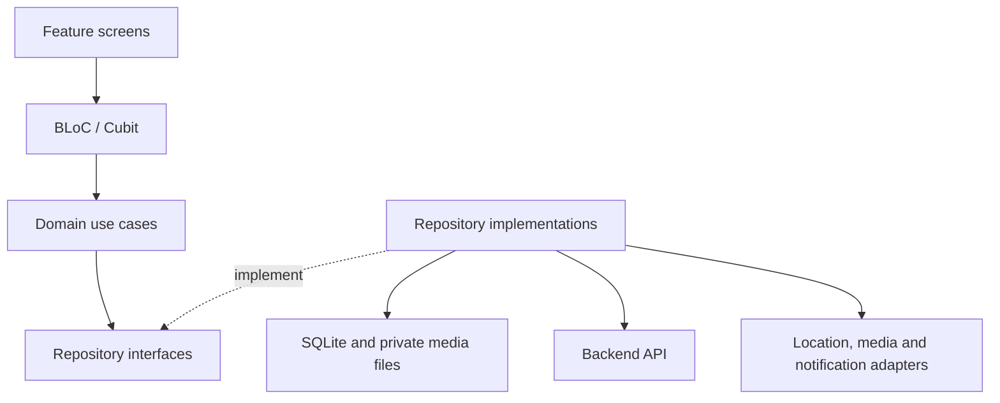
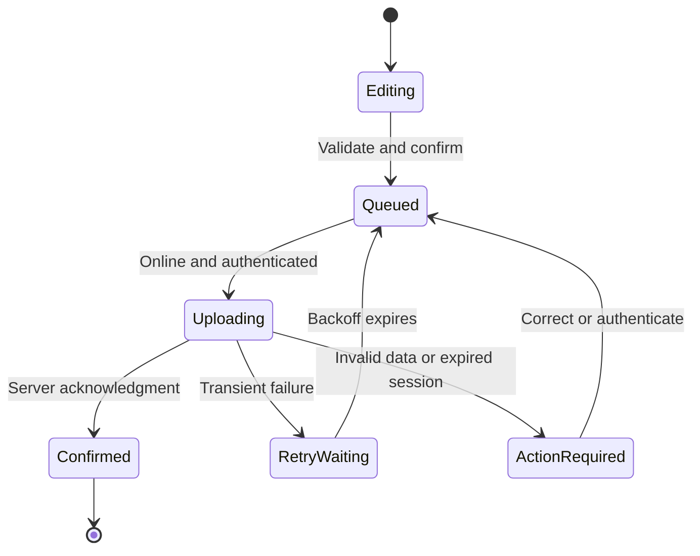

# CleanStreet AI — Flutter Citizen Mobile Application Architecture

**Status:** Proposed implementation design • **Version:** 1.0 • **Date:** 3 October 2026  
**Deliverable:** Citizen mobile architecture, state management, interactive location selection, offline drafts, and optimized photo uploads.

## 1. Purpose and scope

The citizen application enables a citizen to authenticate, photograph waste, select its location and category, review a report, submit it, and follow its progress. It also provides report history, notifications, completion photographs, and an optional rating.

This design assumes the CleanStreet workflow: **Submitted → Analyzed → Assigned → In Progress → Resolved**. These are backend report statuses. Local draft and upload states must never appear as confirmed backend statuses. AI classification, severity, priority, duplicate suggestions, assignments, and resolution decisions belong to backend/operator services.

The design covers Android and iOS. Video capture, worker tracking, and a full offline map download experience are outside the initial citizen release. Technology choices, limits, API routes, and performance targets below are proposals, not existing backend guarantees.

## 2. Architecture decisions

| Concern | Decision | Reason and tradeoff |
|---|---|---|
| Structure | Feature-first modules with presentation, domain, and data boundaries | Keeps changes within a feature and makes device/API dependencies replaceable. |
| State management | BLoC for submission workflows; Cubit for simpler screens | Explicit workflow events support retry and recovery. Riverpod is a valid alternative, but mixing two application state frameworks adds complexity. |
| Map | Google Maps through a provider adapter | Suitable for the initial interactive picker. Mapbox is the alternative if planned offline regions become a requirement. |
| Drafts and outbox | SQLite through Drift | Transactions, relational integrity, typed queries, and migrations suit draft/media/upload relationships. Hive remains an alternative for simple preferences or uncomplicated draft storage. |
| Networking | Dio behind repository interfaces | Central authentication, error translation, cancellation, and upload progress. |
| Photos | image_picker initially; optional camera adapter later | Simple camera/gallery capture. A custom live camera UI is only needed if capture guidance becomes a requirement. |
| Credentials | OS-backed secure storage, or auth SDK-managed persistence | Credentials do not belong in the draft database. |

Flutter's architecture guidance separates UI logic from repositories and services [1]. This design applies that separation with BLoC/Cubit instead of requiring a particular view-model implementation. All mutable report data flows through repositories.

## 3. Components and dependencies



Presentation depends on domain contracts. Data implementations depend on those contracts and platform/network services. Domain classes contain no Flutter widget, map-provider, database, or Dio types. The app composition root constructs dependencies and injects repository interfaces. Screens never query SQLite or call upload endpoints directly.

| Module | Responsibility |
|---|---|
| auth | Registration, login, password reset, session expiry, and account isolation. |
| report_creation | Photo, category, description, review, draft editing, and submission. |
| location_picker | GPS acquisition, map pin selection, coordinate confirmation, and permission states. |
| drafts | Resume/delete drafts and display queued or failed uploads. |
| report_history | Paginated server reports, cached history, and new-account empty state. |
| report_details | Server status timeline, completion image, and optional rating. |
| notifications | Permission, token registration, foreground handling, and authorized deep links. |
| core | HTTP configuration, error types, storage setup, design system, and device adapters. |

Suggested paths:

```text
lib/app/                         composition, routing, environment
lib/core/network/                Dio and auth interceptors
lib/core/storage/                database, migrations, media directories
lib/core/platform/               location, media, notifications
lib/core/theme/                  shared visual tokens
lib/features/<feature>/presentation/  screens, widgets, bloc or cubit
lib/features/<feature>/domain/        entities, contracts, use cases
lib/features/<feature>/data/          DTOs, sources, repository implementations
```

Shared code belongs in core only when multiple features need it. Format Dart at 80 characters. Maintain README setup instructions, architecture decisions, and API documentation; pin compatible package versions in the lockfile after verifying the team's Flutter/Dart and Android/iOS toolchains.

## 4. State management pattern

Use immutable state objects with explicit error and progress fields. BlocBuilder renders state; BlocListener handles one-time navigation and messages [2]. Widgets do not hold the authoritative draft. SQLite is the durable draft source; BLoC holds the active view state.

| Controller | Main inputs | State exposed |
|---|---|---|
| AuthCubit | Sign in/out, session changes | loading, authenticated, unauthenticated, failure |
| ReportEditorBloc | FieldChanged, PhotoSelected, LocationConfirmed, SaveDraft, SubmitRequested | draft snapshot, field errors, media state, save state, submission state |
| LocationPickerCubit | Locate, PinMoved, Confirm | permission state, GPS fix, selected coordinate, accuracy, failure |
| DraftsCubit | Observe drafts, delete, retry | account-scoped rows and upload summary |
| ReportHistoryCubit | Refresh, next page | loading, empty, data, stale cache, failure |
| ReportDetailsCubit | Open, refresh, rate | report, timeline, completion evidence, rating state |

Debounce description autosaves by a proposed 500 ms; persist category, confirmed location, and successfully imported media immediately. Serialize writes for each draft and reject stale async completions by draft revision. Prevent concurrent SubmitRequested handling for the same draft. A single SyncCoordinator owns upload scheduling across screens; navigating away does not destroy a pending submission.

Submission captures an immutable draft revision. Either lock that revision while queued or let further edits create a separate editable revision. Do not mutate the payload under an existing idempotency key.



## 5. Interactive map and location policy

Use google_maps_flutter behind a MapPicker adapter. It renders one waste-location marker and reports plain latitude/longitude values to the controller. Provider controllers remain in the presentation adapter and are disposed with the view. Configure Android/iOS Maps SDKs and restrict platform keys by application identity [3]. SDK keys are not secret server credentials; private provider credentials never ship in the app.

The picker requests foreground location only when the citizen chooses “Use my location.” Center on a fresh fix, show its accuracy, allow map tap or pin drag, and require “Confirm location.” Reverse geocoding provides an optional address label; its failure never invalidates valid coordinates. Avoid requesting background location.

Persist two distinct concepts:

| Field | Meaning |
|---|---|
| report_location | Citizen-confirmed waste coordinates, with source gps or manual_pin. |
| submission_device_location | Device GPS sampled when an online submission is confirmed, with accuracy and captured_at. |

Moving a pin must not overwrite device GPS. An old fix is labelled stale, not presented as current. Proposed freshness is at most 60 seconds; poor accuracy prompts another attempt or explicit review. Validate coordinate ranges and any backend-defined service area.

**Requirement decision:** The prior requirement calls for automatic GPS at submission. Under a strict interpretation, denied permission or unavailable GPS permits saving a draft but blocks final submission. Manual pin placement does not satisfy that requirement by itself. If the team approves a manual-only exception, implement it as an explicit policy and record its provenance.

An offline “Submit” action queues the citizen-confirmed draft; it does not mean the server has accepted it. Capture GPS when queued and preserve its timestamp. Do not silently replace that location with the citizen's later position during automatic synchronization. If truly fresh GPS at server submission is mandatory, pause synchronization and require the citizen to reopen, review, and confirm before uploading.

Google Maps basemap availability is not promised offline. GPS and already-saved coordinates can still be retained; when map tiles are unavailable, show coordinates and “Save draft,” not an empty map that appears usable. Mapbox supports planned offline downloads [4], but switching requires provider setup, download/storage policy, attribution, and current licensing review. Keep provider-specific tile caching out of the initial design.

## 6. Camera and media compression pipeline

The initial report requires one before-photo, a category, and a confirmed location; description is optional. Capture or choose a still image, preview it, and allow replacement before submission. Request camera/gallery permission only for the requested action. Handle cancellation without deleting an existing photo.

image_picker camera output can live in temporary cache, and Android can interrupt the picker activity [5]. Copy recovered/picked files into the application's private persistent directory immediately; run retrieveLostData during Android startup recovery and associate the recovered image with the pending draft capture record.

Pipeline:

1. **Import:** Copy to a temporary file in private storage; validate decodability, actual format, dimensions, and proposed input limits of 20 MB and 40 megapixels. Reject unsupported/corrupt images with a recapture option.
2. **Normalize:** Correct orientation, then resize without upscaling, preserving the whole image and aspect ratio. Avoid cropping evidence.
3. **Compress:** Produce JPEG initially at quality 80 and a longest edge of 1600 pixels. Treat these as tuning targets; some libraries expose minimum dimensions rather than a maximum-edge API, so compute dimensions explicitly and verify output.
4. **Bound:** Aim for at most 1.5 MB. Try quality 70 then 60, then a 1280-pixel edge. If the result still exceeds the backend's hard limit or loses useful detail, request a replacement; never silently upload invalid evidence.
5. **Sanitize and verify:** Remove EXIF metadata from the upload copy, including GPS, after baking orientation into pixels. Decode the output, verify dimensions, MIME type, byte count, and thumbnail. Record a SHA-256 digest. Test the selected plugin's metadata behavior rather than assuming an option strips every metadata block [6].
6. **Commit:** Atomically rename prepared files, then transactionally register their paths and checksum. Generate a small preview thumbnail, proposed 320-pixel edge. Keep the original until preparation succeeds; keep it through server acknowledgment for recoverability, then purge according to retention policy.
7. **Upload:** Stream from file, show progress, and retain local evidence until the server confirms acceptance.

Native compression uses the plugin's asynchronous API; CPU-heavy Dart decoding/hash work runs outside the UI isolate where supported. Process one photo at a time, use bounded decoded-image sizes, and avoid base64 payloads or reading full-resolution images repeatedly into widget memory. Decode preview images at thumbnail size. Native plugin support inside worker isolates must be verified rather than assumed.

Compression must be evaluated with the AI team against real waste photos. These defaults are not an accuracy guarantee; compare classifier results and human-readable detail before finalizing resolution/quality limits. The server independently checks type, size, decoding, authorization, and evidence association.

## 7. Offline storage and recovery

Use SQLite/Drift for metadata and private files for photo bytes. SQLite transactions support atomic metadata changes [7]; filesystem operations and database commits are not one shared transaction, so implement staged writes and recovery cleanup.

| Table | Key fields and constraints |
|---|---|
| drafts | id UUID PK, owner_id, revision, category_id nullable, description, report_lat/lng nullable, location_source, device_lat/lng nullable, accuracy_m nullable, location_captured_at, created_at, updated_at |
| draft_media | id UUID PK, draft_id FK, source_path, prepared_path, thumbnail_path, MIME, byte_count, width, height, sha256, preparation_state |
| outbox | id UUID PK, owner_id, draft_id FK, immutable revision/payload, unique idempotency_key, stage, attempt_count, next_attempt_at, lease_until, upload_reference nullable, server_report_id nullable, last_error_code |
| report_cache | owner_id + server_report_id composite PK, server payload, fetched_at |

Enforce account ownership in every query, foreign keys, and a uniqueness rule allowing only one active outbox operation per draft revision. Store timestamps in UTC. Incomplete drafts are valid; submission validation requires the final mandatory fields. Migrate schema versions explicitly and test upgrades with existing drafts.

“Saved” appears only after durable metadata/file writes finish. Save drafts without network access. The draft list allows resume, delete with confirmation, and explicit retry. Pending submissions display “Waiting to upload.” Cached history displays its last update time and does not invent new server statuses.

At startup: recover picker output, verify registered files, reconcile abandoned temporary files, and reset expired upload leases to retryable work. Missing media marks a draft as action required rather than submitting without evidence. If storage is full, retain the previous valid draft and show a clear failure; do not claim a successful save.

On logout, stop uploads and clear credential material. Keep pending drafts account-isolated and inaccessible to another login; offer deletion on explicit sign-out if appropriate. Re-login resumes only the same owner's queue. Drafts are device-local and are not guaranteed to survive uninstall. Retention duration, device backup exclusions, and whether encrypted database/media storage is required remain team privacy decisions. Never delete unsent drafts merely to enforce a cache quota.

## 8. Submission contract and synchronization

The following is a proposed backend contract to agree before implementation:

| Operation | Proposed contract |
|---|---|
| Initialize evidence upload | POST /api/v1/media/uploads; receive scoped upload URL/reference and accepted constraints. |
| Upload evidence | Upload prepared file using returned method/headers; refresh an expired URL safely. |
| Finalize report | POST /api/v1/reports with category, optional description, both location concepts, evidence reference, client_submission_id, and Idempotency-Key. |
| Reconcile uncertain response | Query by client_submission_id, or retry finalization using the same idempotency key. |
| Read reports | Account-authorized history/detail endpoints; server status is authoritative. |

Persist the outbox record and immutable payload in one transaction before network activity. Claim a job with a durable lease, upload the photo, persist the upload reference, then finalize the report. The backend must verify media ownership and atomically create/associate evidence with the report. Backend acknowledgment changes local state to confirmed and returns report_id plus Submitted status. AI processing proceeds asynchronously.

The server scopes idempotency to the authenticated owner, retains keys for a documented window, returns the same result for the same payload, and rejects key reuse with a different payload. This is a required backend capability, not something the Flutter app can guarantee alone. A timeout after report creation is reconciled before creating any new operation.

Use one active upload initially. Retry network failures, timeouts, rate limits, and suitable server errors with exponential backoff and jitter: proposed 2 seconds, 4 seconds, 8 seconds, up to 5 minutes; honor Retry-After. After a proposed five automatic attempts, require manual retry while retaining the draft. Authentication failure pauses work for reauthentication; validation errors require editing; oversized evidence returns to preparation. Do not retry every 4xx response.

Connectivity events trigger an attempt but do not prove the backend is reachable. Resume on app launch, foreground return, and explicit retry. Background execution is best effort under mobile OS restrictions; the UI must not promise synchronization while the app is terminated. Cancellation preserves the draft. Deleting a draft with an active transfer first stops the job; abandoned remote upload objects require backend expiry/cleanup.

## 9. Security, usability, and maintenance

Use HTTPS, secure credential handling, and a coordinated token refresh mechanism if the backend issues refreshable tokens. The team's Firebase Auth or backend-token decision must be settled behind AuthRepository; do not implement competing session authorities. Server access control enforces ownership for reports, media, and ratings.

Avoid logging tokens, upload URLs, photos, descriptions, or exact coordinates. Log opaque operation IDs, stage, duration, byte count, retry count, and sanitized error codes. Restrict notification deep links to authorized report reads. Notification payloads prompt a refresh; they do not directly set trusted report status.

Support readable text scaling, semantic labels, Arabic/English localization and RTL layouts if required, clear offline banners, accessible location confirmation, and explicit upload progress. Use layout constraints and responsive widgets rather than globally scaling every size from a fixed design canvas.

Keep API DTO mapping in data modules, use /api/v1, and document future breaking changes through versioned endpoints. Follow feature branches, reviewed PRs, and the team's develop/main strategy. Unit-test domain and workflow logic; track the proposed project minimum of 40% unit coverage while prioritizing critical flows over coverage alone.

## 10. Verification and acceptance criteria

| Scenario | Acceptance evidence |
|---|---|
| Offline editing and restart | Photo/category/description/location restore after process death; incomplete drafts remain editable. |
| Picker interruption | Android lost-data recovery attaches the image to the correct draft without duplication. |
| GPS failure | Draft saving works; final submission follows the documented strict-GPS or approved fallback policy. |
| Pin adjustment | Waste coordinates change while captured device coordinates and timestamp remain distinct. |
| Compression | Portrait/landscape and supported HEIC inputs render upright; output preserves framing, stays within agreed limits, and contains no GPS EXIF. |
| Retry after ambiguous timeout | Backend creates one report for the stable submission ID across multiple attempts. |
| Crash during upload | Startup recovers the lease/reference and safely resumes or reconciles the operation. |
| Account switch | The second account cannot read or upload the first account's drafts. |
| Storage/migration failure | No false saved indicator, silent evidence loss, or destructive schema upgrade. |
| Server history | New users see an empty state; local queued drafts do not appear as Submitted server reports. |
| Performance | On an agreed mid-range physical device, scrolling and editing remain responsive during compression/upload; measure memory and preparation time with representative photos. |

Use unit tests for validation, BLoC transitions, retry classification, and location policy; database integration tests for migrations/transactions; API contract tests for idempotency and media ownership; physical-device tests for camera permissions, map behavior, process death, large photos, and constrained networks.

## 11. Implementation sequence and open decisions

1. Agree location semantics, strict GPS behavior, media limits, authentication authority, and idempotency/API contracts.
2. Build module boundaries, authentication, SQLite migrations, draft editor, and durable photo import.
3. Add interactive map picking and media preparation, including recovery paths.
4. Implement durable outbox, authenticated upload, reconciliation, and server history/details.
5. Add notifications, completion evidence/rating, localization, and critical-flow verification.

Before implementation sign-off, assign owners for backend upload expiry, key retention, draft retention/encryption, map-provider configuration and budget, and AI compression validation. Offline drafts are included in the initial scope; full offline maps are a separate decision.

## 12. Primary technical references

Documentation reviewed 3 October 2026. Package versions are deliberately not prescribed until SDK compatibility is checked.

1. Flutter — [Guide to app architecture](https://docs.flutter.dev/app-architecture/guide).
2. Bloc — [Flutter Bloc concepts](https://bloclibrary.dev/flutter-bloc-concepts/).
3. Google — [Set up a Flutter Maps project](https://developers.google.com/maps/flutter-package/config).
4. Mapbox — [Flutter offline map example](https://docs.mapbox.com/flutter/maps/examples/offline/).
5. Flutter image_picker — [Maintainer package documentation](https://pub.dev/packages/image_picker).
6. flutter_image_compress — [Maintainer repository and supported options](https://github.com/fluttercandies/flutter_image_compress).
7. SQLite — [Atomic commit](https://www.sqlite.org/atomiccommit.html).
