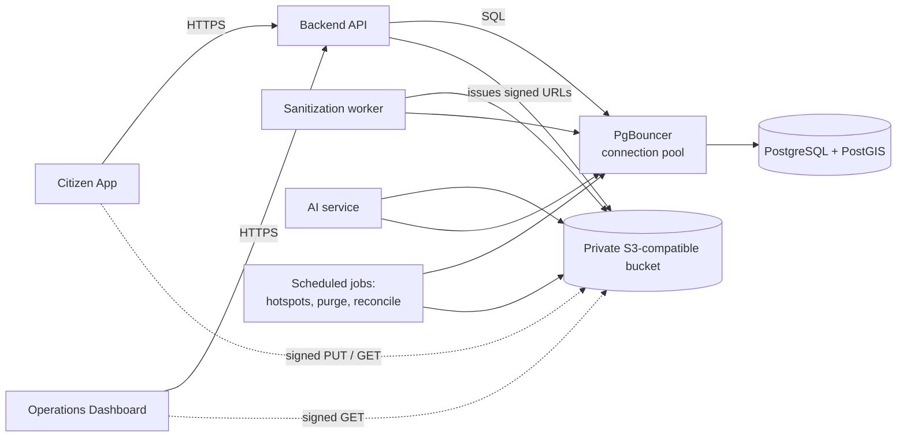
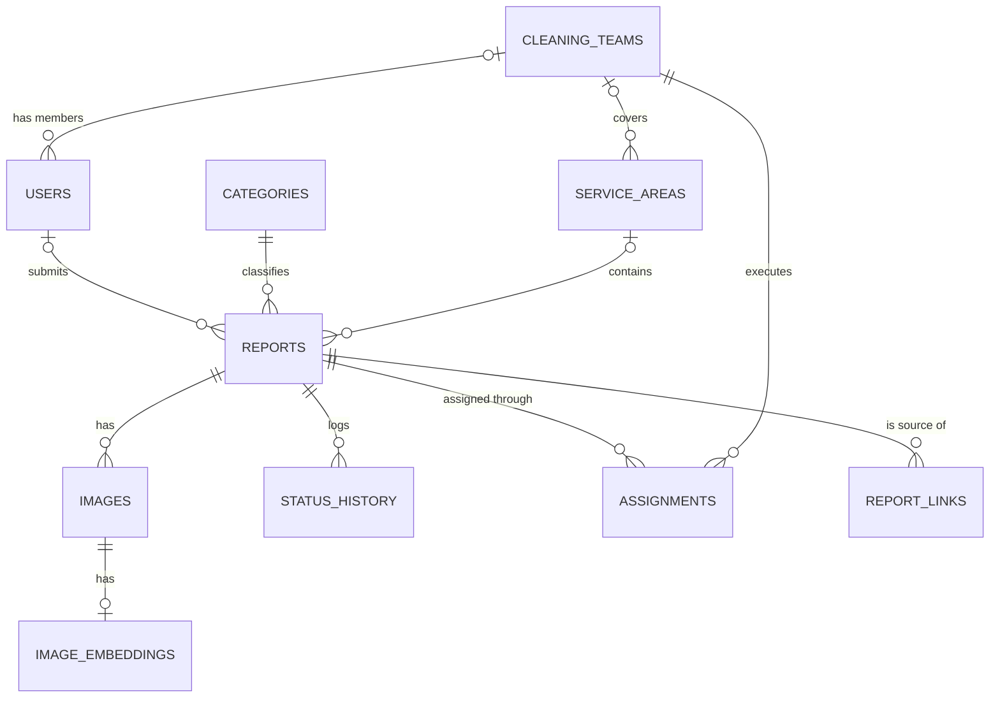
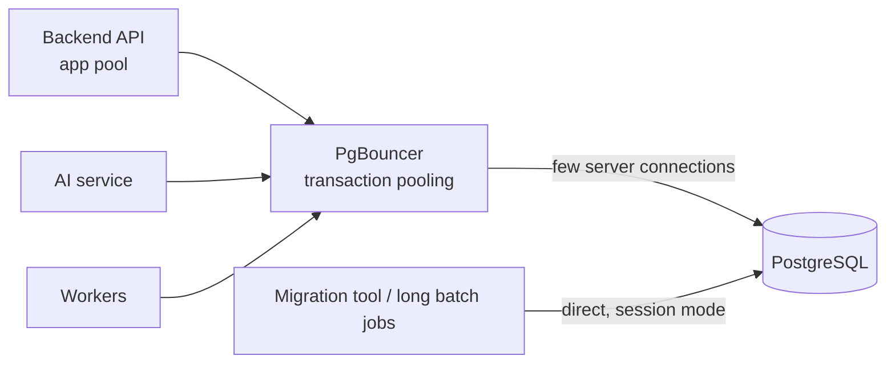
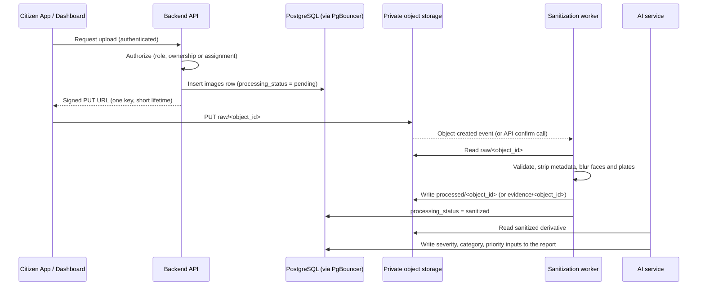
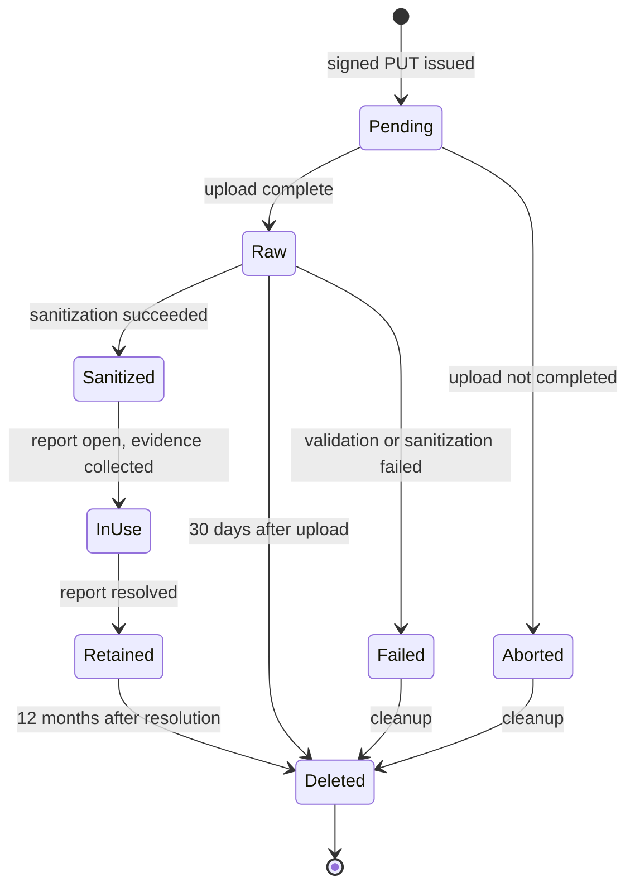

# Data Tier, PostGIS Spatial & Object Storage Architecture

## 1. Purpose and Scope

### 1.1 Purpose

This document defines the architecture of the CleanStreet AI **data tier**:

1. The **PostgreSQL relational schemas** and the entity relationships between them.
2. The **PostGIS geometry types and spatial indexing strategy** (GiST, `ST_DWithin`) that support geofencing, proximity lookups, duplicate detection, and hotspot analysis.
3. **Connection pooling** between the application services and the database.
4. The **private, S3-compatible object storage** architecture for evidence image ingestion, in line with **ADR-003**, including the full lifecycle of a media bucket.

It turns the data architecture of the Project Proposal (Section 14 technology, Section 15 data architecture, Section 11 analytics features) into an implementable specification.

### 1.2 Scope

In scope: schemas, tables, constraints, spatial columns and indexes, query patterns, database roles, connection pooling, backup and recovery, bucket layout, ingestion flow, signed URL use, and bucket lifecycle.

Out of scope: authentication and role definitions (T_85ab37, Authentication & RBAC Specification), the privacy rules for masking, coordinate obfuscation, and signed URL lifetimes (see the Data Privacy, Anonymization, and Storage Access Policy in `docs/requirements/security-requirements/`), AI model design, and mobile or dashboard UI. This document applies those documents at the data-tier level and does not redefine them.

### 1.3 Design principles

| Principle | Consequence in the data tier |
|---|---|
| **One queryable record per incident** | The AI result is written back into the report row, so analytics and duplicate detection stay in one place (Proposal, Section 15.1). |
| **Right store for the data** | Structured and spatial data live in PostgreSQL + PostGIS; images live in object storage and the database keeps only a reference. |
| **Private by default** | No public database endpoint and no public bucket access. Media is reached only through short-lived signed URLs. |
| **Spatial work in the database** | Distance, containment, and clustering run in PostGIS with spatial indexes, not in application code. |
| **Resolve once, read cheaply** | Geofence membership and public grid cells are computed at write time and stored, so reads avoid spatial joins. |
| **Least privilege** | Each service connects with its own database role and its own storage identity. |

---

## 2. Architecture Overview



| Component | Role in the data tier |
|---|---|
| **Backend API** | The only component clients talk to. Authorizes every request, reads and writes the database, and signs storage URLs. |
| **PgBouncer** | Pools and multiplexes database connections (Section 5). |
| **PostgreSQL + PostGIS** | System of record for users, reports, assignments, status history, spatial zones, and hotspots. |
| **Private object storage** | Holds raw originals, sanitized derivatives, and completion evidence. |
| **Sanitization worker** | Validates uploads, strips metadata, blurs faces and plates, and writes derivatives (Section 6.3). |
| **AI service** | Reads sanitized images from storage and writes analysis results back to the report row. |
| **Scheduled jobs** | Hotspot clustering, retention purge, and storage reconciliation. |

**Key technology decisions**

| Decision | Choice | Reason |
|---|---|---|
| Relational database | PostgreSQL 15 or later | Mature, supports PostGIS, partial indexes, declarative partitioning. |
| Spatial extension | PostGIS 3.x | Required for `ST_DWithin`, GiST indexing, `ST_ClusterDBSCAN`, as already chosen in the Proposal. |
| Object storage interface | **S3-compatible API** (Amazon S3, or a compatible store such as MinIO) | Matches the task and ADR-003 requirement for private S3-compatible storage. Firebase Storage, listed as an alternative in the Proposal, is not S3-compatible and is not used by this tier. |
| Authentication provider | Firebase Authentication (Proposal, Section 13) | The database stores only the provider's user ID, never credentials. |
| Connection pooling | PgBouncer in transaction mode | Many short backend requests, few long-lived sessions. |

---

## 3. PostgreSQL Relational Architecture

### 3.1 Schemas

The database is divided into PostgreSQL schemas so that privileges can be granted per concern and personal data is isolated.

| Schema | Contents | Sensitivity |
|---|---|---|
| `identity` | `users` (name, email, role, team membership) | Confidential (PII) |
| `core` | `categories`, `cleaning_teams`, `reports`, `images`, `status_history`, `assignments`, `report_links`, `image_embeddings` | Mixed (see privacy policy classification) |
| `geo` | `service_areas`, `hotspots` | Internal |
| `audit` | `access_log` (append-only, partitioned by month) | Restricted |
| `analytics` | Read-only views and materialized views for dashboards and reporting | Internal / derived |

### 3.2 Entity relationships

The seven tables of the Proposal (Section 15.2) are kept with the same names and purposes. Five tables are added to support geofencing, duplicate detection, hotspot analysis, and auditing: `service_areas`, `hotspots`, `report_links`, `image_embeddings`, and `audit.access_log`.



| Relationship | Cardinality | Notes |
|---|---|---|
| User → Reports | 0..1 to 0..N | `reports.user_id` is nullable: when an account is deleted the report is kept and unlinked (privacy policy, Section 10.3). |
| Category → Reports | 1 to 0..N | Fixed list of waste/issue types. |
| Service area → Reports | 0..1 to 0..N | Resolved at write time. `NULL` means the report is outside every active service area. |
| Report → Images | 1 to 1..N | One report holds the citizen's photo and later the team's completion evidence (`image_type`). |
| Report → Status history | 1 to 1..N | One row per status change, written by trigger. |
| Report → Assignments | 1 to 0..N | A report can be assigned again after rework; only one assignment may be open at a time. |
| Team → Assignments | 1 to 0..N | |
| Team → Service areas | 0..1 to 0..N | A team can own several polygons. Pilot boundaries have no team. |
| Team → Users | 0..1 to 0..N | Cleaning Team members belong to one team. |
| Report → Report links | 1 to 0..N | Suggested duplicate or related reports for operator review. |
| Image → Embedding | 1 to 0..1 | Reused feature embedding for duplicate detection. |

### 3.3 Table definitions

Primary keys are UUIDs (`gen_random_uuid()`), so internal identifiers are not sequential or guessable. Timestamps are `timestamptz` in UTC.

```sql
CREATE EXTENSION IF NOT EXISTS postgis;

CREATE SCHEMA identity;
CREATE SCHEMA core;
CREATE SCHEMA geo;
CREATE SCHEMA audit;
CREATE SCHEMA analytics;

-- Enumerated types
CREATE TYPE identity.user_role AS ENUM
  ('citizen', 'operator', 'cleaning_team_member', 'administrator');

CREATE TYPE core.report_status AS ENUM
  ('submitted', 'acknowledged', 'assigned', 'in_progress',
   'awaiting_verification', 'resolved', 'rejected');

CREATE TYPE core.image_type AS ENUM ('before', 'after');

CREATE TYPE core.processing_status AS ENUM
  ('pending', 'sanitized', 'failed');
```

```sql
-- CORE: reference data and teams
CREATE TABLE core.categories (
  id    smallint GENERATED ALWAYS AS IDENTITY PRIMARY KEY,
  name  text NOT NULL UNIQUE
);

CREATE TABLE core.cleaning_teams (
  id          uuid PRIMARY KEY DEFAULT gen_random_uuid(),
  name        text NOT NULL UNIQUE,
  created_at  timestamptz NOT NULL DEFAULT now()
);

-- IDENTITY
CREATE TABLE identity.users (
  id          uuid PRIMARY KEY DEFAULT gen_random_uuid(),
  auth_uid    text NOT NULL UNIQUE,            -- Firebase Authentication user ID
  name        text,
  email       text NOT NULL UNIQUE,
  role        identity.user_role NOT NULL DEFAULT 'citizen',
  team_id     uuid REFERENCES core.cleaning_teams(id),  -- cleaning team members only
  created_at  timestamptz NOT NULL DEFAULT now(),
  CHECK (team_id IS NULL OR role = 'cleaning_team_member')
);

-- GEO: geofences
CREATE TABLE geo.service_areas (
  id          uuid PRIMARY KEY DEFAULT gen_random_uuid(),
  team_id     uuid REFERENCES core.cleaning_teams(id),
  name        text NOT NULL,
  kind        text NOT NULL CHECK (kind IN ('pilot_boundary', 'team_service_area')),
  geom        geometry(MultiPolygon, 4326) NOT NULL,
  active      boolean NOT NULL DEFAULT true,
  created_at  timestamptz NOT NULL DEFAULT now(),
  CHECK (ST_IsValid(geom))
);
```

```sql
-- CORE: the central table
CREATE TABLE core.reports (
  id                      uuid PRIMARY KEY DEFAULT gen_random_uuid(),
  public_ref              text NOT NULL UNIQUE,   -- random, non-sequential public reference
  user_id                 uuid REFERENCES identity.users(id) ON DELETE SET NULL,
  category_id             smallint NOT NULL REFERENCES core.categories(id),
  service_area_id         uuid REFERENCES geo.service_areas(id),

  -- precise location (Restricted); metres-based proximity via geography
  location                geography(Point, 4326) NOT NULL,
  location_generalized_at timestamptz,            -- set when precision is reduced (retention)

  -- derived public fields (see privacy policy, Section 7)
  privacy_tier            smallint NOT NULL DEFAULT 1 CHECK (privacy_tier IN (1, 2)),
  public_cell_id          text,
  public_location         geography(Point, 4326),

  description             text,

  -- AI results written back into the report (Proposal, Figure 4)
  severity_score          numeric(6,4),
  priority_score          numeric(6,4),
  ai_waste_counts         jsonb,
  ai_model_version        text,
  analyzed_at             timestamptz,

  current_status          core.report_status NOT NULL DEFAULT 'submitted',
  created_at              timestamptz NOT NULL DEFAULT now(),
  updated_at              timestamptz NOT NULL DEFAULT now(),
  resolved_at             timestamptz
);
```

```sql
-- CORE: media references (the file itself lives in object storage)
CREATE TABLE core.images (
  id                 uuid PRIMARY KEY DEFAULT gen_random_uuid(),
  report_id          uuid NOT NULL REFERENCES core.reports(id) ON DELETE CASCADE,
  object_id          uuid NOT NULL UNIQUE,        -- shared by the raw and processed copies
  storage_url        text NOT NULL,               -- private object key only, never a URL (see 6.2)
  image_type         core.image_type NOT NULL,
  processing_status  core.processing_status NOT NULL DEFAULT 'pending',
  content_type       text,
  size_bytes         bigint,
  uploaded_by        uuid REFERENCES identity.users(id) ON DELETE SET NULL,
  uploaded_at        timestamptz NOT NULL DEFAULT now()
);

CREATE TABLE core.image_embeddings (
  image_id       uuid PRIMARY KEY REFERENCES core.images(id) ON DELETE CASCADE,
  model_version  text NOT NULL,
  embedding      real[] NOT NULL
);

-- CORE: audit of status changes (Proposal, Section 15.2)
CREATE TABLE core.status_history (
  id          bigint GENERATED ALWAYS AS IDENTITY PRIMARY KEY,
  report_id   uuid NOT NULL REFERENCES core.reports(id) ON DELETE CASCADE,
  status      core.report_status NOT NULL,
  changed_at  timestamptz NOT NULL DEFAULT now(),
  changed_by  uuid REFERENCES identity.users(id) ON DELETE SET NULL
);

-- CORE: assignment of reports to teams
CREATE TABLE core.assignments (
  id            uuid PRIMARY KEY DEFAULT gen_random_uuid(),
  report_id     uuid NOT NULL REFERENCES core.reports(id) ON DELETE CASCADE,
  team_id       uuid NOT NULL REFERENCES core.cleaning_teams(id),
  assigned_by   uuid REFERENCES identity.users(id) ON DELETE SET NULL,
  assigned_at   timestamptz NOT NULL DEFAULT now(),
  completed_at  timestamptz
);

-- CORE: suggested duplicate / related reports (operator decides)
CREATE TABLE core.report_links (
  report_id          uuid NOT NULL REFERENCES core.reports(id) ON DELETE CASCADE,
  related_report_id  uuid NOT NULL REFERENCES core.reports(id) ON DELETE CASCADE,
  distance_m         real,
  similarity         real,
  decision           text NOT NULL DEFAULT 'suggested'
                     CHECK (decision IN ('suggested', 'confirmed', 'dismissed')),
  decided_by         uuid REFERENCES identity.users(id) ON DELETE SET NULL,
  decided_at         timestamptz,
  PRIMARY KEY (report_id, related_report_id),
  CHECK (report_id <> related_report_id)
);

-- GEO: output of the hotspot job
CREATE TABLE geo.hotspots (
  id            bigint GENERATED ALWAYS AS IDENTITY PRIMARY KEY,
  run_id        uuid NOT NULL,
  computed_at   timestamptz NOT NULL DEFAULT now(),
  window_start  timestamptz NOT NULL,
  window_end    timestamptz NOT NULL,
  report_count  integer NOT NULL,
  centroid      geometry(Point, 4326) NOT NULL,
  extent        geometry(Polygon, 4326),
  params        jsonb NOT NULL            -- eps, minpoints, metric SRID used
);

-- AUDIT: access log (append-only), partitioned by month for 12-month retention
CREATE TABLE audit.access_log (
  id           bigint GENERATED ALWAYS AS IDENTITY,
  occurred_at  timestamptz NOT NULL DEFAULT now(),
  actor_id     uuid,
  actor_role   text,
  action       text NOT NULL,
  object_type  text,
  object_id    uuid,
  result       text NOT NULL CHECK (result IN ('allowed', 'denied')),
  source       text,
  PRIMARY KEY (id, occurred_at)
) PARTITION BY RANGE (occurred_at);
```

**Mapping to the Proposal's ERD.** `REPORTS.latitude/longitude` is replaced by one `geography(Point, 4326)` column, which keeps the same information and enables spatial indexing. `CLEANING_TEAMS.area` is represented by `geo.service_areas`, so a team can cover several polygons. `IMAGES.storage_url` keeps its name and holds only the private object key.

### 3.4 Integrity rules

| Rule | Mechanism |
|---|---|
| Only one open assignment per report | `CREATE UNIQUE INDEX ... ON core.assignments (report_id) WHERE completed_at IS NULL;` |
| Status history is complete and tamper-resistant | A trigger on `core.reports` inserts a `status_history` row in the **same transaction** whenever `current_status` changes. The application role has no `UPDATE` or `DELETE` on `status_history`. |
| `updated_at` is always correct | `BEFORE UPDATE` trigger on `core.reports`. |
| Valid geometry | `ST_IsValid` check on zones; `geography` rejects out-of-range coordinates. |
| Service area is resolved once | The backend sets `service_area_id` when a report is created (Section 4.4). A maintenance job re-resolves it if a boundary changes. |
| Report lifecycle transitions | Which role may move a report from one status to the next is enforced by the backend according to T_85ab37. The database stores the result and the history. |
| Schema changes | Applied only through a versioned migration tool, run with a dedicated migration role, never from application code. |

### 3.5 Database roles and privileges

Each service connects with its own role and holds only the privileges below. Passwords or certificates come from the secrets manager (never from source code).

| Role | Used by | Privileges |
|---|---|---|
| `app_backend` | Backend API | `SELECT/INSERT/UPDATE` on `core`, `geo`, `identity`; `INSERT` on `audit.access_log`; **no** `UPDATE/DELETE` on `core.status_history`; no DDL |
| `ai_service` | AI service | `SELECT` on `core.images` (id, report_id, storage_url, processing_status) and `core.reports` (id, category_id); column-level `UPDATE` only on the AI result columns of `core.reports`; **no access** to `identity` |
| `analytics_ro` | Dashboards, reporting | `SELECT` on `analytics` views only; no direct table access |
| `worker` | Sanitization worker, scheduled jobs | `UPDATE` on `core.images.processing_status`; read/write on `geo.hotspots`; retention functions |
| `migration_admin` | Migration tool | DDL; used only during deployments |

```sql
GRANT UPDATE (severity_score, priority_score, ai_waste_counts, ai_model_version, analyzed_at)
  ON core.reports TO ai_service;
REVOKE UPDATE, DELETE ON core.status_history FROM app_backend;
```

Access decisions for citizens, operators, and cleaning teams are made by the backend (T_85ab37). PostgreSQL row-level security can be added later as defense in depth; because PgBouncer runs in transaction mode, any per-request setting must then be applied with `SET LOCAL` inside the transaction.

---

## 4. PostGIS Spatial Architecture

### 4.1 Type decisions

| Question | Decision | Reason |
|---|---|---|
| Report location type | `geography(Point, 4326)` | Distances and `ST_DWithin` radii are in **metres**, which is what proximity and duplicate rules need. |
| Zone (geofence) type | `geometry(MultiPolygon, 4326)` | Polygon containment (`ST_Covers`) is the classic geometry use case and the zone table is small. |
| Clustering | `geometry` transformed into a **metric projected CRS** at query time | `ST_ClusterDBSCAN` measures `eps` in the units of the coordinate system; in SRID 4326 that would be degrees. |
| Coordinate order | Always **longitude, latitude** (`ST_MakePoint(lon, lat)`) | `ST_MakePoint` takes x = longitude first; reversing it is a common error. |
| Metric SRID | Configured per deployment as `app.metric_srid`, a projected CRS covering the pilot area (for example UTM zone 36N, EPSG:32636, for the Cairo/Fayoum region) | Egypt spans more than one UTM zone, so the value is a setting, not a constant. |

### 4.2 Spatial columns

| Table.column | Type | Purpose | Visibility |
|---|---|---|---|
| `core.reports.location` | `geography(Point, 4326)` | Precise report location | Restricted (privacy policy) |
| `core.reports.public_location` | `geography(Point, 4326)` | Coarsened location for public views | Public (derived) |
| `core.reports.public_cell_id` | `text` | Grid cell used for public aggregates | Public (derived) |
| `geo.service_areas.geom` | `geometry(MultiPolygon, 4326)` | Team service areas and pilot boundary | Internal |
| `geo.hotspots.centroid`, `extent` | `geometry(Point/Polygon, 4326)` | Hotspot results | Internal |

### 4.3 Spatial indexing strategy

Spatial queries use **GiST** (Generalized Search Tree) indexes. A GiST index on a `geography` or `geometry` column lets `ST_DWithin` and bounding-box operators skip most rows instead of scanning the table.

```sql
-- Proximity and duplicate detection
CREATE INDEX idx_reports_location_gist
  ON core.reports USING GIST (location);

-- Geofence lookup (small table, but required for containment queries)
CREATE INDEX idx_service_areas_geom_gist
  ON geo.service_areas USING GIST (geom);

-- Public map: bounding-box queries on coarsened data only
CREATE INDEX idx_reports_public_location_gist
  ON core.reports USING GIST (public_location)
  WHERE public_location IS NOT NULL;
```

Rules for writing spatial queries so the index is used:

- Use **`ST_DWithin(a, b, metres)`** for "within distance" tests. It is index-aware. `ST_Distance(a, b) < x` is not, and must not be used as a filter.
- Order nearest-first with the **`<->` distance operator** (KNN) combined with `LIMIT`, so the index returns neighbours in order.
- Keep the indexed column **bare** on one side of the predicate. Wrapping it in a function (for example `ST_Transform(location::geometry, ...)`) prevents use of `idx_reports_location_gist`.
- Do clustering and other metric-CRS work in **batch jobs**, not on request paths.

**Non-spatial indexes** (the first three come from Proposal Section 15.3):

| Index | Table | Purpose |
|---|---|---|
| `(current_status)` | `core.reports` | Dashboard filtering by status |
| `(created_at)` | `core.reports` | Chronological ordering and analytics |
| GiST on `location` | `core.reports` | Spatial search (above) |
| `(priority_score DESC, created_at) WHERE current_status NOT IN ('resolved','rejected')` | `core.reports` | Dashboard ranking of open reports; partial index stays small |
| `(service_area_id, current_status)` | `core.reports` | A team's or area's reports without a spatial join |
| `(user_id, created_at DESC)` | `core.reports` | A citizen's report history |
| `(public_cell_id)` | `core.reports` | Public aggregation by cell |
| `(report_id)` | `core.images`, `core.assignments`, `core.report_links` | Foreign key lookups |
| `(report_id, changed_at)` | `core.status_history` | Timeline and response-time analytics |
| `(team_id) WHERE completed_at IS NULL` | `core.assignments` | Operator workload balance |
| `(processing_status, uploaded_at) WHERE processing_status = 'pending'` | `core.images` | Reconciliation of stuck uploads |

For very large, time-ordered volumes a BRIN index on `created_at` is an option; with pilot-scale data a standard B-tree is sufficient.

### 4.4 Query patterns

**Geofencing: which service area contains a new report** (run once at insert; the result is stored in `service_area_id`).

```sql
SELECT id, team_id
FROM geo.service_areas
WHERE active
  AND ST_Covers(geom, ST_SetSRID(ST_MakePoint(:lon, :lat), 4326));
```

If a point falls in no active `pilot_boundary`, the report is stored with `service_area_id = NULL` and flagged as outside coverage for operator review. A team's reports are then read with the plain index `(service_area_id, current_status)` and no spatial join.

**Proximity: nearby recent reports** (duplicate and related-report candidates, Proposal Section 11, Tier 3).

```sql
SELECT r.id,
       ST_Distance(r.location, p.g) AS distance_m
FROM core.reports r,
     (SELECT ST_SetSRID(ST_MakePoint(:lon, :lat), 4326)::geography AS g) p
WHERE ST_DWithin(r.location, p.g, :radius_m)
  AND r.created_at >= now() - make_interval(days => :window_days)
  AND r.id <> :new_report_id
ORDER BY r.location <-> p.g
LIMIT 20;
```

The result is a small candidate set. Only these candidates are compared by image-embedding similarity, and matches are inserted into `core.report_links` as `suggested` for the operator to confirm or dismiss. Default parameters (`:radius_m` = 50, `:window_days` = 14) are provisional and held in configuration.

**Hotspots: density clustering** (scheduled job, results stored in `geo.hotspots`).

```sql
INSERT INTO geo.hotspots
  (run_id, window_start, window_end, report_count, centroid, extent, params)
SELECT :run_id, :window_start, :window_end, count(*),
       ST_Centroid(ST_Collect(g)),
       ST_ConvexHull(ST_Collect(g)),
       jsonb_build_object('eps_m', :eps_m, 'minpoints', :minpoints,
                          'metric_srid', :metric_srid)
FROM (
  SELECT location::geometry AS g,
         ST_ClusterDBSCAN(ST_Transform(location::geometry, :metric_srid),
                          eps := :eps_m, minpoints := :minpoints) OVER () AS cid
  FROM core.reports
  WHERE created_at >= :window_start
) c
WHERE cid IS NOT NULL
GROUP BY cid;
```

Provisional defaults: `eps_m` = 75, `minpoints` = 3, window = 90 days. The job runs on a schedule (for example every 15 minutes during the pilot), not per request. Hotspots appear only after enough reports have accumulated, as the Proposal notes (Section 12.4).

**Other analytics.** The remaining Proposal features (area statistics, area burden score, resolution rate, resolution performance, operator workload, SLA-breach flag) are implemented as views or materialized views in the `analytics` schema over `core.reports`, `core.assignments`, and `core.status_history`. Materialized views are refreshed by a scheduled job with `REFRESH MATERIALIZED VIEW CONCURRENTLY`, which requires a unique index on each view.

### 4.5 Public coordinates and grid cells

`public_cell_id` and `public_location` are computed **once, when the report is created** (and again only if its privacy tier changes), by a database function that snaps the point to the grid in the metric CRS. Cell sizes (250 m standard, 1 km sensitive), deterministic jitter, and the k = 3 small-cell rule are defined in the privacy policy, Section 7, and are not repeated here. Public views read only `public_cell_id` / `public_location` through `analytics` views, never `location`.

### 4.6 Index maintenance and validation

- Create indexes on large tables with `CREATE INDEX CONCURRENTLY` to avoid blocking writes.
- Keep autovacuum enabled. After a bulk import or boundary change, run `ANALYZE` on the affected tables so the planner has current statistics.
- Validate every spatial query with `EXPLAIN (ANALYZE, BUFFERS)`: the plan must show an `Index Scan` or `Bitmap Index Scan` using the GiST index, not a sequential scan.
- Load-test with synthetic data (for example 100,000 random points inside the pilot boundary generated with `generate_series`) and re-run the checks in Section 9.

---

## 5. Connection Pooling

Many short backend requests, a few long-running jobs, and several services all need the database. PostgreSQL creates one process per connection, so connections are limited and pooled.



### 5.1 Design

| Item | Decision |
|---|---|
| Pooler | **PgBouncer**, one instance in front of the database, version 1.21 or later |
| Mode | **Transaction pooling** for the backend, AI service, and workers |
| Direct connections | Migrations and long batch jobs (hotspot clustering, large purges) use a separate database alias in **session mode** or connect directly |
| Separate users | The pooler keeps separate pools per database role (Section 3.5), so one service cannot starve another |
| TLS | TLS between clients and PgBouncer, and between PgBouncer and PostgreSQL |
| Application pools | Each service keeps a small client-side pool pointing at PgBouncer; PgBouncer does the multiplexing |

### 5.2 Reference configuration (provisional)

```ini
[databases]
cleanstreet      = host=postgres port=5432 dbname=cleanstreet
cleanstreet_jobs = host=postgres port=5432 dbname=cleanstreet pool_mode=session

[pgbouncer]
pool_mode               = transaction
auth_type               = scram-sha-256
max_client_conn         = 500
default_pool_size       = 20
reserve_pool_size       = 5
max_prepared_statements = 100
server_idle_timeout     = 600
query_wait_timeout      = 30
client_tls_sslmode      = require
server_tls_sslmode      = verify-full
```

PostgreSQL side (starting points, tuned during the pilot):

```
max_connections                         = 100
idle_in_transaction_session_timeout     = 30s
statement_timeout                       = 15s    # per role; batch roles get a higher value
log_min_duration_statement              = 500ms
```

**Sizing rule.** Total server connections used by all pools must stay below `max_connections` with headroom for administration and migrations. A common starting point for a pool is roughly twice the number of CPU cores of the database server; increase only if pool-wait metrics show queuing.

### 5.3 Transaction-mode constraints

In transaction pooling a client may use a different server connection on each transaction. Therefore:

- Do not rely on session state: `SET` without `LOCAL`, session-level advisory locks, temporary tables across transactions, and `LISTEN/NOTIFY` do not work reliably through the pool.
- Prepared statements require PgBouncer 1.21 or later with `max_prepared_statements` set (as above); otherwise client drivers must disable server-side prepared statements.
- Anything that needs a session (migrations, `LISTEN`, long batch jobs) uses the `cleanstreet_jobs` alias or a direct connection.

### 5.4 Monitoring

Watch PgBouncer's waiting-client count, average wait time, and pool usage; PostgreSQL's active connections, `pg_stat_statements`, and slow-query log. Rising client wait time with idle server connections points to pool configuration; rising query time points to indexing or load.

---

## 6. Private Object Storage Architecture (ADR-003)

### 6.1 Decisions

| Item | Decision |
|---|---|
| Interface | S3-compatible API |
| Exposure | **Private**. No public read, list, or write; no public bucket policy. |
| Buckets | One bucket per environment (for example `cleanstreet-<env>-media`) with three prefixes: `raw/`, `processed/`, `evidence/` |
| Client access | Only through backend-issued **signed URLs**; clients hold no storage credentials |
| Service access | Each service has its own storage identity with prefix-scoped permissions |
| Encryption | At rest with provider-managed keys (customer-managed where available); in transit with TLS 1.2 or later, enforced by bucket policy |
| Versioning | **Off.** Versioning would keep deleted copies, which conflicts with the retention rules. If the provider enforces it, a lifecycle rule expires noncurrent versions after 1 day. |

Where ADR-003 specifies a different storage mechanism, lifetime, or layout, ADR-003 governs and this section is amended to match.

### 6.2 Layout and keys

| Prefix | Contents | Written by | Read by |
|---|---|---|---|
| `raw/` | Unmodified uploads (Restricted) | Citizen or cleaning-team member through a signed PUT | Sanitization worker; permitted raw-media reviewers through short signed GET |
| `processed/` | Sanitized report photos | Sanitization worker | Backend (signing GET), AI service |
| `evidence/` | Sanitized completion evidence | Cleaning team via signed PUT into `raw/` then sanitized into `evidence/` | Backend (signing GET), AI service if needed |

- Keys are `<prefix>/<object_id>` where `object_id` is a random UUIDv4. The key contains no user, report, location, or time information, and the raw and processed copies of one image share the same `object_id`.
- `core.images.storage_url` stores the key of the stored object (for example `processed/<object_id>`). It is **never** a signed URL, a public link, or a long-lived token.
- Object metadata and tags carry no personal data. Allowed tags: `image_type`, `environment`.

### 6.3 Ingestion flow



1. **Request.** The backend authenticates the user, checks role and ownership (T_85ab37), creates the `images` row as `pending`, and returns a signed PUT URL for `raw/<object_id>`. The URL is limited to one key, one method, the expected content type, and a maximum size.
2. **Upload.** The client uploads straight to storage; file bytes never pass through the API or the database.
3. **Trigger.** The storage object-created event (or an explicit confirm call from the client as a fallback) queues the sanitization job. The job is **idempotent**: re-processing the same `object_id` overwrites the same derivative.
4. **Validate.** File type is checked by content, size is checked against the limit (default 10 MB, configurable). Invalid files are deleted and the row is set to `failed`.
5. **Sanitize.** Metadata is removed and faces and plates are blurred where feasible, as defined in the privacy policy, Section 8. The result is written to `processed/` (report photos) or `evidence/` (completion photos).
6. **Update.** `processing_status` becomes `sanitized`. A failed job is retried a limited number of times, then marked `failed` and surfaced to operators.
7. **Analyze.** The AI service reads the sanitized derivative and writes its results into the `reports` row.

### 6.4 Access and signed URLs

All access follows the privacy policy, Section 9. In summary:

| Purpose | Method | Lifetime |
|---|---|---|
| Upload original or completion evidence | PUT | 10 minutes |
| View sanitized media (citizen, operator, assigned team) | GET | 10 minutes |
| View raw original (permitted accounts only) | GET | 5 minutes |
| AI service | Service identity, or GET | 5 minutes if a URL is used |

No signed URL may exceed 15 minutes. URLs are generated on demand after authorization, are never stored or logged, and are returned with `Cache-Control: private, no-store`. Bucket-level controls (block public access, ACLs disabled, HTTPS-only, restricted CORS, access logging) are listed in the privacy policy, Section 9.2.

### 6.5 Bucket lifecycle

A media object moves through the states below. Retention values are defaults from the privacy policy, Section 10, stored as configuration.



| Stage | Where | Rule |
|---|---|---|
| Pending | Database row only | `images.processing_status = 'pending'`. Rows still pending after 1 hour are marked `failed` by the reconciliation job. |
| Incomplete multipart upload | `raw/` | Lifecycle rule **abort incomplete multipart uploads after 1 day**. |
| Raw | `raw/` | Lifecycle rule **expires objects 30 days after creation**. |
| Sanitized, in use | `processed/`, `evidence/` | Kept while the report is open. |
| Retained | `processed/`, `evidence/` | Kept for **12 months after `resolved_at`**. |
| Deleted | All prefixes | Removed by the scheduled purge job (below); also removed on explicit citizen request where permitted. |

**Why two mechanisms.** Object age is the right trigger for `raw/` (30 days from upload), so a native lifecycle rule enforces it even if the application is down. For `processed/` and `evidence/` the trigger is the report's `resolved_at`, which storage does not know, so a **scheduled purge job** drives it:

1. Select images whose report has `resolved_at` older than the retention period.
2. Delete the objects in batches (the S3 `DeleteObjects` call accepts up to 1,000 keys).
3. Only after the objects are confirmed deleted, delete the `images` rows. This order ensures keys are never lost while objects still exist.
4. Write the run to the audit log.

The same job generalizes precise coordinates of reports past their retention date (the privacy policy, Section 10.1) and sets `location_generalized_at`. Account deletion sets `reports.user_id` to `NULL` through the foreign key; media then follows the normal schedule.

### 6.6 Consistency and reconciliation

A nightly reconciliation job keeps the database and the bucket in agreement:

- **Orphan objects** (a key with no `images` row) older than 24 hours are deleted.
- **Dangling rows** (a row marked `sanitized` whose object is missing) are marked `failed` and raised to operators.
- **Stuck pending rows** are handled as in the table above.
- Counts of deleted, orphaned, and failed items are logged for monitoring.

### 6.7 Durability and backup

- Object durability is provided by the storage service. Versioning stays off; no separate long-term copies of raw originals are made, so deleted data is not retained elsewhere.
- Backups never extend retention beyond what the privacy policy allows (Section 7.4 below).

---

## 7. Backup, Recovery, and Operations

### 7.1 Database

| Item | Decision |
|---|---|
| Backup method | Daily base backup plus continuous WAL archiving, giving point-in-time recovery |
| Retention | 35 days, rolling (matches the privacy policy, Section 10.4) |
| Encryption | Backups encrypted at rest and in transit |
| Restore test | One restore rehearsal per project phase, in a non-production environment |
| After a restore | Previously processed deletions and purges are re-applied before service resumes |

### 7.2 Environments

Development and testing use synthetic data only. Real citizen data exists only in the pilot environment. Each environment has its own database, bucket, and credentials.

### 7.3 Monitoring

PostgreSQL: connection count, replication/WAL archive health, `pg_stat_statements`, slow-query log, table and index bloat. Storage: bucket size per prefix, request errors, and spikes of denied requests (also fed to the audit and alerting rules of the privacy policy, Section 12). Jobs: success, duration, and row/object counts for hotspot, purge, and reconciliation runs.

### 7.4 Retention alignment

| Data | Rule |
|---|---|
| Raw originals | 30 days (bucket lifecycle) |
| Sanitized media and completion evidence | 12 months after resolution (purge job) |
| Precise coordinates | Generalized 12 months after resolution |
| Audit log | 12 months (drop monthly partitions older than 12 months) |
| Backups | 35 days rolling |

---

## 8. Capacity and Sizing (Illustrative)

Storage needs are driven by images, not rows. The figures below are an **illustrative planning example**, to be replaced with measured values during the pilot.

| Quantity | Assumption | Result |
|---|---|---|
| Reports | 10,000 | |
| Images per report | 2 (report photo + completion evidence) | 20,000 images |
| Average sanitized image | 2 MB | about 40 GB of retained media |
| Raw originals in the 30-day window | about one month of uploads | bounded by the lifecycle rule |
| Database rows | about 1 KB per report plus history and images rows | well under 1 GB for 10,000 reports |

The database stays small relative to storage, so a single PostgreSQL primary with PgBouncer is sufficient for the MVP. A read replica for the dashboard and `analytics` views is a later option if reporting load grows.

---

## 9. Verification

| # | Check | Expected result |
|---|---|---|
| D-01 | `EXPLAIN (ANALYZE, BUFFERS)` of the proximity query on 100,000 synthetic reports | Plan uses `idx_reports_location_gist`; no sequential scan on `core.reports` |
| D-02 | Same query with `ST_Distance(...) < x` used as a filter | Documented as the anti-pattern; not used in any service code |
| D-03 | Geofence query for points inside, on the edge of, and outside a service area | Inside and on-edge points resolve to the area; outside points give `NULL` |
| D-04 | Longitude/latitude order test with a known point | Stored point matches the real-world location |
| D-05 | Hotspot job on a seeded cluster of reports | Cluster appears in `geo.hotspots` with expected count; isolated points excluded |
| D-06 | Two open assignments for one report | Second insert rejected by the partial unique index |
| D-07 | Status change on a report | Exactly one `status_history` row created in the same transaction; the application role cannot update or delete it |
| D-08 | Account deletion | `reports.user_id` becomes `NULL`; the report remains |
| D-09 | `ai_service` role attempts to read `identity.users` or update `location` | Denied |
| D-10 | Open 300 simultaneous client connections to PgBouncer | Server connections stay within the pool limit; no PostgreSQL connection errors |
| D-11 | Session-dependent operation through the transaction pool | Documented as unsupported; the `cleanstreet_jobs` alias works |
| D-12 | Direct anonymous request to a bucket object or listing | Denied |
| D-13 | Signed URL used after expiry, for the wrong key, or with the wrong method | Denied |
| D-14 | Upload an invalid file type or an oversize file | Rejected; object deleted; row set to `failed` |
| D-15 | Upload a valid image | Row moves `pending` → `sanitized`; derivative exists in `processed/`; no EXIF present |
| D-16 | Re-deliver the same upload event | Same derivative produced; no duplicate rows |
| D-17 | Raw object older than 30 days | Absent after lifecycle run |
| D-18 | Purge job on a report resolved over 12 months ago | Objects deleted first, then rows; audit entry written |
| D-19 | Reconciliation with a seeded orphan object and a dangling row | Orphan deleted after 24 hours; dangling row marked `failed` |
| D-20 | Restore a backup into a test environment | Database starts and retention/deletion jobs re-apply |

---

## 10. Traceability

| Task requirement | Covered in |
|---|---|
| PostgreSQL relational schemas | Section 3 |
| Relational entity relationships | Section 3.2 (ERD and cardinalities), Section 3.3 (definitions) |
| PostGIS geometry types | Sections 4.1, 4.2 |
| Spatial indexing for geofencing and proximity lookups (GiST, `ST_DWithin`) | Sections 4.3, 4.4, 4.6 |
| Connection pooling | Section 5 |
| Private S3-compatible object storage for evidence image ingestion per ADR-003 | Sections 6.1 to 6.4 |
| Private media storage bucket lifecycle | Sections 6.5 to 6.7 |

| Proposal reference | Covered in |
|---|---|
| Section 14: PostgreSQL + PostGIS, object storage | Sections 2, 3, 4, 6 |
| Section 15.1: data flow, AI result written back to the report | Sections 3.3, 6.3 |
| Section 15.2: seven-table ERD | Sections 3.2, 3.3 |
| Section 15.3: indexing | Section 4.3 |
| Section 11: duplicate detection, hotspots, analytics features | Section 4.4 |
| Section 17: secure storage, access control, retention, audit logging | Sections 3.5, 6, 7.4 |

---

## 11. Assumptions and Notes

- Numeric parameters (search radius, time window, `eps`, `minpoints`, pool sizes, timeouts, file-size limit, retention periods) are conservative defaults held in configuration, to be confirmed during the pilot. This follows how the Proposal treats other tunable parameters.
- The metric SRID is chosen for the pilot area and stored as a setting.
- Embeddings are stored as `real[]` and compared by the AI service on the small candidate set returned by the PostGIS pre-filter, as described in the Proposal (Section 11). A dedicated vector extension can be introduced later if candidate sets grow large.
- Data privacy rules (masking, coordinate obfuscation, signed URL lifetimes, retention) are defined in the Data Privacy, Anonymization, and Storage Access Policy. This document implements them at the data-tier level and must be kept consistent with it.
