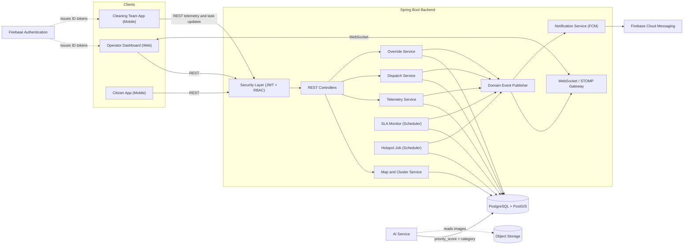
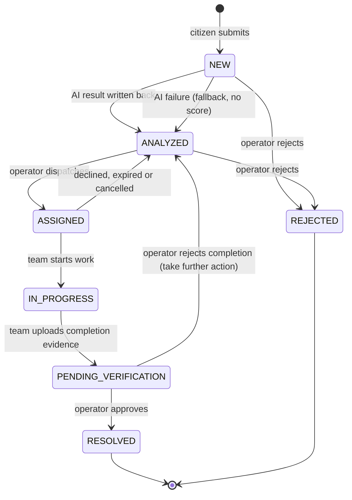
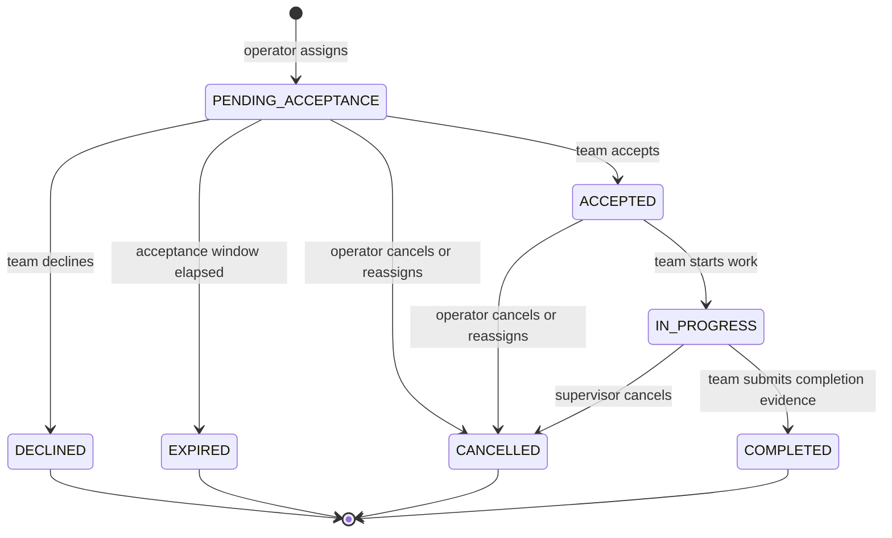
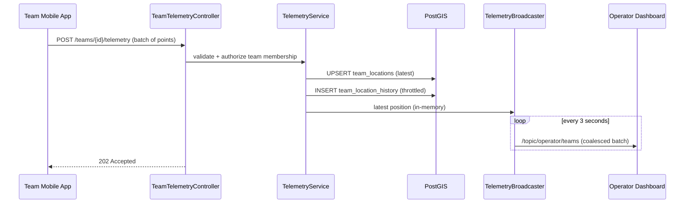
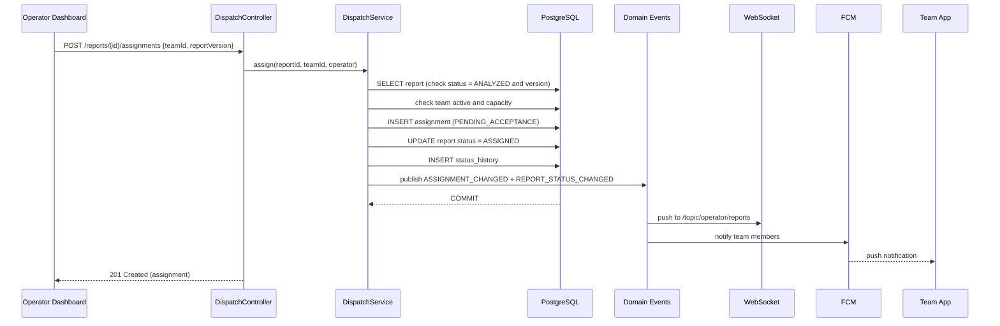

# Operator Dispatch Dashboard & Monitoring Architecture

**Backend Architecture Specification (Java Spring Boot)**

| | |
|---|---|
| **Project** | CleanStreet AI: Smart Citizen-Requested Street Cleaning and Waste Management Platform |
| **Task ID** | T_031ba6 |
| **Package** | P02 Design & Preparation → System Architecture |
| **Author** | Mariam Mahfouz (Backend, Java Spring Boot) |
| **Date** | 3 October 2026 |
| **Status** | Draft for Team Leader review |
| **Source documents** | *CleanStreet AI Proposal (Updated)*: Sections 6, 10, 11, 15, 16, 17, 19, 23 |

---

## Table of Contents

1. [Purpose and Scope](#1-purpose-and-scope)
2. [Requirements Traceability](#2-requirements-traceability)
3. [Architecture Overview](#3-architecture-overview)
4. [Backend Module Structure](#4-backend-module-structure)
5. [Data Model Extensions](#5-data-model-extensions)
6. [Report and Assignment Lifecycle](#6-report-and-assignment-lifecycle)
7. [Real-Time Map and Clustering](#7-real-time-map-and-clustering)
8. [Live Telemetry Streams](#8-live-telemetry-streams)
9. [Team Dispatch Orchestration Workflows](#9-team-dispatch-orchestration-workflows)
10. [Manual Override Protocols](#10-manual-override-protocols)
11. [SLA Monitoring](#11-sla-monitoring)
12. [Real-Time Push Layer (WebSocket Contract)](#12-real-time-push-layer-websocket-contract)
13. [REST API Catalogue](#13-rest-api-catalogue)
14. [Security and RBAC](#14-security-and-rbac)
15. [Non-Functional Requirements](#15-non-functional-requirements)
16. [Observability and Testing Strategy](#16-observability-and-testing-strategy)
17. [Assumptions, Risks and Open Questions](#17-assumptions-risks-and-open-questions)
18. [Implementation Backlog](#18-implementation-backlog)

---

## 1. Purpose and Scope

This document specifies the **backend architecture** that powers the **Web Operator Dispatch & Incident Monitoring Dashboard** of CleanStreet AI. It defines how the Spring Boot backend:

- serves a **real-time report map with clustering**,
- ingests and distributes **live cleaning-team location telemetry**,
- supports **manual dispatch override protocols**,
- manages **incident (report) status updates**, and
- exposes **operational SLA monitoring** interfaces.

### 1.1 Guiding principle: "AI assists, operator decides"

The proposal (Sections 11 and 16.3) establishes that AI output is decision support and that the **final operational decision remains with the human operator**. Every design decision below follows from that:

- Priority scores, duplicate matches and team recommendations are **suggestions**. Nothing is auto-merged or auto-dispatched by default.
- The system-computed value is **never overwritten**. An operator override is stored beside it, with a reason and an audit record.
- Every state change and override is logged (Section 17 of the proposal: audit logging via `STATUS_HISTORY`).

### 1.2 In scope

- Backend services, data model extensions, REST and WebSocket contracts for the operator dashboard.
- Dispatch recommendation, assignment, reassignment and verification workflows.
- Telemetry ingestion from cleaning-team mobile clients.
- SLA calculation and alerting.

### 1.3 Out of scope

Consistent with Section 9 of the proposal ("Out of Scope for the Initial Version"):

- Physical waste collection, autonomous robots, large-scale fleet management.
- **Guaranteed real-time tracking of all workers.** Live tracking in this design is **best-effort, opt-in, shift-bound**, and every position carries a freshness indicator (Section 8.4).
- Automated legal enforcement, full municipal system integration.
- The web frontend implementation and the AI inference service internals. Only their **interfaces with the backend** are defined here.
- Route optimisation (proposal Section 19 marks it as a later-phase feature). The design leaves a clean extension point (Section 9.7).

---

## 2. Requirements Traceability

| # | Requirement (from task description / deliverable) | Where addressed |
|---|---|---|
| R1 | Real-time report map visualisation **with clustering** | Section 7 (map clustering), Section 12 (push events) |
| R2 | **Live cleaning-team location tracking** / live telemetry streams | Section 8 |
| R3 | **Manual dispatch override protocols** / manual override controls | Section 10 |
| R4 | **Incident status updating** | Section 6 (lifecycle), Section 13 (API) |
| R5 | **Operational SLA monitoring** interfaces | Section 11 |
| R6 | **Team dispatch orchestration workflows** | Section 9 |
| R7 | Hotspot and repeated-report visibility for the operator (proposal §16.2 step 5) | Section 7.4 |
| R8 | Security, RBAC, audit (proposal §17) | Sections 10.5, 14 |
| R9 | Consistency with data architecture (proposal §15) | Section 5 |

---

## 3. Architecture Overview

### 3.1 Component view



### 3.2 Technology choices

| Concern | Choice | Rationale |
|---|---|---|
| Language / runtime | Java 17 (LTS) or 21 (LTS) | Long-term support; team standard |
| Framework | Spring Boot 3.x | Required by team role |
| API style | REST (JSON) for commands and queries | Simple, testable, matches proposal §14 ("REST APIs") |
| Real-time push | **Spring WebSocket + STOMP** | Bidirectional-capable, topic model fits dashboard feeds, native Spring Security integration |
| Persistence | Spring Data JPA + **Hibernate Spatial**, native SQL for PostGIS functions | Proposal §14/§15 mandates PostgreSQL + PostGIS |
| Migrations | **Flyway** | Versioned, repeatable schema changes |
| AuthN | Firebase Authentication (ID tokens), validated by **Spring Security OAuth2 Resource Server** | Proposal §13 lists Firebase Authentication |
| AuthZ | Spring Security method security (`@PreAuthorize`), roles resolved from `USERS.role` | DB is the source of truth for roles |
| Push notifications | Firebase Admin SDK (FCM) | Proposal §13 lists FCM |
| Scheduling | Spring `@Scheduled` (+ ShedLock if more than one instance is ever deployed) | SLA and hotspot jobs |
| API docs | springdoc-openapi (Swagger UI) | Contract shared with frontend and mobile teams |
| Observability | Spring Boot Actuator + Micrometer | Health, metrics |
| Testing | JUnit 5, Mockito, Testcontainers (`postgis/postgis`) | Real PostGIS in tests |

### 3.3 Design decisions (ADR summary)

| ID | Decision | Alternatives considered | Why |
|---|---|---|---|
| ADR-1 | Dashboard receives updates by **WebSocket/STOMP push**; all **commands go over REST** | SSE; polling; commands over WebSocket | REST commands give clean HTTP status codes, idempotency and easy testing. WebSocket is used only for server→client fan-out. Polling would not meet "real-time". |
| ADR-2 | Events are published **after DB commit** (`@TransactionalEventListener(AFTER_COMMIT)`) | Publish inside the transaction | Prevents the dashboard from showing state that later rolls back. |
| ADR-3 | Team telemetry is ingested over **HTTPS batch POST** (not a socket from the phone) | MQTT; WebSocket from mobile | Works through mobile networks and battery constraints, and is simplest for the Flutter team. Volume is tiny at MVP scale (Section 15). |
| ADR-4 | **Latest team position** held in a one-row-per-team table; history kept separately with short retention | Redis geo store | Avoids new infrastructure for MVP. Redis is a documented upgrade path. |
| ADR-5 | Map clustering is **server-side, viewport- and zoom-aware** using PostGIS | Client-only clustering | Scales to thousands of open reports and keeps payloads small. Client may still use a library for animation. |
| ADR-6 | **System score is immutable; overrides are layered** on top | Overwrite `priority_score` | Preserves auditability and lets the project evaluate "AI vs operator" (success criterion: prioritisation consistency, proposal §23). |
| ADR-7 | **Single active assignment per report is enforced by the database** (partial unique index) | Application-level check only | Eliminates double-dispatch races between concurrent operators. |

---

## 4. Backend Module Structure

A **modular monolith**, one deployable Spring Boot application with strict package boundaries. This is appropriate for a 16-week student project and can be split later.

```
com.cleanstreet
├── CleanStreetApplication.java
├── common
│   ├── config            # Security, WebSocket, Jackson, Scheduling, OpenAPI config
│   ├── error             # GlobalExceptionHandler (RFC 7807 ProblemDetail), domain exceptions
│   ├── event             # DomainEvent base, DomainEventPublisher
│   └── geo               # GeoUtils, SRID constants, BoundingBox value object
├── identity
│   ├── model             # User, Role enum
│   └── security          # FirebaseJwtConverter, CurrentUser resolver
├── report
│   ├── model             # Report, ReportStatus, StatusHistory, Image
│   ├── repository
│   ├── service           # ReportQueryService, ReportStatusService
│   └── api               # OperatorReportController
├── map
│   ├── service           # ClusterService, HotspotService
│   ├── repository        # Native PostGIS queries
│   ├── job               # HotspotRefreshJob
│   └── api               # MapController, HotspotController
├── team
│   ├── model             # CleaningTeam, TeamMember, TeamPresence
│   ├── service           # TelemetryService, PresenceService, TelemetryBroadcaster
│   └── api               # TeamTelemetryController, OperatorTeamController
├── dispatch
│   ├── model             # Assignment, AssignmentStatus
│   ├── service           # DispatchService, RecommendationService, AssignmentTimeoutJob
│   └── api               # DispatchController, TeamTaskController
├── override
│   ├── model             # DispatchOverride, OverrideType, OverrideReason
│   ├── service           # OverrideService, OverridePolicy
│   └── api               # OverrideController
├── sla
│   ├── model             # SlaPolicy, SlaState
│   ├── service           # SlaEvaluator, SlaSummaryService
│   ├── job               # SlaMonitorJob
│   └── api               # SlaController
├── realtime
│   ├── config            # WebSocketConfig, StompAuthInterceptor
│   ├── model             # EventEnvelope, EventType
│   └── service           # RealtimePublisher (listens to domain events)
└── notification
    └── service           # FcmNotificationService
```

**Layering rules**

- `api` → `service` → `repository`. Controllers contain **no** business logic.
- Modules communicate through **services and domain events**, never through another module's repository.
- Controllers use **DTOs** (Java records). JPA entities are never returned directly.

---

## 5. Data Model Extensions

The proposal's ERD (Section 15.2) defines seven tables. The dispatch dashboard needs a small number of **additions**, summarised below. These are proposed changes that must be **merged into the shared ERD** (see Open Question Q1).

### 5.1 Summary of changes

| Table | Change | Reason |
|---|---|---|
| `REPORTS` | **Add** `geom`, `priority_override_score`, `effective_priority_score`, `priority_tier`, `sla_state`, `version` | PostGIS queries, override layering, SLA, optimistic locking |
| `ASSIGNMENTS` | **Add** `status`, `assigned_by`, `accepted_at`, `started_at`, `end_reason`. **Relationship Report→Assignment changes from 1..1 to 1..N** (with one active) | Reassignment history, accept/decline flow |
| `CLEANING_TEAMS` | **Add** `service_area` (polygon), `max_open_tasks`, `active` | Area matching and workload cap |
| `TEAM_MEMBERS` | **New** | Links users to teams |
| `TEAM_LOCATIONS` | **New** | Latest known position per team |
| `TEAM_LOCATION_HISTORY` | **New** | Short-retention breadcrumb trail |
| `DISPATCH_OVERRIDES` | **New** | Override audit and active-override tracking |
| `SLA_POLICIES` | **New** | Configurable SLA thresholds per priority tier |
| `HOTSPOT_SNAPSHOTS` | **New** | Cached DBSCAN output |

> The original ERD shows `REPORTS 1..1 → ASSIGNMENTS`. That cannot represent reassignment (a declined or cancelled assignment followed by a new one). The fix is 1..N with a partial unique index guaranteeing only **one active** assignment at a time.

### 5.2 Schema (Flyway migration `V2__dispatch_dashboard.sql`)

```sql
-- Requires: CREATE EXTENSION IF NOT EXISTS postgis;

-- ============ REPORTS (alterations) ============
ALTER TABLE reports
  ADD COLUMN geom geometry(Point, 4326)
      GENERATED ALWAYS AS (ST_SetSRID(ST_MakePoint(longitude, latitude), 4326)) STORED,
  ADD COLUMN priority_override_score numeric(4,3),            -- nullable: set only by override
  ADD COLUMN effective_priority_score numeric(4,3)
      GENERATED ALWAYS AS (COALESCE(priority_override_score, priority_score)) STORED,
  ADD COLUMN priority_tier varchar(10) NOT NULL DEFAULT 'LOW', -- LOW | MEDIUM | HIGH (maintained by service)
  ADD COLUMN sla_state varchar(12) NOT NULL DEFAULT 'ON_TRACK',-- ON_TRACK | AT_RISK | BREACHED | PAUSED | MET
  ADD COLUMN version bigint NOT NULL DEFAULT 0;                -- optimistic locking (@Version)

CREATE INDEX idx_reports_geom       ON reports USING GIST (geom);
CREATE INDEX idx_reports_status     ON reports (current_status);
CREATE INDEX idx_reports_created_at ON reports (created_at);
CREATE INDEX idx_reports_open_prio  ON reports (effective_priority_score DESC)
  WHERE current_status NOT IN ('RESOLVED','REJECTED');

-- ============ CLEANING TEAMS (alterations) ============
ALTER TABLE cleaning_teams
  ADD COLUMN service_area   geometry(MultiPolygon, 4326),      -- nullable until area is drawn
  ADD COLUMN max_open_tasks integer NOT NULL DEFAULT 5,
  ADD COLUMN active         boolean NOT NULL DEFAULT true;

CREATE INDEX idx_teams_service_area ON cleaning_teams USING GIST (service_area);

-- ============ TEAM MEMBERS ============
CREATE TABLE team_members (
  team_id  bigint NOT NULL REFERENCES cleaning_teams(id),
  user_id  bigint NOT NULL REFERENCES users(id),
  PRIMARY KEY (team_id, user_id)
);

-- ============ ASSIGNMENTS (alterations) ============
ALTER TABLE assignments
  ADD COLUMN status      varchar(20) NOT NULL DEFAULT 'PENDING_ACCEPTANCE',
  ADD COLUMN assigned_by bigint REFERENCES users(id),
  ADD COLUMN accepted_at timestamptz,
  ADD COLUMN started_at  timestamptz,
  ADD COLUMN end_reason  varchar(30);   -- DECLINED | EXPIRED | CANCELLED | REASSIGNED | COMPLETED

-- DB-enforced: at most ONE active assignment per report
CREATE UNIQUE INDEX uq_active_assignment
  ON assignments (report_id)
  WHERE status IN ('PENDING_ACCEPTANCE','ACCEPTED','IN_PROGRESS');

CREATE INDEX idx_assignments_team_open
  ON assignments (team_id)
  WHERE status IN ('PENDING_ACCEPTANCE','ACCEPTED','IN_PROGRESS');

-- ============ TEAM LOCATIONS (latest position, one row per team) ============
CREATE TABLE team_locations (
  team_id       bigint PRIMARY KEY REFERENCES cleaning_teams(id),
  geom          geometry(Point, 4326) NOT NULL,
  accuracy_m    real,
  speed_mps     real,
  heading_deg   real,
  battery_pct   smallint,
  reported_by   bigint REFERENCES users(id),
  recorded_at   timestamptz NOT NULL,     -- device time (validated)
  received_at   timestamptz NOT NULL DEFAULT now()
);
CREATE INDEX idx_team_locations_geom ON team_locations USING GIST (geom);

-- ============ TEAM LOCATION HISTORY (retention-limited) ============
CREATE TABLE team_location_history (
  id           bigserial PRIMARY KEY,
  team_id      bigint NOT NULL REFERENCES cleaning_teams(id),
  geom         geometry(Point, 4326) NOT NULL,
  accuracy_m   real,
  recorded_at  timestamptz NOT NULL
);
CREATE INDEX idx_tlh_team_time ON team_location_history (team_id, recorded_at DESC);

-- ============ DISPATCH OVERRIDES (audit + active tracking) ============
CREATE TABLE dispatch_overrides (
  id             bigserial PRIMARY KEY,
  report_id      bigint NOT NULL REFERENCES reports(id),
  override_type  varchar(30) NOT NULL,   -- PRIORITY | FORCE_ASSIGN | REASSIGN | CANCEL_ASSIGNMENT
                                         -- | FORCE_STATUS | CATEGORY | DUPLICATE_LINK
  reason_code    varchar(30) NOT NULL,   -- enum, see Section 10.3
  reason_text    varchar(500) NOT NULL,  -- mandatory free text
  previous_value jsonb,
  new_value      jsonb,
  performed_by   bigint NOT NULL REFERENCES users(id),
  approved_by    bigint REFERENCES users(id),     -- required for supervisor-tier overrides
  status         varchar(12) NOT NULL DEFAULT 'APPLIED', -- APPLIED | PENDING_APPROVAL | REJECTED | REVOKED
  expires_at     timestamptz,                     -- optional (e.g. temporary priority boost)
  created_at     timestamptz NOT NULL DEFAULT now()
);
CREATE INDEX idx_overrides_report ON dispatch_overrides (report_id, created_at DESC);

-- ============ SLA POLICIES ============
CREATE TABLE sla_policies (
  priority_tier        varchar(10) PRIMARY KEY,   -- HIGH | MEDIUM | LOW
  assign_within_min    integer NOT NULL,          -- report created -> assigned
  resolve_within_min   integer NOT NULL,          -- report created -> resolved
  at_risk_ratio        numeric(3,2) NOT NULL DEFAULT 0.75
);
INSERT INTO sla_policies VALUES
  ('HIGH',   60,   480, 0.75),     -- provisional, pending pilot-operator calibration
  ('MEDIUM', 240,  1440, 0.75),
  ('LOW',    1440, 4320, 0.75);

-- ============ HOTSPOT SNAPSHOTS ============
CREATE TABLE hotspot_snapshots (
  id            bigserial PRIMARY KEY,
  computed_at   timestamptz NOT NULL,
  cluster_no    integer NOT NULL,
  centroid      geometry(Point, 4326) NOT NULL,
  hull          geometry(Geometry, 4326),
  report_count  integer NOT NULL,
  open_count    integer NOT NULL,
  max_priority  numeric(4,3),
  params        jsonb NOT NULL                   -- {eps_m, min_points, window_days}
);
CREATE INDEX idx_hotspots_computed ON hotspot_snapshots (computed_at DESC);
```

### 5.3 Priority tiers

`effective_priority_score` is on a **0–1 scale** (proposal §11: each factor normalised 0–1, then weighted).

| Tier | Rule (provisional) |
|---|---|
| `HIGH` | `effective_priority_score >= 0.70` |
| `MEDIUM` | `0.40 <= score < 0.70` |
| `LOW` | `score < 0.40` |

Thresholds live in `application.yml` (`cleanstreet.priority.tiers.*`) and are provisional pending calibration, as the proposal states for all weights.

---

## 6. Report and Assignment Lifecycle

### 6.1 Report status state machine

The proposal's citizen-visible states are *acknowledged / in progress / resolved* (§19, Adoption). The operator workflow (§16.2) adds assignment, completion review and "take further action". The internal states below cover both.



| Internal status | Citizen sees | Meaning |
|---|---|---|
| `NEW` | Submitted | Stored, awaiting AI analysis |
| `ANALYZED` | Acknowledged | AI analysis complete; waiting in the dispatch queue |
| `ASSIGNED` | Acknowledged | A team has been assigned (pending or accepted) |
| `IN_PROGRESS` | In progress | Team is on site |
| `PENDING_VERIFICATION` | In progress | Completion evidence uploaded; operator reviewing |
| `RESOLVED` | Resolved (with evidence) | Operator confirmed cleanup |
| `REJECTED` | Closed (not actionable) | Operator closed the report (reason recorded) |

**Key rules**

1. A report **cannot reach `RESOLVED` merely because a team marked it complete.** It must pass through `PENDING_VERIFICATION` and an explicit operator decision (proposal §16.2, step 9).
2. A rejected completion returns the report to `ANALYZED` (back into the dispatch queue) and is logged.
3. If the AI service fails or times out, the report moves to `ANALYZED` with `priority_score = NULL` flagged *"needs manual triage"*, so no report is stuck in `NEW`.
4. Every transition writes a `STATUS_HISTORY` row **in the same transaction** (`status`, `changed_at`, plus `changed_by` and `note`, which are recommended additional columns).

### 6.2 Assignment status machine



| Assignment event | Report status effect |
|---|---|
| `PENDING_ACCEPTANCE` / `ACCEPTED` | `ASSIGNED` |
| `IN_PROGRESS` | `IN_PROGRESS` |
| `COMPLETED` | `PENDING_VERIFICATION` |
| `DECLINED` / `EXPIRED` / `CANCELLED` | back to `ANALYZED` (and an operator alert is raised) |

The **acceptance step is configurable** (`cleanstreet.dispatch.acceptance.enabled`, window `acceptance.timeout-minutes`, default 10). When disabled, assignments are created directly as `ACCEPTED`.

### 6.3 Transition permissions

| Transition | Allowed roles |
|---|---|
| `NEW → ANALYZED` | System (AI callback) |
| `ANALYZED → ASSIGNED` | `OPERATOR`, `SUPERVISOR` |
| `ASSIGNED → IN_PROGRESS` | `TEAM_MEMBER` of the assigned team |
| `IN_PROGRESS → PENDING_VERIFICATION` | `TEAM_MEMBER` of the assigned team (evidence required) |
| `PENDING_VERIFICATION → RESOLVED / ANALYZED` | `OPERATOR`, `SUPERVISOR` |
| `* → REJECTED` | `OPERATOR` (reason required) |
| Any other / out-of-order transition | **Denied** (`409 Conflict`) |

Transition validation is centralised in `ReportStatusService` using an explicit allowed-transitions map, so the rules live in one place and are unit-tested exhaustively.

---

## 7. Real-Time Map and Clustering

### 7.1 Two kinds of clustering (do not confuse them)

| | **Display clustering** | **Hotspot detection** |
|---|---|---|
| Purpose | Keep the map readable at low zoom | Surface *recurring problem locations* for operators and analytics |
| Method | Grid aggregation (`ST_SnapToGrid`) by zoom level | Density clustering (`ST_ClusterDBSCAN`) |
| When computed | **Per request**, for the current viewport | **Scheduled job**, cached snapshot |
| Output | Cluster markers with counts | Hotspot polygons/centroids with statistics |
| Proposal reference | §10 (map-based views) | §11 feature #7, §23 hotspot criterion |

### 7.2 Display clustering: `GET /api/v1/operator/map/reports`

**Query parameters**

| Param | Type | Description |
|---|---|---|
| `bbox` | `minLng,minLat,maxLng,maxLat` | Current map viewport (required) |
| `zoom` | integer 0–22 | Current zoom level (required) |
| `status` | CSV (optional) | Default: all open statuses (everything except `RESOLVED`, `REJECTED`) |
| `tier` | CSV (optional) | `HIGH,MEDIUM,LOW` |
| `category` | CSV of ids (optional) | Filter by category |
| `slaState` | CSV (optional) | `AT_RISK,BREACHED` etc. |
| `teamId` | long (optional) | Only reports assigned to this team |

**Behaviour**

- If `zoom >= cleanstreet.map.cluster-max-zoom` (default **16**) → return **individual report points**.
- Otherwise → return **clusters** using a grid cell sized for ~60 px on screen:

```
cellSizeDegrees = (360 / 2^zoom) * (60 / 256)
```

- A hard cap (`cleanstreet.map.max-features`, default 2000) protects the client. If exceeded, the server returns a coarser grid and sets `"truncated": true`.

**Cluster SQL (native query)**

```sql
SELECT
    ST_X(ST_Centroid(ST_Collect(r.geom)))              AS lng,
    ST_Y(ST_Centroid(ST_Collect(r.geom)))              AS lat,
    COUNT(*)                                           AS report_count,
    MAX(r.effective_priority_score)                    AS max_priority,
    BOOL_OR(r.sla_state = 'BREACHED')                  AS has_breach,
    COUNT(*) FILTER (WHERE r.current_status = 'ANALYZED') AS unassigned_count,
    MIN(r.id)                                          AS sample_report_id
FROM reports r
WHERE r.geom && ST_MakeEnvelope(:minLng, :minLat, :maxLng, :maxLat, 4326)   -- uses GiST index
  AND r.current_status IN (:statuses)
  AND (:tiers IS NULL OR r.priority_tier IN (:tiers))
GROUP BY ST_SnapToGrid(r.geom, :cellSize)
```

**Response (GeoJSON `FeatureCollection`)**

```json
{
  "type": "FeatureCollection",
  "generatedAt": "2026-10-03T14:55:10Z",
  "zoom": 12,
  "truncated": false,
  "features": [
    {
      "type": "Feature",
      "geometry": { "type": "Point", "coordinates": [31.2357, 30.0444] },
      "properties": {
        "kind": "CLUSTER",
        "count": 14,
        "maxPriority": 0.86,
        "hasBreach": true,
        "unassignedCount": 5
      }
    },
    {
      "type": "Feature",
      "geometry": { "type": "Point", "coordinates": [31.2401, 30.0489] },
      "properties": {
        "kind": "REPORT",
        "reportId": 1042,
        "status": "ANALYZED",
        "tier": "HIGH",
        "priorityScore": 0.81,
        "slaState": "AT_RISK",
        "category": "Illegal dumping",
        "overridden": false
      }
    }
  ]
}
```

> At cluster-click, the client simply **zooms in** and re-requests, so no separate "expand cluster" endpoint is needed.

### 7.3 Keeping the map real-time

The map is **pull for geometry, push for change**:

1. Client loads the viewport via REST (above).
2. Client subscribes to `/topic/operator/reports` (Section 12).
3. On each `REPORT_*` event, the client either patches the visible marker or, if the changed report falls inside the viewport at cluster level, re-requests the viewport (debounced, e.g. 500 ms).
4. On WebSocket reconnect, the client **re-fetches the snapshot** (Section 12.5).

This design avoids streaming cluster geometry over the socket and keeps events small.

### 7.4 Hotspots: `GET /api/v1/operator/hotspots`

A scheduled job (`HotspotRefreshJob`, default every **10 minutes**) computes density clusters and stores them in `hotspot_snapshots`. The endpoint serves the **latest snapshot**.

```sql
WITH clustered AS (
  SELECT r.id,
         r.geom,
         r.current_status,
         r.effective_priority_score,
         ST_ClusterDBSCAN(ST_Transform(r.geom, :projectedSrid),
                          eps := :epsMeters,
                          minpoints := :minPoints) OVER () AS cid
  FROM reports r
  WHERE r.created_at >= now() - make_interval(days => :windowDays)
)
SELECT cid                                                         AS cluster_no,
       ST_Centroid(ST_Collect(geom))                               AS centroid,
       ST_ConvexHull(ST_Collect(geom))                             AS hull,
       COUNT(*)                                                    AS report_count,
       COUNT(*) FILTER (WHERE current_status NOT IN ('RESOLVED','REJECTED')) AS open_count,
       MAX(effective_priority_score)                               AS max_priority
FROM clustered
WHERE cid IS NOT NULL
GROUP BY cid;
```

| Parameter | Default (provisional) | Config key |
|---|---|---|
| `epsMeters` | 50 | `cleanstreet.hotspot.eps-meters` |
| `minPoints` | 3 | `cleanstreet.hotspot.min-points` |
| `windowDays` | 30 | `cleanstreet.hotspot.window-days` |
| `projectedSrid` | 32636 (UTM 36N, covers Greater Cairo/Fayoum) | `cleanstreet.geo.projected-srid` |

Distances in EPSG:4326 are in degrees, so geometries are **transformed to a metric projected SRID** for DBSCAN. The SRID is configurable so the platform is not locked to one region.

**Honest limitation (stated in proposal §12.4):** hotspots only become meaningful after a period of report collection.

**Success-criterion hook:** the proposal's target is that ≥ 80% of manually identified recurring locations are surfaced (§23). The snapshot table plus its stored `params` makes that comparison reproducible.

### 7.5 Repeated-report visibility

When AI duplicate detection (proposal Tier 3) finds a candidate match, the backend emits `DUPLICATE_SUGGESTED` with the related report ids. The operator sees it in the report detail panel and decides to **link** (an override of type `DUPLICATE_LINK`) or **dismiss**. Nothing is merged automatically.

---

## 8. Live Telemetry Streams

### 8.1 Flow



### 8.2 Ingestion endpoint

`POST /api/v1/teams/{teamId}/telemetry`, role `TEAM_MEMBER` of that team only.

```json
{
  "points": [
    {
      "lat": 30.0444,
      "lng": 31.2357,
      "accuracyM": 12.5,
      "speedMps": 4.2,
      "headingDeg": 270,
      "batteryPct": 71,
      "recordedAt": "2026-10-03T14:55:02Z"
    }
  ]
}
```

Mobile clients should send every **10–15 seconds** while on shift (and may batch several points if the network drops).

### 8.3 Validation and protection rules

| Rule | Behaviour |
|---|---|
| `lat` ∈ [−90, 90], `lng` ∈ [−180, 180] | Else `400` |
| `accuracyM` > 100 m | Point stored in history but **not promoted** to "latest" (too imprecise) |
| `recordedAt` more than 60 s in the future | Rejected (clock skew protection) |
| `recordedAt` older than the stored latest point | Stored in history only, latest unchanged (out-of-order delivery) |
| Batch size > 50 points | `413` |
| Rate limit | Max 1 request / 5 s / team (Bucket4j or a simple in-memory limiter), `429` otherwise |
| Teams with no active shift / no open assignment | Accepted only if the team's `active = true`. Tracking is **shift-bound** |
| Implausible jump (speed > 55 m/s between points) | Flagged `suspect`, not promoted |

### 8.4 Presence and freshness (making "live" honest)

Since tracking is best-effort, **every position is shown with its age**. The backend derives `TeamPresence`:

| Presence | Rule | Dashboard display |
|---|---|---|
| `LIVE` | last point ≤ 60 s old | Solid marker |
| `STALE` | 60 s < age ≤ 5 min | Faded marker + "last seen Xs ago" |
| `OFFLINE` | age > 5 min, or no point this shift | Grey marker, last known position |

A scheduled job (every 15 s) detects presence **changes** and emits `TEAM_PRESENCE_CHANGED`, so the dashboard updates without waiting for a new location.

### 8.5 Broadcast coalescing

To avoid flooding the dashboard, the backend keeps the latest position per team **in memory** and a scheduler flushes **one batched message every 3 seconds** (only teams whose position changed). With 30 teams this is at most a few KB per flush.

### 8.6 Operator query endpoints

| Endpoint | Purpose |
|---|---|
| `GET /api/v1/operator/teams` | All teams with presence, last position, open task count, current assignment |
| `GET /api/v1/operator/teams/{id}/track?from=&to=` | Breadcrumb trail from history (max 24 h window) |

### 8.7 Privacy and retention (aligned with proposal §17)

- Location of workers is **personal data**. It is collected **only during active shifts** and only for the team's work.
- Latest position is visible to `OPERATOR` / `SUPERVISOR` / `ADMIN` only. Team members see only their own team. Citizens **never** see team positions (they see only report status).
- `team_location_history` retention: **7 days** (configurable `cleanstreet.telemetry.retention-days`), enforced by a nightly purge job.
- The team mobile app must show a clear **"location sharing is active"** indicator, and sharing starts when the member starts a shift.
- Telemetry values are never written to application logs.

---

## 9. Team Dispatch Orchestration Workflows

### 9.1 Dispatch queue

The operator's work queue is the set of reports in status `ANALYZED`, ordered by:

1. `sla_state` (`BREACHED` first, then `AT_RISK`),
2. `effective_priority_score` descending,
3. `created_at` ascending (older first, the age factor already influences the score).

`GET /api/v1/operator/dispatch/queue?page=&size=`

### 9.2 Team recommendation (suggestion only)

`GET /api/v1/operator/reports/{id}/recommendations`

`RecommendationService` returns a **ranked list of up to 5 eligible teams, with the reasoning**, so the operator can see *why* (consistent with the "operator must be able to understand a ranking to override it" principle in §16.3).

**Eligibility filters**

- `team.active = true`
- team has at least one member on shift (presence ≠ `OFFLINE` or an explicit "on shift" flag)
- open task count `< max_open_tasks`, **unless** the operator force-assigns (Section 10)

**Scoring (each factor normalised 0–1, weighted sum, weights configurable)**

| Factor | Default weight | Calculation |
|---|---|---|
| Proximity | 0.50 | `1 - min(distance / maxDistance, 1)`. Distance via `ST_Distance` (geography) from the team's latest position; **fallback** to the service-area centroid if presence is `STALE`/`OFFLINE` |
| Workload | 0.30 | `1 - (openTasks / maxOpenTasks)` |
| Area match | 0.20 | `1` if report location is inside `service_area` (`ST_Covers`), else `0` |

```sql
-- Proximity (illustrative)
SELECT t.id,
       ST_Distance(tl.geom::geography, r.geom::geography)  AS distance_m,
       ST_Covers(t.service_area, r.geom)                   AS in_area
FROM reports r
JOIN cleaning_teams t ON t.active
LEFT JOIN team_locations tl ON tl.team_id = t.id
WHERE r.id = :reportId;
```

**Response example**

```json
{
  "reportId": 1042,
  "recommendations": [
    {
      "teamId": 3,
      "teamName": "Team Alpha",
      "score": 0.87,
      "distanceM": 640,
      "positionFreshness": "LIVE",
      "openTasks": 1,
      "inServiceArea": true,
      "explanation": "Closest live team (640 m), 1 of 5 task slots used, inside service area"
    }
  ]
}
```

Weights are **provisional** and presented as such, like the severity and priority weights in the proposal.

### 9.3 Assign: the main dispatch sequence



**Concurrency safety**

- The request carries the `reportVersion` the operator saw (optimistic locking, `@Version`). If another operator changed the report first → **`409 Conflict`** with the current state, and the dashboard refreshes.
- Even if two requests race past the application check, the **`uq_active_assignment` partial unique index** guarantees only one wins; the loser receives `409`.
- Assignment creation and status change happen in **one transaction**.

### 9.4 Team-side task lifecycle

| Action | Endpoint | Effect |
|---|---|---|
| View my tasks | `GET /api/v1/team/tasks` | Open assignments for the caller's team |
| Accept | `POST /api/v1/team/assignments/{id}/accept` | `PENDING_ACCEPTANCE → ACCEPTED` |
| Decline (reason required) | `POST /api/v1/team/assignments/{id}/decline` | `→ DECLINED`; report returns to queue; operator alerted |
| Start work | `POST /api/v1/team/assignments/{id}/start` | `→ IN_PROGRESS` (report `IN_PROGRESS`) |
| Submit completion | `POST /api/v1/team/assignments/{id}/complete` | Requires **≥ 1 "after" image** (`IMAGES.image_type = AFTER`); `→ COMPLETED`; report `PENDING_VERIFICATION` |

`AssignmentTimeoutJob` (every minute) expires `PENDING_ACCEPTANCE` assignments older than the acceptance window → `EXPIRED`, returns the report to `ANALYZED`, and emits an operator alert.

### 9.5 Operator verification

`POST /api/v1/operator/reports/{id}/verification`

```json
{ "decision": "APPROVE", "note": "Area clean, photo matches location" }
```

| Decision | Result |
|---|---|
| `APPROVE` | Report `RESOLVED`; `assignments.completed_at` set; **citizen notified** with the completion evidence (proposal §16.1 step 9) |
| `REJECT` | Report returns to `ANALYZED` with a mandatory note; team notified; appears in queue flagged "re-work" |

### 9.6 Reassignment

Reassigning an already-assigned report is an **override** (Section 10.2): it cancels the active assignment (`end_reason = REASSIGNED`) and creates a new one in a single transaction, with a mandatory reason. The previous team is notified.

### 9.7 Extension point for routing (future)

`RecommendationService` depends on a `DistanceProvider` interface:

- **MVP implementation:** straight-line geodesic distance (PostGIS).
- **Future implementation:** Google Maps Routes API (proposal §13) for road distance / ETA.

Swapping providers requires no change to controllers or clients.

---

## 10. Manual Override Protocols

An **override** is any operator action that departs from the system's computed or default behaviour. Overrides are first-class, audited objects.

### 10.1 Principles

1. **Never destroy the system's value.** `priority_score` (AI/rule output) is left untouched; an override sets `priority_override_score`. `effective_priority_score` = override if present, else computed.
2. **Mandatory justification.** Every override needs a `reason_code` (enum) **and** free text.
3. **Everything is auditable.** Each override creates a `dispatch_overrides` row with previous and new values, actor and timestamp, and also a `STATUS_HISTORY` entry when status is affected.
4. **Two permission tiers.** Routine overrides by `OPERATOR`; high-impact ones need `SUPERVISOR`.
5. **Visible in the UI.** Overridden reports carry `overridden: true` in API and WebSocket payloads so the dashboard can badge them.
6. **Overrides can expire or be revoked.**

### 10.2 Override catalogue

| Type | What it does | Min. role | Approval needed? |
|---|---|---|---|
| `PRIORITY` | Sets a manual priority score/tier | `OPERATOR` (within ±1 tier of computed) | Supervisor approval if it moves a report **down** from `HIGH`, or by more than one tier |
| `FORCE_ASSIGN` | Assigns to a team that is over capacity or outside its area | `OPERATOR` | No (reason required, flagged in analytics) |
| `REASSIGN` | Cancels the active assignment and assigns another team | `OPERATOR` | No while `PENDING_ACCEPTANCE`/`ACCEPTED`; **Supervisor** if `IN_PROGRESS` |
| `CANCEL_ASSIGNMENT` | Cancels the active assignment, report returns to queue | `OPERATOR` (`SUPERVISOR` if `IN_PROGRESS`) | Per above |
| `FORCE_STATUS` | Moves a report to a status outside the normal map (e.g., close a stale report) | `SUPERVISOR` | n/a (already supervisor-tier) |
| `CATEGORY` | Corrects the AI-assigned category | `OPERATOR` | No |
| `DUPLICATE_LINK` | Links a report to an existing incident as a duplicate | `OPERATOR` | No |

### 10.3 Reason codes

`AI_MISCLASSIFICATION`, `SAFETY_RISK`, `PUBLIC_EVENT`, `REPEAT_COMPLAINT`, `TEAM_UNAVAILABLE`, `TEAM_CAPACITY`, `WRONG_AREA`, `DUPLICATE`, `STALE_REPORT`, `OTHER` (free text mandatory for all codes, and **`OTHER` requires at least 20 characters**).

### 10.4 Endpoint and request/response

`POST /api/v1/operator/reports/{id}/overrides`

```json
{
  "type": "PRIORITY",
  "reasonCode": "SAFETY_RISK",
  "reasonText": "Broken glass next to school entrance, escalating.",
  "newValue": { "priorityScore": 0.95 },
  "expiresAt": "2026-10-05T23:59:00Z",
  "reportVersion": 7
}
```

| Outcome | HTTP | Body |
|---|---|---|
| Applied | `201` | Override record, `status: APPLIED` |
| Needs supervisor | `202` | Override record, `status: PENDING_APPROVAL` (no effect yet) |
| Policy violated | `403` | ProblemDetail with the violated rule |
| Stale `reportVersion` | `409` | Current state |
| Missing / invalid reason | `422` | Field errors |

**Supervisor approval**

| Endpoint | Purpose |
|---|---|
| `GET /api/v1/supervisor/overrides/pending` | Pending approvals |
| `POST /api/v1/supervisor/overrides/{id}/approve` | Applies the override |
| `POST /api/v1/supervisor/overrides/{id}/reject` | Rejects (reason required) |
| `POST /api/v1/operator/overrides/{id}/revoke` | Revokes an applied override, restoring the previous value |

`OverridePolicy` is a single class that decides *applied vs needs-approval vs forbidden*, making rules easy to review and test. It reads thresholds from configuration.

### 10.5 Audit and safeguards

- `dispatch_overrides` is **append-only** (no update/delete through the API except status transitions to `REVOKED`/`REJECTED`).
- An `ExpiredOverrideJob` (every minute) reverts expired priority overrides and emits `REPORT_UPDATED`.
- Analytics endpoint `GET /api/v1/supervisor/overrides/stats` returns override counts by type, reason and operator. This supports the proposal's evaluation of **prioritisation consistency** (§23) and gives the team data on where the AI/priority formula disagrees with operators.
- Operators cannot approve their own pending overrides.

---

## 11. SLA Monitoring

### 11.1 Definitions

Two clocks per report, both measured from `created_at`, thresholds taken from `sla_policies` by the report's **priority tier** (using `effective_priority_score`):

| SLA | Starts | Met when | Breached when |
|---|---|---|---|
| **Assignment SLA** | `created_at` | First assignment created (or status leaves `ANALYZED`) | Elapsed > `assign_within_min` and still unassigned |
| **Resolution SLA** | `created_at` | Report reaches `RESOLVED` | Elapsed > `resolve_within_min` and not resolved |

**Provisional default thresholds** (seeded in `sla_policies`, to be agreed with the pilot operator, proposal §19 "Operational" risk):

| Tier | Assign within | Resolve within |
|---|---|---|
| HIGH | 1 h | 8 h |
| MEDIUM | 4 h | 24 h |
| LOW | 24 h | 72 h |

### 11.2 SLA state

| State | Rule |
|---|---|
| `ON_TRACK` | Elapsed < `at_risk_ratio` (75%) of the relevant threshold |
| `AT_RISK` | 75% ≤ elapsed < 100% |
| `BREACHED` | Elapsed ≥ 100% |
| `MET` | Resolved within the threshold |
| `PAUSED` | Optional: report awaiting citizen information (reserved for future use) |

The state shown is the **worst** of the two clocks that is still running. The **tier is re-evaluated when an override changes priority**, so SLA targets follow the effective priority.

### 11.3 `SlaMonitorJob`

- Runs **every minute**.
- A single set-based SQL update recalculates `sla_state` for open reports and **returns only the rows whose state changed**.
- For each changed row, emit `SLA_STATE_CHANGED` (and, on entering `AT_RISK` / `BREACHED`, an operator alert).
- This realises feature #12 of the proposal (*Report ageing / SLA breach flag*).

### 11.4 SLA monitoring API

| Endpoint | Returns |
|---|---|
| `GET /api/v1/operator/sla/summary` | Counts of open reports by `sla_state` and tier, plus breach rate (rolling window) |
| `GET /api/v1/operator/sla/breaches?state=AT_RISK,BREACHED` | Paginated list, ordered by severity of lateness |
| `GET /api/v1/operator/workload` | Open tasks per team and capacity utilisation (proposal feature #11) |
| `GET /api/v1/operator/metrics/resolution?from=&to=&groupBy=team\|category\|tier` | Average / median resolution time (proposal feature #10) |
| `GET /api/v1/operator/metrics/resolution-rate?area=&window=` | Resolved / total per area, rolling window (proposal feature #9) |

**Example: `GET /api/v1/operator/sla/summary`**

```json
{
  "generatedAt": "2026-10-03T14:56:00Z",
  "open": { "total": 87, "onTrack": 61, "atRisk": 17, "breached": 9 },
  "byTier": {
    "HIGH":   { "open": 12, "atRisk": 4,  "breached": 3 },
    "MEDIUM": { "open": 40, "atRisk": 9,  "breached": 4 },
    "LOW":    { "open": 35, "atRisk": 4,  "breached": 2 }
  },
  "breachRateLast7Days": 0.12,
  "avgTimeToAssignMin": 52,
  "avgTimeToResolveMin": 410
}
```

These are all **database aggregations, not AI**, consistent with how the proposal classifies them (§11, "Operational analytics: not AI").

---

## 12. Real-Time Push Layer (WebSocket Contract)

### 12.1 Connection

- Endpoint: `wss://<host>/ws` (SockJS fallback optional).
- Protocol: **STOMP 1.2**.
- Application destination prefix for client→server messages: `/app` (unused for commands; **commands use REST**).
- Broker destinations: `/topic/**` (broadcast), `/user/queue/**` (per-user).

### 12.2 Authentication and authorisation

- Client sends `Authorization: Bearer <Firebase ID token>` in the STOMP **`CONNECT`** frame headers.
- `StompAuthInterceptor` (`ChannelInterceptor`) validates the JWT and maps roles, rejecting invalid tokens.
- Subscription rules, enforced on `SUBSCRIBE`:

| Destination | Allowed roles |
|---|---|
| `/topic/operator/**` | `OPERATOR`, `SUPERVISOR`, `ADMIN` |
| `/user/queue/alerts` | Any authenticated user (only their own messages) |
| `/user/queue/team-tasks` | `TEAM_MEMBER` (own team) |

- Firebase ID tokens expire after about 1 hour. The client must **refresh the token and reconnect** before expiry. The server also closes sessions whose token has expired.

### 12.3 Topics

| Topic | Event types | Payload focus |
|---|---|---|
| `/topic/operator/reports` | `REPORT_CREATED`, `REPORT_UPDATED`, `REPORT_STATUS_CHANGED`, `REPORT_PRIORITY_CHANGED`, `DUPLICATE_SUGGESTED` | Minimal report summary |
| `/topic/operator/assignments` | `ASSIGNMENT_CHANGED` | Assignment id, report id, team, status |
| `/topic/operator/teams` | `TEAM_LOCATION_BATCH`, `TEAM_PRESENCE_CHANGED` | Coalesced positions (Section 8.5) |
| `/topic/operator/sla` | `SLA_STATE_CHANGED`, `SLA_SUMMARY_UPDATED` | State changes + refreshed counts |
| `/topic/operator/hotspots` | `HOTSPOTS_REFRESHED` | Snapshot id and timestamp (client re-fetches) |
| `/user/queue/alerts` | `ALERT` | Assignment declined/expired, override awaiting approval, SLA breach |
| `/user/queue/team-tasks` | `TASK_ASSIGNED`, `TASK_CANCELLED` | For team members (also sent via FCM) |

### 12.4 Event envelope

All messages share one envelope:

```json
{
  "eventId": "7c1f3a52-0d5b-4c43-9d57-9b1d2e0f8f10",
  "type": "REPORT_STATUS_CHANGED",
  "occurredAt": "2026-10-03T14:55:40Z",
  "aggregateId": 1042,
  "aggregateVersion": 8,
  "payload": {
    "reportId": 1042,
    "from": "ANALYZED",
    "to": "ASSIGNED",
    "tier": "HIGH",
    "slaState": "AT_RISK",
    "assignedTeamId": 3,
    "overridden": false
  }
}
```

### 12.5 Reliability and consistency

WebSocket delivery is **at-most-once**, so the design assumes messages can be missed:

- Each event carries `aggregateVersion`. The client **ignores events older than the version it already holds**.
- On reconnect (or if the client detects a gap), it re-fetches REST snapshots (`/operator/map/reports`, `/operator/teams`, `/operator/sla/summary`). **REST is the source of truth, WebSocket is the accelerator.**
- Events are published **after commit** (ADR-2), so the dashboard never sees rolled-back state.
- Heartbeats: STOMP heart-beat 10 s/10 s to detect dead connections.

### 12.6 Scaling note

MVP uses Spring's **in-memory simple broker** (single instance). If horizontal scaling is ever needed, replace it with a **broker relay** (RabbitMQ STOMP or Redis pub/sub) without changing the topic contract.

---

## 13. REST API Catalogue

Base path: `/api/v1`. All endpoints require a valid JWT unless stated. Errors use **RFC 7807 `ProblemDetail`**.

### 13.1 Operator: reports and map

| Method | Path | Role | Description |
|---|---|---|---|
| GET | `/operator/map/reports` | OPERATOR+ | Clustered/points map data (Section 7.2) |
| GET | `/operator/hotspots` | OPERATOR+ | Latest hotspot snapshot |
| GET | `/operator/reports` | OPERATOR+ | List view: filter by status, tier, category, SLA state, team, date; sort; paginate |
| GET | `/operator/reports/{id}` | OPERATOR+ | Detail: images, AI results, score breakdown, overrides, status history, assignment history, duplicate suggestions |
| POST | `/operator/reports/{id}/status` | OPERATOR+ | Reject a report (`REJECTED`, reason required). Other transitions happen via dispatch/verification endpoints |
| POST | `/operator/reports/{id}/verification` | OPERATOR+ | Approve / reject completion |
| GET | `/operator/dispatch/queue` | OPERATOR+ | Prioritised unassigned reports |

### 13.2 Operator: dispatch and teams

| Method | Path | Role | Description |
|---|---|---|---|
| GET | `/operator/reports/{id}/recommendations` | OPERATOR+ | Ranked team suggestions |
| POST | `/operator/reports/{id}/assignments` | OPERATOR+ | Assign team |
| GET | `/operator/teams` | OPERATOR+ | Teams with presence, position, load |
| GET | `/operator/teams/{id}/track` | OPERATOR+ | Breadcrumb trail |
| GET | `/operator/workload` | OPERATOR+ | Team workload balance |

### 13.3 Overrides

| Method | Path | Role | Description |
|---|---|---|---|
| POST | `/operator/reports/{id}/overrides` | OPERATOR+ | Create override (Section 10.4) |
| POST | `/operator/overrides/{id}/revoke` | OPERATOR+ | Revoke applied override |
| GET | `/supervisor/overrides/pending` | SUPERVISOR+ | Pending approvals |
| POST | `/supervisor/overrides/{id}/approve` | SUPERVISOR+ | Approve |
| POST | `/supervisor/overrides/{id}/reject` | SUPERVISOR+ | Reject |
| GET | `/supervisor/overrides/stats` | SUPERVISOR+ | Override analytics |

### 13.4 SLA and metrics

| Method | Path | Role | Description |
|---|---|---|---|
| GET | `/operator/sla/summary` | OPERATOR+ | Counts by state/tier |
| GET | `/operator/sla/breaches` | OPERATOR+ | At-risk / breached list |
| GET | `/operator/metrics/resolution` | OPERATOR+ | Resolution-time stats |
| GET | `/operator/metrics/resolution-rate` | OPERATOR+ | Resolution rate by area |
| GET | `/admin/sla/policies` | ADMIN | View SLA policies |
| PUT | `/admin/sla/policies/{tier}` | ADMIN | Update thresholds |

### 13.5 Cleaning team

| Method | Path | Role | Description |
|---|---|---|---|
| POST | `/teams/{teamId}/telemetry` | TEAM_MEMBER | Submit location batch |
| POST | `/teams/{teamId}/shift/start` | TEAM_MEMBER | Begin shift (enables tracking) |
| POST | `/teams/{teamId}/shift/end` | TEAM_MEMBER | End shift (stops tracking) |
| GET | `/team/tasks` | TEAM_MEMBER | My team's open tasks |
| POST | `/team/assignments/{id}/accept` | TEAM_MEMBER | Accept |
| POST | `/team/assignments/{id}/decline` | TEAM_MEMBER | Decline with reason |
| POST | `/team/assignments/{id}/start` | TEAM_MEMBER | Start work |
| POST | `/team/assignments/{id}/complete` | TEAM_MEMBER | Submit completion evidence |

### 13.6 Conventions

- **Pagination:** `?page=0&size=20` → `{ content: [], page, size, totalElements }`.
- **Time:** ISO-8601 UTC in APIs; the dashboard renders in `Africa/Cairo`.
- **IDs:** numeric database ids externally for MVP.
- **Optimistic locking:** mutating endpoints accept `reportVersion`; mismatch → `409`.
- **Error example**

```json
{
  "type": "https://cleanstreet.example/errors/invalid-transition",
  "title": "Invalid status transition",
  "status": 409,
  "detail": "Report 1042 is RESOLVED and cannot move to ASSIGNED.",
  "instance": "/api/v1/operator/reports/1042/assignments"
}
```

---

## 14. Security and RBAC

Implements the proposal's Section 17 controls for this module.

### 14.1 Roles

| Role | Description |
|---|---|
| `CITIZEN` | Submits and tracks own reports. No access to operator or team data |
| `TEAM_MEMBER` | Member of one cleaning team |
| `OPERATOR` | Dispatcher using the dashboard |
| `SUPERVISOR` | Operator privileges plus approvals and high-impact overrides |
| `ADMIN` | Configuration (SLA policies, teams, users) |

Role hierarchy: `ADMIN > SUPERVISOR > OPERATOR`. `TEAM_MEMBER` and `CITIZEN` are separate branches.

### 14.2 Authentication flow

1. Clients authenticate with **Firebase Authentication** and obtain an ID token.
2. Spring Security **OAuth2 Resource Server** validates the JWT signature and issuer (`https://securetoken.google.com/<firebase-project-id>`) and audience.
3. A `JwtAuthenticationConverter` loads the local `USERS` row (cached for 60 s) and sets authorities from `USERS.role`. **Roles are not trusted from the token alone.**
4. Disabled users are rejected even if the token is valid.

### 14.3 Authorisation rules beyond roles

- `TEAM_MEMBER` access is **scoped to their own team** (checked against `team_members`). Accessing another team's telemetry or assignments → `403`.
- Operators see all reports in the pilot; a future version can scope by area.
- Use `@PreAuthorize` on service methods (not only controllers) so rules hold for every entry point.

### 14.4 Protection measures

| Concern | Measure |
|---|---|
| Transport | HTTPS / WSS only; HSTS |
| CORS | Allow-list of the dashboard origin only |
| Input validation | Jakarta Bean Validation on all DTOs; reject unknown fields |
| SQL injection | JPA / parameterised native queries only (no string concatenation) |
| Rate limiting | Telemetry (Section 8.3) and login-adjacent endpoints |
| Secrets | Environment variables / secret manager. Firebase service-account JSON never committed to GitHub |
| Audit | `STATUS_HISTORY`, `dispatch_overrides`, and structured logs including `userId`, `action`, `reportId` |
| Data minimisation | Telemetry retention (Section 8.7). Operator APIs return only fields the dashboard needs |
| Image access | Pre-signed, short-lived URLs from object storage. Raw image access restricted to authorised accounts (proposal §19 Privacy) |

### 14.5 Permission matrix (summary)

| Capability | Citizen | Team member | Operator | Supervisor | Admin |
|---|:-:|:-:|:-:|:-:|:-:|
| View map and queue | | | ✔ | ✔ | ✔ |
| View team live positions | | own team | ✔ | ✔ | ✔ |
| Submit telemetry | | ✔ | | | |
| Assign / reassign team | | | ✔ | ✔ | ✔ |
| Accept / start / complete task | | ✔ | | | |
| Approve / reject completion | | | ✔ | ✔ | ✔ |
| Priority override (routine) | | | ✔ | ✔ | ✔ |
| High-impact override approval | | | | ✔ | ✔ |
| Edit SLA policies | | | | | ✔ |

---

## 15. Non-Functional Requirements

### 15.1 Capacity assumptions (MVP, provisional)

| Dimension | Assumption |
|---|---|
| Concurrent operators | ≤ 20 |
| Cleaning teams on shift | ≤ 30 |
| Active (open) reports | ≤ 20,000 |
| Telemetry rate | ≈ 3 requests/second at 30 teams × 1 per 10 s |
| Dashboard events | tens per second at peak |

These are deliberately modest, matching a university-campus or single-neighbourhood pilot (proposal §23). They are sized so a **single Spring Boot instance and one PostgreSQL instance** suffice.

### 15.2 Performance targets (provisional, to be verified in testing)

| Metric | Target |
|---|---|
| Map viewport query (10k open reports) | p95 < 300 ms |
| Telemetry ingestion | p95 < 200 ms |
| Event delivery (commit → dashboard) | p95 < 2 s |
| Assign command | p95 < 400 ms |
| SLA job runtime | < 5 s per run |

### 15.3 Reliability

| Concern | Approach |
|---|---|
| AI service unavailable | Reports still reach `ANALYZED` (manual triage flag). AI callback is **idempotent** (keyed by report id + analysis version) |
| Duplicate commands (client retry) | Idempotent status transitions (same transition twice → no-op/`200`) and unique-index protection for assignments |
| Notification (FCM) failure | Logged and retried with backoff. **Never** blocks or rolls back the dispatch transaction |
| WebSocket drop | Snapshot re-sync on reconnect (Section 12.5) |
| Scheduled jobs | Single instance in MVP. Add **ShedLock** before running more than one instance |
| Database | Flyway migrations, nightly backups (deployment concern, noted for DevOps) |

### 15.4 Maintainability

- Weights, thresholds, windows and timeouts are **configuration, not constants**, because the proposal states they are provisional.
- One `OverridePolicy`, one `ReportStatusService` transition map, one `SlaEvaluator`. Business rules are each in exactly one place.

**Representative `application.yml` fragment**

```yaml
cleanstreet:
  priority:
    tiers: { high: 0.70, medium: 0.40 }
  map:
    cluster-max-zoom: 16
    max-features: 2000
    cell-pixels: 60
  hotspot:
    eps-meters: 50
    min-points: 3
    window-days: 30
    refresh-cron: "0 */10 * * * *"
  geo:
    projected-srid: 32636
  telemetry:
    max-accuracy-m: 100
    live-seconds: 60
    stale-seconds: 300
    retention-days: 7
    broadcast-interval-ms: 3000
  dispatch:
    acceptance:
      enabled: true
      timeout-minutes: 10
    recommendation-weights: { proximity: 0.5, workload: 0.3, area: 0.2 }
  sla:
    monitor-cron: "0 * * * * *"
```

---

## 16. Observability and Testing Strategy

### 16.1 Observability

- **Actuator** endpoints: `/actuator/health` (including DB), `/actuator/metrics`.
- **Custom Micrometer metrics:** `ws.sessions.active`, `telemetry.points.received`, `telemetry.points.rejected`, `dispatch.assignments.created`, `dispatch.overrides.applied`, `sla.breached.count`, `map.query.duration`.
- **Structured logs** with a correlation id per request. No personal data or coordinates in INFO logs.

### 16.2 Test plan

| Level | Scope | Tools |
|---|---|---|
| Unit | Status transition map, `OverridePolicy`, `SlaEvaluator`, recommendation scoring, telemetry validation | JUnit 5, Mockito |
| Repository / spatial | Cluster SQL, DBSCAN SQL, `ST_Covers`/distance queries against **real PostGIS** | `@DataJpaTest` + Testcontainers (`postgis/postgis`) |
| API slice | Controllers, validation, error mapping, RBAC (each role vs each endpoint) | `@WebMvcTest`, Spring Security Test |
| WebSocket | Authenticated connect, forbidden subscribe, event received after commit | `WebSocketStompClient` integration test |
| Concurrency | Two operators assigning the same report → exactly one `201`, one `409` | Multi-threaded integration test |
| Load | Telemetry from 30 simulated teams; map queries with 10k reports | k6 or Gatling |
| Security | Token tampering, expired token, cross-team access, override privilege escalation | Integration tests + manual checklist |

### 16.3 Definition of done for this module

- All endpoints documented in OpenAPI and reviewed by frontend/mobile owners.
- Every state transition and override covered by tests.
- RBAC matrix (Section 14.5) verified by automated tests.
- No endpoint returns JPA entities directly.
- Migration scripts apply cleanly to an empty database and to the proposal's seven-table baseline.
- Success criteria hooks (Section 17.3) produce the data needed for evaluation.

---

## 17. Assumptions, Risks and Open Questions

### 17.1 Assumptions

| # | Assumption |
|---|---|
| A1 | Cleaning-team members use a **mobile client** (same Flutter app with the `TEAM_MEMBER` role, or a dedicated team build) that can send GPS telemetry and task updates. |
| A2 | The AI service writes `priority_score` and `category` into `REPORTS` as described in proposal §15.1, then signals completion (callback or DB write followed by an event), which moves a report `NEW → ANALYZED`. |
| A3 | A **single named pilot operator organisation** exists (proposal §19), so SLA thresholds can be agreed with a real owner. Current values are provisional. |
| A4 | Firebase Authentication is the identity provider; the `USERS` table remains the role authority. |
| A5 | The first pilot is a **single-area deployment**; operators see all reports. |

### 17.2 Risks

| Risk | Impact | Mitigation |
|---|---|---|
| Live tracking is not guaranteed (phone GPS, battery, network, permissions) | Dashboard positions may be stale | Freshness states (Section 8.4), "last seen" display, assignment never depends on live position (fallback to area centroid). Consistent with the proposal's out-of-scope note on guaranteed tracking |
| Worker-location privacy | Legal and ethical exposure | Shift-bound consent, 7-day retention, role-limited visibility (Section 8.7) |
| Provisional weights and thresholds are wrong | Poor recommendations or SLA noise | Everything configurable, operator override always available, override analytics to recalibrate |
| ERD drift between backend and the rest of the team | Integration bugs | Merge Section 5 changes into the shared ERD **before** MVP development (Q1) |
| Hotspot output is weak early on | Operators distrust the feature | Stated limitation (proposal §12.4). UI shows "insufficient history" below a minimum report count |
| Single-instance in-memory broker | No horizontal scaling | Acceptable at MVP scale; broker-relay upgrade path defined (Section 12.6) |

### 17.3 Evaluation hooks (proposal §23)

| Success criterion | Data this module provides |
|---|---|
| Prioritisation consistency (≥ 70% agreement with human ranking) | `dispatch_overrides` of type `PRIORITY` (computed vs override) |
| Hotspot detection (≥ 80% of manual recurring locations) | `hotspot_snapshots` with stored parameters |
| Operator usefulness (≥ 70% useful rating) | Dashboard usage metrics; survey data is collected outside the backend |
| End-to-end workflow | `STATUS_HISTORY` + `assignments` timestamps for each report, from citizen submission to verified completion |

### 17.4 Open questions for Team Leader review

| # | Question | Default if no decision |
|---|---|---|
| **Q1** | Approve the ERD additions in Section 5, particularly the **`REPORTS → ASSIGNMENTS` change from 1..1 to 1..N**? | Proceed as designed; update shared ERD |
| **Q2** | Should cleaning-team members use the **same mobile app** (role-based screens) or a separate team app? Affects who implements telemetry/task screens. | Same app, role-based |
| **Q3** | Is the **accept/decline step** wanted, or should assignments go directly to `ACCEPTED`? | Enabled, but switchable by config |
| **Q4** | Are the **provisional SLA thresholds** (Section 11.1) acceptable for the committee demo? | Use provisional values and label them as such |
| **Q5** | Is a **SUPERVISOR** role in scope for the MVP, or should override approval be merged into `OPERATOR`? | Keep SUPERVISOR (needed for the approval protocol) |
| **Q6** | Does the web dashboard stack have a preferred **map library** (e.g., Leaflet, Google Maps JS, Mapbox GL)? The GeoJSON contract works with all of them. | GeoJSON, library-agnostic |
| **Q7** | Is PostGIS available on the chosen hosting (needed for clustering and DBSCAN)? | Assumed yes (mandated by proposal §14) |

---

## 18. Implementation Backlog

Ordered to align with the MVP phase of the development plan (proposal §21), so each step delivers something demonstrable.

| Order | Work item | Depends on |
|---|---|---|
| 1 | Flyway baseline (7 tables) + extensions in Section 5 | Q1 |
| 2 | Security: Firebase JWT validation, roles, RBAC tests | A4 |
| 3 | `ReportStatusService` + `STATUS_HISTORY` + transition tests | 1 |
| 4 | Operator report list/detail endpoints | 3 |
| 5 | Map display clustering endpoint + spatial tests | 1 |
| 6 | Dispatch: recommendation, assign, team task lifecycle, verification | 3 |
| 7 | WebSocket gateway, after-commit event publishing, STOMP auth | 3, 6 |
| 8 | Telemetry ingestion, presence, broadcast coalescing | 1, 7 |
| 9 | Override module (policy, approvals, audit, expiry job) | 6 |
| 10 | SLA monitor job + summary/breach/metrics endpoints | 3 |
| 11 | Hotspot job + endpoint | 5 |
| 12 | Load, concurrency and security testing; OpenAPI review | all |

---

*End of document.*
