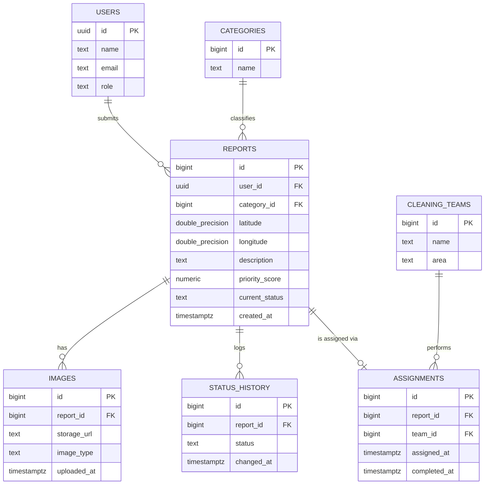

# PostgreSQL Relational ERD & Data Model

| | |
|---|---|
| **Project** | CleanOps / CleanStreet AI: Smart Citizen-Requested Street Cleaning and Waste Management Platform |
| **Task** | PostgreSQL Relational ERD & Database DDL Schema Script |
| **Package** | P02 — Design & Preparation → Database ERD, PostGIS Schemas & API Contracts |
| **Owner** | George Mohsen (per task card) |
| **Date** | 10 October 2026 |
| **Status** | Draft for Team Leader review |
| **Source of truth** | *CleanStreet AI Proposal (Updated)*, Section 15.2 (Entity-Relationship Diagram, Figure 5) and Section 15.3 (Indexing) |
| **Related documents** | `Backend_Serverless_Architecture_and_API_Gateway_Design.md` (ADR-001 / ADR-007 conformant; establishes Supabase Auth, numeric report ids, role enum) |
| **Companion file** | [`schema_draft.sql`](./schema_draft.sql) — the runnable DDL implementing this model |

---

## 1. Purpose & Scope

This document designs the relational schema for CleanOps's structured data (as opposed to image binaries, which live in Object Storage per ADR-001 and the proposal's Section 15.1). It covers exactly the **seven tables named in Proposal Section 15.2**: `USERS`, `CATEGORIES`, `REPORTS`, `IMAGES`, `STATUS_HISTORY`, `CLEANING_TEAMS`, `ASSIGNMENTS`.

**In scope:** primary keys, foreign keys, column types, constraints, indexes (per Section 15.3), and the ready-to-run DDL script.

**Out of scope:** row-level security policies, PostgreSQL RPC business-logic functions, the rate-limit/idempotency/outbox infrastructure tables defined in the API Gateway document (those are a separate, already-approved design and are not duplicated here), and any table not named in Section 15.2.

---

## 2. Conformance and Consistency

Two things this schema must not contradict:

1. **Proposal Section 15.2** is the structural source of truth for which seven tables exist and which columns each one's "key columns" list names (reproduced in Section 4 below).
2. **The already-reviewed `Backend_Serverless_Architecture_and_API_Gateway_Design.md`** already makes two concrete, approved assumptions about this schema that this document must stay consistent with rather than silently re-deciding:
   - **Supabase Auth is the identity provider**, and the application's `users` table holds the role used for authorization (assumption A1 in that document). Supabase Auth's own `auth.users.id` is a `uuid`, and the backend's session middleware looks up the application profile by that `uuid` (`sub` claim).
   - **Report ids are numeric**, not UUIDs — the route schema example in that document validates `id` with `z.coerce.number().int().positive()`, and the JSON envelope example shows `"data": { "id": 1042, ... }`.
   - **The role vocabulary is `CITIZEN | TEAM_MEMBER | OPERATOR | SUPERVISOR | ADMIN`** (the `AuthContext.role` type in that document's Section 7.4.2).

   This document follows both decisions rather than introducing a third, different convention. Section 6 states this explicitly as a design decision rather than leaving it implicit.

Where the proposal's ERD (Figure 5) does not specify something the DDL cannot omit — a concrete column type, a nullability rule, an enumerated value list — Section 6 proposes the missing detail and labels it clearly as **proposed**, not as an existing project fact, per the same discipline used in the prior architecture documents.

---

## 3. Entity-Relationship Diagram

This matches Figure 5 of the proposal: `USERS` and `CATEGORIES` each relate to `REPORTS` as 1-to-many; `REPORTS` relates to `IMAGES` and `STATUS_HISTORY` as 1-to-many; `REPORTS` relates to `ASSIGNMENTS` as (at most) one-to-one; `CLEANING_TEAMS` relates to `ASSIGNMENTS` as 1-to-many. See Section 6.4 for how the "one-to-one" `REPORTS`–`ASSIGNMENTS` edge is implemented, since a report has no assignment until an operator creates one.

---

## 4. Tables (as named in Proposal Section 15.2)

| Table | Purpose (from the proposal) | Key columns (from the proposal) |
|---|---|---|
| `USERS` | Registered citizens who submit reports | `id`, `name`, `email`, `role` |
| `CATEGORIES` | Fixed waste/issue types used to classify reports | `id`, `name` |
| `REPORTS` | The central table — every report with location, description, priority score, and current status | `id`, `user_id` (FK), `category_id` (FK), `latitude`/`longitude`, `priority_score`, `current_status` |
| `IMAGES` | Photo links per report; a report can hold more than one image (before/after) | `id`, `report_id` (FK), `storage_url`, `image_type` |
| `STATUS_HISTORY` | Audit log for every status change, as required by proposal Section 16 / Section 17 | `id`, `report_id` (FK), `status`, `changed_at` |
| `CLEANING_TEAMS` | Cleaning teams responsible for execution, and each team's working area | `id`, `name`, `area` |
| `ASSIGNMENTS` | Links each report to the responsible team, with assignment and completion timestamps | `id`, `report_id` (FK), `team_id` (FK), `assigned_at`, `completed_at` |

Two design notes the proposal itself calls out (Section 15.2), carried forward unchanged: **`IMAGES` is a separate table** so a single report can hold both the citizen's original photo and the cleaning team's completion evidence, and **`STATUS_HISTORY` implements the audit-logging requirement as an actual table**, not just a stated intention — it also feeds the response-time and resolution-rate analytics named in Section 11 of the proposal.

No eighth table (such as a separate `AI_RESULTS` table) is introduced. AI output lives on `REPORTS.category_id` and `REPORTS.priority_score`, consistent with Section 15.1 of the proposal ("the AI result is written back into the report record itself") and with the already-delivered Data Flow & Storage Architecture document.

---

## 5. Relationships

| Relationship | Cardinality (per Figure 5) | Enforced by |
|---|---|---|
| `USERS` → `REPORTS` | 1..N | `reports.user_id` references `users.id` |
| `CATEGORIES` → `REPORTS` | 1..N | `reports.category_id` references `categories.id` |
| `REPORTS` → `IMAGES` | 1..N | `images.report_id` references `reports.id` |
| `REPORTS` → `STATUS_HISTORY` | 1..N | `status_history.report_id` references `reports.id` |
| `REPORTS` → `ASSIGNMENTS` | 1..1 (at most one assignment per report — see 6.4) | `assignments.report_id` references `reports.id`, with a `UNIQUE` constraint |
| `CLEANING_TEAMS` → `ASSIGNMENTS` | 1..N | `assignments.team_id` references `cleaning_teams.id` |

---

## 6. Design Decisions (proposed, where the proposal is silent on a concrete detail)

The proposal's ERD (Figure 5) names the tables, the key columns, and the cardinalities. It does not specify SQL types, nullability, enumerated value lists, or `ON DELETE` behaviour. Each decision below fills exactly one such gap. Each is labelled with where it comes from.

### 6.1 Primary key types — `uuid` for `USERS`, `bigint identity` for everything else

**Decision:** `users.id` is `uuid`. Every other table's `id` is `bigint generated always as identity`.

**Why:** this is not a free choice — it is required for consistency with the already-approved `Backend_Serverless_Architecture_and_API_Gateway_Design.md` (Section 2 above). Supabase Auth issues `uuid` user ids, and that document's route schemas already validate report ids as plain integers. Introducing a different convention here would silently contradict a document the Team Leader has already reviewed.

### 6.2 Role vocabulary — `CHECK` constraint, not a free-text column

**Decision:** `users.role` is constrained to `'CITIZEN', 'TEAM_MEMBER', 'OPERATOR', 'SUPERVISOR', 'ADMIN'`.

**Why:** these five values are not invented here — they are the `AuthContext.role` union type already defined and approved in the API Gateway document's Section 7.4.2. Reusing them (rather than re-deriving a role list from scratch) is what keeps the two documents describing one system instead of two.

### 6.3 Report status vocabulary — proposed, open for confirmation

**Decision (proposed):** `reports.current_status` is constrained to `'NEW', 'ANALYZED', 'ASSIGNED', 'IN_PROGRESS', 'RESOLVED', 'REOPENED'`.

**Why these specific values, and why this is flagged as proposed rather than fact:** `NEW`, `ANALYZED`, and `ASSIGNED` are directly evidenced in the already-approved API Gateway document (its Section 10.5 sequence diagram shows a report moving `NEW` → `ANALYZED`; its Section 5.7 route catalogue filters on `status=ANALYZED,ASSIGNED`). `RESOLVED` matches the operator workflow's "Mark as Resolved" step (proposal Figure 7). `IN_PROGRESS` and `REOPENED` are **not** directly evidenced anywhere and are proposed here only because Figure 7's "Take Further Action" branch loops back to "Monitor Request Progress," which needs *some* status to represent — the exact token is not fixed by any source document. **This is an open question for the Team Leader (see Section 9, Q1)**, not a decided fact; the DDL script names the constraint so the value list can be edited in one place without a schema rewrite.

### 6.4 `ASSIGNMENTS` to `REPORTS` is enforced as *at most* one, not *exactly* one

**Decision:** `assignments.report_id` is `UNIQUE` and nullable-by-absence (a report simply has no `ASSIGNMENTS` row until an operator assigns it), rather than a `NOT NULL` one-to-one enforced at `REPORTS` creation time.

**Why:** Figure 5 labels this edge "1..1," but the operator workflow (Figure 7, proposal) shows reports existing — and visible on the dashboard — before a team is assigned. A hard "exactly one, from creation" constraint would make report creation and assignment the same transaction, which contradicts the asynchronous, two-step flow already described in the approved Data Flow & Storage Architecture document. "At most one, enforced by uniqueness once it exists" is the interpretation that keeps both documents consistent; it is noted here explicitly rather than silently reconciled.

### 6.5 Spatial storage — `latitude`/`longitude` plus a generated PostGIS `geography` column

**Decision:** `REPORTS` keeps the `latitude` and `longitude` columns named in Figure 5, and adds a **generated** `location geography(Point, 4326)` column computed from them, indexed with `GIST`.

**Why:** Section 15.3 of the proposal requires "a spatial index on `latitude`/`longitude` in `REPORTS` (via PostGIS)." A plain B-tree index on two `double precision` columns is not a spatial index and cannot support PostGIS's nearby-report queries; PostGIS indexes a `geography`/`geometry` column. Generating that column from `latitude`/`longitude` (rather than replacing them) satisfies the proposal's indexing requirement in Section 15.3 without removing the two columns Figure 5 names.

### 6.6 `image_type` vocabulary — `'BEFORE'` / `'AFTER'`

**Decision:** `images.image_type` is constrained to `'BEFORE', 'AFTER'`.

**Why:** this is the proposal's own wording — Section 15.1 refers to "before/after photos" stored in Object Storage, and the `IMAGES` table purpose in Section 15.2 says it exists so a report "can hold both the citizen's original photo and the cleaning team's completion evidence." `BEFORE` is the citizen's submission photo; `AFTER` is the completion evidence.

### 6.7 `ON DELETE` behaviour

**Decision (proposed):** `reports.user_id` and `reports.category_id` use `ON DELETE RESTRICT` (a user or category cannot be deleted while reports reference it). `images.report_id`, `status_history.report_id`, and `assignments.report_id` use `ON DELETE CASCADE` (deleting a report removes its photos, audit trail, and assignment with it). `assignments.team_id` uses `ON DELETE RESTRICT`.

**Why:** none of this is specified in the proposal. The reasoning: a report's own child records (images, history, assignment) have no independent meaning once the report itself is gone, so cascading is the simplest MVP behaviour; but deleting a user or a category out from under existing reports would silently corrupt the audit trail the proposal requires in Section 17, so those are restricted instead. **Flagged as a proposed MVP decision** — in practice, the project is far more likely to soft-delete or deactivate users than hard-delete them, and this default can be revisited if that is confirmed (see Section 9, Q2).

### 6.8 Timestamps

**Decision (proposed):** every `*_at` column is `timestamptz`, defaulting to `now()` where the proposal implies a row is timestamped at creation (`reports.created_at`, `images.uploaded_at`, `status_history.changed_at`). `assignments.assigned_at` defaults to `now()` on insert; `assignments.completed_at` is nullable (a new assignment is not yet completed).

---

## 7. Indexing (Proposal Section 15.3)

| Index | Rationale (quoted from Section 15.3) |
|---|---|
| `GIST` index on `reports.location` (the generated PostGIS geography column, see 6.5) | "Spatial index on latitude/longitude in REPORTS (via PostGIS) — supports nearby-report search for hotspot and duplicate detection." |
| B-tree index on `reports.current_status` | "Index on current_status — the operations dashboard filters on this constantly." |
| B-tree index on `reports.created_at` | "Index on created_at — for analytics and chronological ordering of reports." |

Every foreign key also gets a supporting B-tree index (`reports.user_id`, `reports.category_id`, `images.report_id`, `status_history.report_id`, `assignments.report_id`, `assignments.team_id`), since PostgreSQL does not create these automatically and every one of them is a join or lookup path used by the API routes already defined in the Gateway document (for example, "a citizen's own reports," "a team's own assignments").

---

## 8. How this schema is read by the already-approved API design

This is a consistency check, not new design: the Gateway document's route catalogue and sequence diagrams only make sense against this schema if the following line up, and they do.

| API Gateway document reference | Expects | This schema provides |
|---|---|---|
| Section 10.5, `rpc create_report()` | A `reports` row insertable with status `NEW` | `reports.current_status` default-able to `'NEW'`, allowed by the CHECK constraint (6.3) |
| Section 10.5, `rpc apply_ai_result()` | An `UPDATE` on the same report row, setting category and priority, moving `NEW` → `ANALYZED` | `reports.category_id`, `reports.priority_score`, `reports.current_status` are all mutable columns on the one `REPORTS` row (no separate AI-results table, per Section 4 above) |
| Section 5.7 route catalogue, `GET /v1/operator/reports?status=ANALYZED,ASSIGNED` | Filtering reports by `current_status` | B-tree index on `reports.current_status` (Section 7) |
| Section 5.7, `POST /v1/operator/reports/:id/assignments` | `:id` validated as `z.coerce.number().int().positive()` | `reports.id` is `bigint`, not `uuid` (6.1) |
| Section 7.4.2, `AuthContext.role` | One of five fixed role strings | `users.role` CHECK constraint (6.2) |

---

## 9. Open Questions for Team Leader Review

| # | Question | Default if no decision |
|---|---|---|
| **Q1** | Is the proposed `current_status` value set (`NEW, ANALYZED, ASSIGNED, IN_PROGRESS, RESOLVED, REOPENED`) correct, or does the project have a different fixed list in mind for the "Take Further Action" branch of the operator workflow (Figure 7)? | This document's six-value list (Section 6.3) |
| **Q2** | Should a user ever be hard-deleted, or only deactivated (`users.active`-style soft delete, matching the account-disable behaviour already described in the API Gateway document's Section 7.4.2)? This affects whether `ON DELETE RESTRICT` on `reports.user_id` is the right long-term choice | `ON DELETE RESTRICT` (Section 6.7) |
| **Q3** | Does `CATEGORIES` need any column beyond `id`/`name` at this stage (for example, a `description` or an `icon` reference for the citizen app), or is the two-column table in Figure 5 final for the MVP? | Two columns only, as drawn in Figure 5 |

---

## 10. Acceptance Criteria

- [x] All seven tables named in Proposal Section 15.2 are present, with no table added or removed.
- [x] Every "key column" listed in Section 15.2's table is implemented.
- [x] Primary keys and foreign keys match the relationships drawn in Figure 5.
- [x] The AI result (`category_id`, `priority_score`) is written to the same `REPORTS` row — no separate results table.
- [x] All three indexes named in Section 15.3 are implemented, with the spatial index actually spatial (GIST on a PostGIS geography column, not a plain B-tree on two floats).
- [x] Every detail not specified by the proposal (types, enums, delete behaviour) is labelled as a proposed decision with its reasoning, not presented as an existing project fact.
- [x] The schema is consistent with the already-approved Backend Serverless Architecture & API Gateway Design document (id types, role vocabulary, status values used in its examples).
- [ ] Team Leader has answered Q1–Q3.
