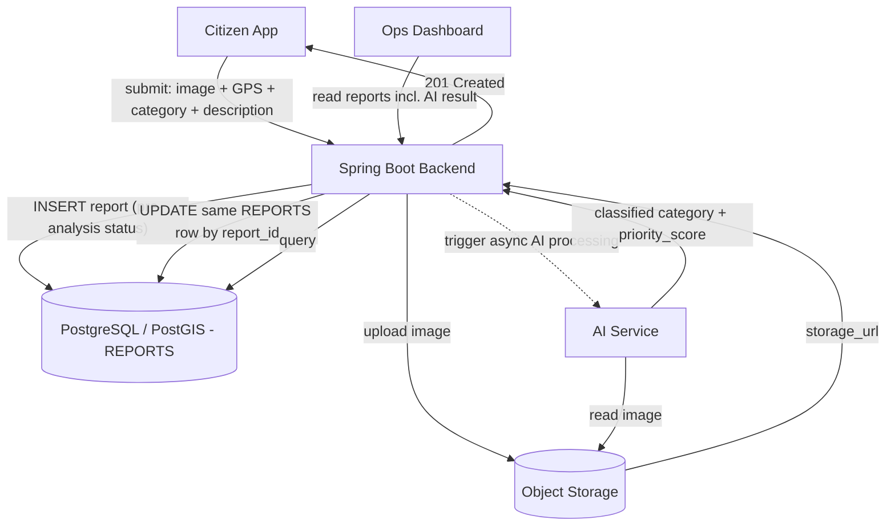
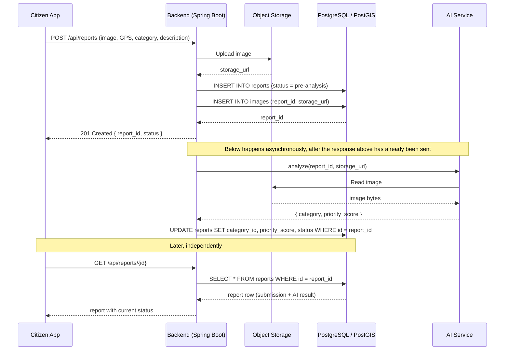

# CleanOps — Data Flow & Storage Architecture

**Component:** Backend (Java Spring Boot)
**Scope:** P01 — Data Requirements — Data Flow & Storage Architecture

---

## 1. Purpose & Scope

This document describes how a citizen-submitted waste report moves through the CleanOps system, from submission to the point where the AI service's analysis is written back into that same report record, and finally to how the operations dashboard reads the result.

It covers exactly one thing: **the data flow and storage responsibilities for the report → image → AI → write-back path.** It does not cover authentication design, routing/assignment logic, UI design, or infrastructure topics outside this flow.

The single fact this document must make unambiguous: **the AI result is written back as an `UPDATE` on the same `REPORTS` row created at submission — never as a new row in a separate results table.**

**Ownership boundary.** The severity and priority calculation logic itself (the rule-based formulas) is implemented and owned by the AI/scoring service — a separate backend component maintained by a different team member. The Spring Boot backend covered in this document does not compute severity or priority. Its only responsibility regarding the score is to send the AI service a reference to the image, receive back the already-computed result, and persist it onto the report row.

---

## 2. Architecture Components

| Component | Role in this flow |
|---|---|
| **Citizen App** | Submits the report: image, GPS location, category, optional description |
| **Backend (Spring Boot)** | Single point of coordination. Receives the submission, stores the image, creates the report, triggers AI processing, writes the AI result back, serves the dashboard |
| **PostgreSQL / PostGIS** | Stores structured, queryable data — the report itself, its location, its status, and (after analysis) its category and priority score |
| **Object Storage** (Firebase Storage or S3) | Stores the image binary. PostgreSQL never holds image bytes, only a reference to it |
| **AI Service** | A separate service. Reads the image from Object Storage, performs detection/classification, computes severity and priority using rule-based logic, and returns a structured result to the backend |
| **Operations Dashboard** | Reads reports (including AI results) from the backend once analysis is complete |

The backend is the only component that talks to every other component. The AI service never talks to PostgreSQL directly, and the citizen app never talks to Object Storage or the AI service directly.

---

## 3. Data Flow Overview

At a high level, the flow has two parts:

1. **Synchronous part** (inside the citizen's HTTP request/response): submit report → store image → create report row → respond to the citizen.
2. **Asynchronous part** (after the response has already been sent): trigger AI analysis → AI reads the image and returns a result → backend updates the same report row.

The citizen app is never blocked waiting for AI inference. This is a deliberate MVP decision (see Section 13) so that report submission stays fast and independent of AI processing time.

---

## 4. End-to-End Data Flow

1. **Citizen submits a report.** The citizen app sends the image, GPS coordinates, a category, and an optional description to the backend.
2. **Backend uploads the image to Object Storage.** This happens first, because the report record needs a valid image reference to be meaningful. Object Storage returns a `storage_url`.
3. **Backend creates the `REPORTS` row in PostgreSQL/PostGIS**, using the citizen-supplied location, category, and description, and links the image via the `IMAGES` table (see Section 5). The report is created with an initial, pre-analysis status (see Section 13).
4. **Backend responds to the citizen app** confirming the report was received. At this point no AI result exists yet.
5. **Backend triggers AI processing in the background**, passing the `report_id` and the image's `storage_url` — not the image bytes.
6. **AI service reads the image directly from Object Storage** using the URL it was given.
7. **AI service performs detection/classification and computes severity and priority** using its rule-based scoring logic, and returns a structured result (classified category, priority score) to the backend.
8. **Backend updates the same `REPORTS` row** — by `report_id` — setting the AI-derived category and priority score, and advancing the status to indicate analysis is complete.
9. **Operations dashboard reads reports from PostgreSQL through the backend**, ordered by priority, seeing both the original submission data and the AI result on a single row.

---

## 5. Storage Responsibilities

| Data | Stored in | Notes |
|---|---|---|
| Image binary (the actual photo) | **Object Storage** | Never stored in PostgreSQL. Large binary data does not belong in a relational database — it bloats the database, slows backups, and PostgreSQL provides no advantage over purpose-built object storage for serving files. |
| Image reference (`storage_url`) and image metadata | **PostgreSQL**, `IMAGES` table | The `IMAGES` table links to `REPORTS` via `report_id` (foreign key), so a report can hold more than one image (e.g. citizen photo now; completion evidence later, outside this task's scope). |
| Report data: location, category, description, status, priority score | **PostgreSQL / PostGIS**, `REPORTS` table | Structured and queryable. Location is stored so PostGIS can run spatial queries later (outside this task's scope). |

No separate `AI_RESULTS` table is introduced. The AI service's output is written directly onto columns that already exist on the `REPORTS` row.

---

## 6. AI Integration & Result Write-Back

This is the core requirement of the task, stated explicitly:

- The backend calls the AI service with a **reference** (`report_id`, `storage_url`) — not the raw image.
- **All detection, classification, and severity/priority scoring logic lives inside the AI service, owned by a different backend/team member.** This Spring Boot backend treats that logic as a black box: it sends a reference and receives a finished result. It does not implement, duplicate, or validate the scoring formulas itself.
- The AI service does not write to the database itself. It only returns a result to the backend.
- The backend is the **only** component permitted to write the AI result into PostgreSQL — writing, not calculating, is this backend's responsibility.
- The write-back is a single `UPDATE` statement targeting the report by its primary key:

```sql
UPDATE reports
SET category_id = :ai_category_id,
    priority_score = :ai_priority_score,
    current_status = :post_analysis_status
WHERE id = :report_id;
```

- No new row is inserted for the AI result. No separate table stores it. After this `UPDATE`, the single `REPORTS` row contains both the citizen's original submission and the AI's analysis.

---

## 7. Data Flow Diagram



The dashed arrow marks the boundary between the synchronous request/response path (solid) and the background AI path (dashed). Both paths converge on the same `REPORTS` row.

---

## 8. Sequence Diagram



---

## 9. Database Impact

Tables involved in this flow (as defined by the existing project data model):

| Table | Operation in this flow |
|---|---|
| `REPORTS` | 1 × `INSERT` at submission, 1 × `UPDATE` at AI write-back |
| `IMAGES` | 1 × `INSERT` at submission (citizen photo, linked via `report_id`) |

Fields on `REPORTS` touched by this flow:

- Set at creation (step 3): location, citizen-supplied category, description, initial status, `created_at`.
- Set at write-back (step 8): AI-classified category, priority score, updated status.

No other tables (`STATUS_HISTORY`, `ASSIGNMENTS`, `CLEANING_TEAMS`) are written to by this specific flow; they belong to the operator/assignment workflow, which is out of scope for this task.

---

## 10. API / Service Interaction

Two backend-facing interactions are required to support this flow:

- **Citizen-facing:** `POST /api/reports` — accepts the report submission, performs steps 2–4 synchronously, and returns immediately once the report row exists.
- **Internal, backend-to-AI-service:** the backend calls the AI service's analysis endpoint in the background (step 5) and receives the result directly in that call's response (step 7). No separate callback endpoint is required, because the backend itself initiates and holds the async task — the AI service does not need to call back into the backend independently.

This keeps the integration to a single request/response pair between the backend and the AI service, run on a background thread rather than the citizen's request thread.

---

## 11. Failure & Recovery Considerations

| Failure point | Behavior |
|---|---|
| **Object Storage upload fails** | No report row is created. The backend returns an error to the citizen app and asks them to retry submission. This avoids creating a report with no valid image reference. |
| **Database persistence fails after image upload succeeds** | The backend returns an error to the citizen app. The uploaded image becomes an orphaned file in Object Storage; cleanup of orphaned files is a proposed MVP follow-up, not part of this flow's real-time path. |
| **AI processing fails or times out** | The report row already exists and stays visible on the dashboard in its pre-analysis status. The failure is logged. The report is not deleted or hidden — an unanalyzed report is still a valid, actionable citizen report. |
| **Retry behavior** | If AI processing fails, a single retry may be attempted by the backend's background task. Retrying calls the AI service again with the same `report_id` and `storage_url`; it does not create a new report and does not insert a new row. If retries are exhausted, the report simply remains in its pre-analysis status until manually or later re-triggered. |

No message queue, webhook, or external infrastructure is introduced for retry or failure handling — the background AI call is a simple in-process asynchronous task within the Spring Boot application (e.g. a `@Async`-annotated service method), which is sufficient at MVP scale and avoids infrastructure the project does not need yet.

---

## 12. Consistency and Idempotency

- The backend identifies the target report solely by `report_id`, which it generated at creation and passed to the AI service. There is no ambiguity about which row an AI result belongs to.
- Because the AI call is a single request/response initiated and owned by the backend (not an external callback), there is no scenario where an unrelated or duplicate AI result arrives unprompted.
- To guard against a retried AI call double-applying its result (e.g. a slow first attempt eventually responding after a retry already succeeded), the write-back `UPDATE` should be conditioned on the report still being in its pre-analysis status:

```sql
UPDATE reports
SET category_id = :ai_category_id,
    priority_score = :ai_priority_score,
    current_status = :post_analysis_status
WHERE id = :report_id
  AND current_status = :pre_analysis_status;
```

If the row has already moved past the pre-analysis status, the update simply affects zero rows — the late/duplicate result is discarded rather than overwriting a result that already exists. This is deliberately simple and does not require a dedicated idempotency-key mechanism at MVP scale.

---

## 13. MVP Decisions

The following are **proposed decisions**, not facts drawn from the existing project documentation. They are needed to make this flow implementable and are flagged here for the team lead's sign-off:

- **Processing mode:** asynchronous. Report submission returns as soon as the report row exists; AI analysis runs in the background and updates the same row afterward. This is a proposal consistent with the project's stated workflow (submission is confirmed before analysis begins), made explicit here because the source material does not specify sync vs. async.
- **Background mechanism:** an in-process async method call within the Spring Boot application (e.g. `@Async`), not a message queue or external broker — the simplest option appropriate for a graduation-project MVP.
- **Status values:** two states are needed at minimum for this flow to function — a *pre-analysis* status (set at report creation) and a *post-analysis* status (set once the AI write-back succeeds). Exact status naming is a proposed placeholder pending the team's agreed status vocabulary; this document does not fix final enum values.
- **Retry policy:** a single retry attempt on AI failure/timeout before leaving the report in its pre-analysis status indefinitely. No dead-letter handling or alerting is proposed at MVP scale.
- **Orphaned-file cleanup** (image uploaded but report creation failed): flagged as a known edge case, not solved by this flow; left as a future housekeeping task.

---

## 14. Acceptance Criteria

This task is considered complete when the following can all be confirmed against the implementation:

- [ ] A citizen report submission results in exactly one `REPORTS` row and one linked `IMAGES` row.
- [ ] The image binary is stored only in Object Storage; PostgreSQL stores only the `storage_url` reference.
- [ ] The citizen app receives a response without waiting for AI analysis to finish.
- [ ] AI analysis is triggered after the report is created, using only the `report_id` and `storage_url`.
- [ ] The AI service's result is applied via an `UPDATE` to the same `REPORTS` row — no new row and no separate results table are created.
- [ ] A report remains visible and queryable even if AI analysis has not yet completed or has failed.
- [ ] A retried or duplicate AI result cannot overwrite a report that has already been updated.
- [ ] The operations dashboard can retrieve a report's submission data and AI result together from a single row.
