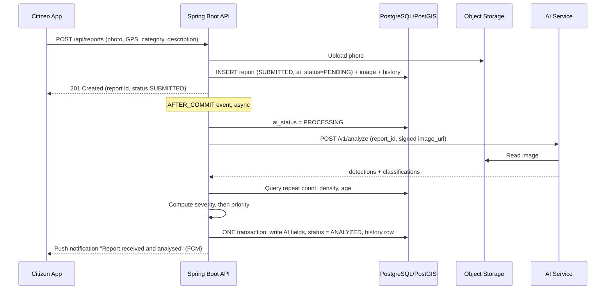

# AI Service Integration Requirements

| | |
|---|---|
| **Project** | CleanStreet AI |
| **Package** | P01 — Project Foundation & Requirements → AI Requirements |
| **Owner** | George Mohsen (Back-end, Java Spring Boot) |
| **Status** | Draft for team-lead review |
| **Source** | Project proposal §6, §11, §15, §16 |

## 1. Purpose

This document defines how the AI service is integrated with the Spring Boot back-end:

1. **Trigger** — when and how an AI analysis starts after a citizen submits a report.
2. **Turnaround** — how fast results are expected and what happens on failure.
3. **Write-back** — exactly which fields are written into the `REPORTS` record, and how the status advances to `ANALYZED`.

Guiding principle (proposal §16.3): **AI assists, the operator decides.** The AI result never rejects a report and never closes one; it only enriches the record and orders the operator's queue.

## 2. Scope

**In scope:** trigger, request/response contract with the AI service, severity and priority calculation, database write-back, status transition, failure handling, security, acceptance criteria.

**Out of scope:** model training (AI team), operator assignment and routing, hotspot clustering (DBSCAN) and duplicate-report linking (Tier 3, see §12), notification content.

## 3. Components and responsibilities

| Component | Responsibility |
|---|---|
| **Citizen app** | Submits report + photo + GPS + category (+ optional description). |
| **Spring Boot back-end** | Saves the report, uploads the photo to Object Storage, triggers and orchestrates the analysis, computes severity and priority, **writes all results to PostgreSQL**, updates status, logs history. |
| **AI service** (Python, YOLOv8 + classifier) | Stateless inference. Reads the image, returns detections and classifications. Does not touch the database. |
| **Object Storage** (Firebase Storage / S3) | Holds images; the DB stores only `storage_url`. |
| **PostgreSQL + PostGIS** | Single source of truth for report, AI result, status, and history. |
| **Ops dashboard** | Reads reports ranked by `priority_score`. |

> **Design decision D1 — back-end is the single database writer.**
> Proposal Figure 4 draws the AI service writing `priority_score` + category back to PostgreSQL. This spec keeps the AI service **stateless** and lets Spring Boot persist everything. Reasons: severity and priority need repeat count, location density and report age, which are PostGIS queries the back-end already owns; one writer means one transaction, one audit trail, and no DB credentials in the AI service. The data flow in the proposal is otherwise unchanged (AI result still lands inside the `REPORTS` record).

## 4. Trigger

### 4.1 Trigger condition

An analysis is triggered **automatically, once per report**, when **all** of the following are true:

1. The report row is committed with `current_status = SUBMITTED`.
2. At least one `IMAGES` row with `image_type = 'before'` exists for the report and the file is confirmed uploaded to Object Storage.
3. `ai_status = PENDING` (default at creation).

There is **no manual action** by the citizen or operator to start the normal flow. Operators may manually re-run analysis (§4.3).

### 4.2 Mechanism

1. `POST /api/reports` runs in one DB transaction: insert `REPORTS` (`SUBMITTED`, `ai_status = PENDING`), insert `IMAGES`, insert `STATUS_HISTORY (SUBMITTED)`.
2. After the transaction **commits**, the back-end publishes a `ReportSubmittedEvent(reportId)`.
3. A `@TransactionalEventListener(phase = AFTER_COMMIT)` handler running on an `@Async` executor starts the analysis, so the citizen gets an immediate `201 Created` and never waits for the AI.
4. A **safety-net scheduler** (every 60 s) re-queues reports stuck in `PENDING` for more than 2 minutes, or in `PROCESSING` for more than 5 minutes, with `ai_attempts < 3`. This covers server restarts and lost events.



### 4.3 Manual re-analysis

`POST /api/reports/{id}/reanalyze` (role `OPERATOR` or `ADMIN`) resets `ai_status = PENDING`, `ai_attempts = 0` and re-runs the flow. Used for `FAILED` reports or after weight-table recalibration. Re-analysis overwrites AI fields; it does **not** create a second `ANALYZED` history row if the status is already `ANALYZED` or later.

## 5. Status lifecycle

```
SUBMITTED ──► ANALYZED ──► ASSIGNED ──► IN_PROGRESS ──► COMPLETED ──► RESOLVED
                                                            │
                                                            └─(operator rejects completion)─► back to IN_PROGRESS
```

- `SUBMITTED → ANALYZED` is performed **only** by the AI integration flow in this document.
- The transition is **conditional**: `UPDATE ... SET current_status='ANALYZED' WHERE id=? AND current_status='SUBMITTED'`. If the report has already moved on (e.g. operator assigned it manually during an AI outage), the AI fields are still saved but the status is **not** moved backwards or re-set.
- Every transition inserts a `STATUS_HISTORY` row (audit requirement, proposal §17).

> **Note:** The proposal names the statuses "acknowledged / in progress / resolved" for citizens and "Analyzed" / "Assigned" / "Resolved" in the operator workflow. The enum above is the proposed unified list; the citizen app can map `SUBMITTED`/`ANALYZED` to "Received/Acknowledged".

## 6. AI service contract

### 6.1 Request

`POST {ai.base-url}/v1/analyze` — header `X-API-Key: <secret>`

```json
{
  "report_id": 1042,
  "image_id": 2087,
  "image_url": "https://storage.example.com/reports/1042/before.jpg?sig=...&exp=..."
}
```

- `image_url` is a **short-lived signed URL** (TTL 10 min). The AI service never gets storage credentials.

### 6.2 Response `200 OK`

```json
{
  "report_id": 1042,
  "model_version": "yolov8n-taco-v1 + cls-gcv2-v1",
  "inference_ms": 840,
  "detections": [
    {
      "label": "bottle",
      "material": "glass",
      "confidence": 0.87,
      "bbox": [120, 340, 80, 160]
    },
    {
      "label": "plastic bag",
      "material": "plastic",
      "confidence": 0.62,
      "bbox": [400, 300, 150, 120]
    }
  ]
}
```

| Field | Type | Notes |
|---|---|---|
| `model_version` | string | Stored for reproducibility. |
| `detections[].label` | string | Object class from the detector (TACO). |
| `detections[].material` | string | Material class from the classifier (Garbage Classification v2: `metal, glass, biological, paper, battery, trash, cardboard, shoes, clothes, plastic`). |
| `detections[].confidence` | float 0–1 | Combined/detector confidence. |
| `detections[].bbox` | `[x, y, w, h]` px | For dashboard overlay. |
| `detections: []` | | Valid response — no waste found (see §9.2). |

### 6.3 Errors

| HTTP | Meaning | Back-end behaviour |
|---|---|---|
| 400 / 422 | Unreadable/invalid image | **No retry.** `ai_status = FAILED`, reason stored. |
| 401 / 403 | Bad API key | No retry, log at ERROR, alert. |
| 429 / 5xx / timeout | Transient | Retry (§8). |

> The two Tier-1 models (detect → classify) are hidden behind this one endpoint. The back-end does not need to know about two stages.

## 7. Turnaround (proposed targets)

The proposal does not fix numbers, so these are **proposed targets** to be validated during the AI phase (weeks 9–12 of the plan):

| Metric | Target |
|---|---|
| AI service inference time (single image) | ≤ 5 s (p95) |
| Submission → status `ANALYZED` | ≤ 30 s (p95), ≤ 60 s (p99) |
| HTTP timeout, back-end → AI service | connect 3 s, read 30 s |
| Hard ceiling before report is flagged for manual triage | 5 min |
| Citizen `POST /api/reports` response time | Unaffected by AI (async), ≤ 2 s |

The dashboard must remain **fully usable while analysis is pending or failed**: unanalysed reports appear in the queue (see §9.3).

## 8. Failure handling

| Case | Behaviour |
|---|---|
| Transient error / timeout | Up to **3 attempts**, back-off 10 s → 30 s → 90 s. `ai_attempts` incremented each try. |
| Back-end restart mid-flight | Scheduler (§4.2 step 4) picks up stale `PENDING`/`PROCESSING`. |
| 3 attempts exhausted, or non-retryable error | `ai_status = FAILED`, `ai_last_error` saved, `current_status` **stays `SUBMITTED`**, report appears in the operator queue with a "Needs manual review" badge. |
| AI service down for long periods | Circuit breaker (Resilience4j) opens after 5 consecutive failures for 60 s to avoid hammering it. |
| Duplicate trigger (event + scheduler race) | Claim via `UPDATE ... SET ai_status='PROCESSING' WHERE id=? AND ai_status='PENDING'`; only the caller with 1 affected row proceeds. Write-back is idempotent. |

A failed analysis **never blocks** a report from being assigned and cleaned.

## 9. Scoring: from detections to severity and priority

The proposal (§11, Tier 2) defines severity and priority as **transparent formulas, not learned models**, because no dataset has severity labels. All parameters live in configuration/DB tables so they can be calibrated without redeploying. **All values below are provisional** and must be presented as such to the committee.

### 9.1 Severity (0–100)

1. Discard detections with `confidence < ai.min-confidence` (default `0.40`).
2. `raw = Σ weight(material) × confidence` over remaining detections.
3. `severity_score = 100 × min(raw / ai.severity.cap, 1)` (default cap `10`).
4. `severity_level`: `< 25` LOW · `< 50` MEDIUM · `< 75` HIGH · `≥ 75` CRITICAL.

Weights are stored in table `severity_weights(material, weight)`. Provisional starting values (glass heavier than plastic per proposal; the rest are placeholders to calibrate):

| Material | Weight | Material | Weight |
|---|---|---|---|
| battery | 4.0 | biological | 2.0 |
| glass | 3.0 | trash | 1.5 |
| metal | 2.5 | paper / cardboard | 1.0 |
| plastic | 2.0 | shoes / clothes | 1.0 |

### 9.2 Zero detections

If `detections` is empty, the analysis is still `COMPLETED`: `severity_score = 0`, `detected_object_count = 0`, `needs_manual_review = true`, status still advances to `ANALYZED`. **The AI never decides a report is invalid** (proposal §11 closing note).

### 9.3 Priority (0–100)

Each factor is normalised to 0–1 first so no factor dominates by numeric range (proposal §11):

| Factor | Normalisation (defaults, configurable) | Weight |
|---|---|---|
| Severity | `severity_score / 100` | 0.40 |
| Repeat occurrence | `min(repeat_count / 5, 1)` — other reports within **25 m** in the last **30 days** (PostGIS `ST_DWithin`) | 0.25 |
| Report age | `min(age_hours / 72, 1)` | 0.20 |
| Location density | `min(open_reports_within_200m / 10, 1)` | 0.15 |

`priority_score = 100 × Σ (weight × normalised factor)`
`priority_level`: `< 25` LOW · `< 50` MEDIUM · `< 75` HIGH · `≥ 75` URGENT.

**Age changes over time**, so a scheduled job (every 15 min) recomputes `priority_score` for all reports with status `< RESOLVED`, using the stored `severity_score`. Without this, older reports would never rise in the queue.

**Transparency:** the individual factor values and weights used are saved in `priority_breakdown` (JSON) so the operator can see *why* a report ranks where it does — required for the operator to be able to override it meaningfully (proposal §16.3).

> **Clarification needed (Q2):** proposal §16.2 lists "image evidence" as a fifth priority factor, while §11 lists four. This spec treats image evidence as already captured through severity (derived from the image). Confirm with the team lead.

## 10. Data written back to the database

### 10.1 `REPORTS` — existing columns updated

| Column | Written by AI flow | Value |
|---|---|---|
| `priority_score` | ✅ | Computed per §9.3 |
| `current_status` | ✅ | `SUBMITTED` → `ANALYZED` (conditional, §5) |

Never modified by the AI flow: `user_id`, `category_id` (the **citizen's chosen category is preserved**), `latitude`, `longitude`, `description`, `created_at`.

### 10.2 `REPORTS` — new columns (proposed ERD extension)

The ERD in the proposal (Figure 5) only has `priority_score` and `current_status`. To store detection, classification and severity results **inside the report record** (as §15.1 requires), add:

| Column | Type | Description |
|---|---|---|
| `ai_status` | `varchar(12)` | `PENDING` / `PROCESSING` / `COMPLETED` / `FAILED`. Default `PENDING`. |
| `ai_attempts` | `smallint` | Attempts so far. Default 0. |
| `ai_last_error` | `text` | Last failure reason, nullable. |
| `analyzed_at` | `timestamptz` | When results were written. |
| `ai_model_version` | `varchar(100)` | From AI response. |
| `detected_object_count` | `int` | Detections above confidence threshold. |
| `detections` | `jsonb` | Full list: label, material, confidence, bbox. |
| `ai_dominant_material` | `varchar(30)` | Material with the highest weighted contribution. |
| `ai_confidence` | `numeric(4,3)` | Mean confidence of kept detections. |
| `severity_score` | `numeric(5,2)` | 0–100, §9.1. |
| `severity_level` | `varchar(10)` | LOW / MEDIUM / HIGH / CRITICAL. |
| `priority_level` | `varchar(10)` | LOW / MEDIUM / HIGH / URGENT. |
| `priority_breakdown` | `jsonb` | Factor values + weights used. |
| `needs_manual_review` | `boolean` | True when zero detections or AI failed. Default false. |

> **Why `ai_dominant_material` and not a FK to `CATEGORIES`?** `CATEGORIES` are fixed *issue types* chosen by the citizen; AI output is *material classes* from a different taxonomy (proposal §11, "Dataset provenance" risk). Keeping them separate avoids a lossy mapping.

### 10.3 Other tables

| Table | Write |
|---|---|
| `STATUS_HISTORY` | Insert `(report_id, 'ANALYZED', now())`. |
| `IMAGES` | **No change** (AI only reads). |
| `severity_weights` *(new, config)* | Read-only for this flow. |

Recommended optional column for audit: `STATUS_HISTORY.changed_by` (`NULL`/`'SYSTEM'` for AI transitions).

### 10.4 Transactionality

Steps 1–3 below happen in **one DB transaction** so a report is never `ANALYZED` without its scores:

1. `UPDATE reports SET <all AI fields above>, ai_status='COMPLETED', analyzed_at=now() WHERE id=?`
2. Conditional status update to `ANALYZED`
3. `INSERT INTO status_history ...`

### 10.5 Migration (Flyway)

```sql
ALTER TABLE reports
  ADD COLUMN ai_status            varchar(12)  NOT NULL DEFAULT 'PENDING',
  ADD COLUMN ai_attempts          smallint     NOT NULL DEFAULT 0,
  ADD COLUMN ai_last_error        text,
  ADD COLUMN analyzed_at          timestamptz,
  ADD COLUMN ai_model_version     varchar(100),
  ADD COLUMN detected_object_count int,
  ADD COLUMN detections           jsonb,
  ADD COLUMN ai_dominant_material varchar(30),
  ADD COLUMN ai_confidence        numeric(4,3),
  ADD COLUMN severity_score       numeric(5,2),
  ADD COLUMN severity_level       varchar(10),
  ADD COLUMN priority_level       varchar(10),
  ADD COLUMN priority_breakdown   jsonb,
  ADD COLUMN needs_manual_review  boolean      NOT NULL DEFAULT false;

CREATE TABLE severity_weights (
  material varchar(30) PRIMARY KEY,
  weight   numeric(4,2) NOT NULL
);

CREATE INDEX idx_reports_ai_status ON reports (ai_status);
CREATE INDEX idx_reports_priority  ON reports (priority_score DESC);
```

(Existing indexes on `current_status`, `created_at` and the PostGIS spatial index remain as in proposal §15.3.)

## 11. Non-functional requirements

- **Security:** AI service reachable only from the back-end (private network or API key); signed image URLs with short TTL; no user identity data sent to the AI service; secrets in environment variables, never in Git.
- **Privacy:** images may contain people/plates (proposal §17). Only the image URL and report id are sent; blurring, where implemented, happens before storage or before analysis.
- **Observability:** log `report_id`, attempt number, latency and outcome per analysis; metrics for success rate, p95 latency, failed count, retry count.
- **Configuration** (`application.yml`): `ai.base-url`, `ai.api-key`, `ai.timeout.*`, `ai.max-attempts`, `ai.min-confidence`, `ai.severity.cap`, priority weights and normalisation caps.
- **Testability:** the AI client is behind an interface (`AiAnalysisClient`) so it can be mocked/stubbed; integration tests use WireMock.

## 12. Related features (not part of this task's write-back)

Kept out on purpose to stay within the "AI writes detection/classification/severity/priority" scope:

- **Duplicate / related-report detection** (Tier 3, embeddings + PostGIS): would extend the AI response with an `embedding` field and add a `REPORT_LINKS` table; suggested to the operator, never auto-merged.
- **Hotspot detection** (`ST_ClusterDBSCAN`): scheduled analytics job, separate task.
- **Citizen notification** on `ANALYZED`: fired through FCM but message content belongs to the notifications task.

## 13. Suggested Spring Boot structure

```
com.cleanstreet.ai
├── AiAnalysisTrigger          // @TransactionalEventListener + @Async
├── AiAnalysisScheduler        // stale PENDING/PROCESSING sweeper, priority recompute
├── AiAnalysisService          // orchestration: claim → call → score → persist
├── client
│   ├── AiAnalysisClient       // interface
│   ├── HttpAiAnalysisClient   // WebClient/RestClient + Resilience4j
│   └── dto (AnalyzeRequest, AnalyzeResponse, Detection)
├── scoring
│   ├── SeverityCalculator     // reads severity_weights
│   └── PriorityCalculator     // repeat/density via PostGIS, age
└── persistence                // repository methods for atomic write-back
```

## 14. Acceptance criteria

- [ ] Submitting a report returns `201` without waiting for the AI.
- [ ] Within the target time, the report shows `ANALYZED` with `severity_score`, `priority_score`, `detections`, `ai_dominant_material`, `analyzed_at` populated.
- [ ] A `STATUS_HISTORY` row exists for `SUBMITTED → ANALYZED`.
- [ ] Citizen's original `category_id`, description and location are unchanged.
- [ ] AI service outage → report stays `SUBMITTED`, `ai_status = FAILED`, flagged for manual review, still assignable.
- [ ] Empty detections → `ANALYZED`, severity 0, `needs_manual_review = true`.
- [ ] Concurrent trigger (event + scheduler) produces exactly one analysis write.
- [ ] Priority for open reports is recomputed periodically and older reports rise in the queue.
- [ ] Changing a row in `severity_weights` changes the next analysis without redeploy.
- [ ] Ops dashboard sorts by `priority_score` descending.

## 15. Open questions for the team lead / AI team

| # | Question | Default assumed here |
|---|---|---|
| Q1 | Should Spring Boot or the AI service compute severity/priority? | Back-end computes (D1); AI returns detections only. |
| Q2 | Is "image evidence" a separate priority factor (§16.2) or covered by severity (§11)? | Covered by severity. |
| Q3 | Final status enum names and citizen-facing labels? | As in §5. |
| Q4 | AI service tech/hosting (FastAPI? same server?) and expected inference time on the target hardware? | FastAPI, ≤ 5 s. |
| Q5 | Can the ERD be extended with the columns in §10.2? | Yes. |
| Q6 | Calibration of severity weights and priority weights with the pilot operator. | Provisional values in §9. |
| Q7 | Do we send one image per report or also completion (`after`) images to the AI? | `before` images only. |
