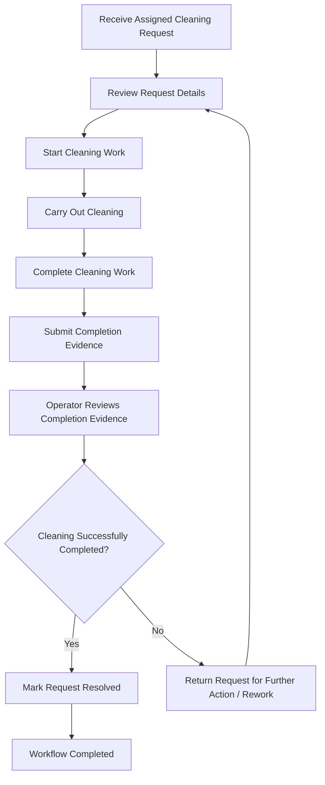

# Cleaning-Team Workflow Diagram

**Work Package:** Cleaning-Team Workflow  
**Task:** In-Progress Update Requirements  
**Project:** CleanStreet AI — Smart Citizen-Requested Street Cleaning and Waste Management Platform

---

## 1. Purpose

This document defines the cleaning team's specific workflow from receiving an assigned request through completion, submission of completion evidence, and final resolution or return for further action.

The workflow is based on Section 16.2 of the project proposal and focuses specifically on the cleaning team's execution path.

---

## 2. Cleaning-Team Workflow

The cleaning team receives a request after the operator reviews the report and assigns it to a cleaning team.

The workflow is:

**Receive → Start → Complete → Submit Evidence → Review → Resolved / Returned for Rework**

### 2.1 Mermaid Flowchart



---

## 3. Step-by-Step Requirements

| Step | Actor | Action | Result / Status |
|---|---|---|---|
| 1 | Cleaning Team | Receive the assigned cleaning request. | Request is available to the assigned team. |
| 2 | Cleaning Team | Review the request details, including the reported issue and relevant location/evidence. | Team understands the required cleaning task. |
| 3 | Cleaning Team | Start the cleaning work. | Request moves into active/in-progress work. |
| 4 | Cleaning Team | Carry out the required cleaning activity. | Cleaning work is performed. |
| 5 | Cleaning Team | Complete the cleaning activity. | Work is ready for verification. |
| 6 | Cleaning Team | Submit completion evidence, such as an after-cleaning image. | Completion evidence is attached to the request. |
| 7 | Operator | Review the submitted completion evidence. | Evidence is checked before final resolution. |
| 8 | Operator | Decide whether the cleaning was successfully completed. | Request is either resolved or returned for further action. |
| 9A | Operator | If the evidence confirms successful cleaning, resolve the request. | Request reaches the resolved state. |
| 9B | Operator / Cleaning Team | If cleaning was not carried out properly, return the request for further action/rework. | Request returns to the workflow for additional work. |

---

## 4. In-Progress Update Requirements

### IPR-01 — Request Receipt

The system shall make an assigned cleaning request available to the responsible cleaning team, including the information required to understand and act on the request.

### IPR-02 — Work Start

The cleaning team shall be able to indicate that work has started on an assigned request.

### IPR-03 — In-Progress Status

The system shall represent a request as in progress while the cleaning team is actively carrying out the assigned work.

### IPR-04 — Work Completion

The cleaning team shall be able to indicate that the assigned cleaning activity has been completed and is ready for verification.

### IPR-05 — Completion Evidence

The cleaning team shall be able to submit completion evidence for the work performed. The proposal supports completion evidence through images uploaded by the cleaning team.

### IPR-06 — Evidence Review

The operations workflow shall allow the responsible operator to review the submitted completion evidence before the request is finally resolved.

### IPR-07 — Resolution

If the submitted evidence confirms successful completion, the operator shall resolve the request.

### IPR-08 — Return for Rework

If the cleaning was not carried out properly or the evidence does not support successful completion, the request shall return to the workflow for further action rather than being permanently closed.

### IPR-09 — Status History

Status changes during the workflow shall be recorded so that the system can maintain an audit trail of the request's progress.

---

## 5. Workflow State Model

```text
ASSIGNED
   |
   v
IN_PROGRESS
   |
   v
COMPLETED
   |
   v
EVIDENCE_SUBMITTED
   |
   v
UNDER_REVIEW
   |
   +--------------------+
   |                    |
   v                    v
RESOLVED          RETURNED_FOR_REWORK
                        |
                        v
                   IN_PROGRESS
```

`RETURNED_FOR_REWORK` returns the request to active work rather than ending the workflow.

---

## 6. Responsibilities

### Cleaning Team

- Receive assigned requests.
- Review the request information.
- Start the assigned cleaning work.
- Carry out the cleaning activity.
- Mark the work as completed.
- Submit completion evidence.

### Operations Operator

- Assign requests to cleaning teams.
- Monitor progress.
- Review completion evidence.
- Resolve successfully completed requests.
- Take further action or return requests for rework when the cleaning is not satisfactory.

The proposal keeps the final operational decision with the human operator.

---

## 7. Relationship to the Database

The workflow is supported by the database entities defined in the project proposal:

- `CLEANING_TEAMS` stores cleaning teams responsible for execution and their working area.
- `ASSIGNMENTS` links reports to responsible teams and records assignment/completion timestamps.
- `STATUS_HISTORY` records status changes for audit logging and supports response-time and resolution-rate analytics.
- `IMAGES` stores image references, including cleaning completion evidence.

The proposal identifies the key columns as:

```text
CLEANING_TEAMS:
id, name, area

ASSIGNMENTS:
id, report_id, team_id, assigned_at, completed_at

STATUS_HISTORY:
id, report_id, status, changed_at

IMAGES:
id, report_id, storage_url, image_type
```

---

## 8. Analytics and Tracking

The workflow produces operational information that can support analytics, including:

- time from assignment to start;
- time spent in progress;
- completion time;
- evidence submission;
- resolution time;
- requests returned for rework;
- unresolved or ageing requests;
- cleaning-team workload.

These metrics support the proposal's analytics goals, including response times, unresolved requests, resolution performance, and broader cleaning trends.

---

## 9. Traceability to the Project Proposal

| Workflow Element | Proposal Basis |
|---|---|
| Operator reviews incoming reports | Section 16.2 — Operator workflow, Step 2 |
| Operator checks AI analysis | Section 16.2 — Step 3 |
| Priority score is calculated | Section 16.2 — Step 4 |
| Hotspots/repeated reports are checked | Section 16.2 — Step 5 |
| Request is assigned to a cleaning team | Section 16.2 — Step 6 |
| Progress is monitored | Section 16.2 — Step 7 |
| Completion evidence is reviewed | Section 16.2 — Step 8 |
| Request is resolved or receives further action | Section 16.2 — Step 9 |
| Failed/unsatisfactory cleaning returns to the workflow | Section 16.2 explicitly states that a request cannot be closed solely because a team marked it complete |
| Completion evidence is uploaded by the team | Sections 6 and 16 of the proposal |
| Status changes are audited | Section 15.2 — `STATUS_HISTORY` |
| Assignment and completion timestamps are stored | Section 15.2 — `ASSIGNMENTS` |

---

## 10. Acceptance Notes

The finalized workflow covers the cleaning team's path from receiving an assigned request through starting work, completing the cleaning activity, submitting completion evidence, and reaching either a resolved state or a returned-for-rework state.

The workflow does not include physical collection logistics, autonomous cleaning, large-scale fleet management, or guaranteed real-time worker tracking, which are outside the initial project scope.
