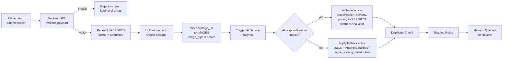

# Report Ingestion, Duplicate Handling, and Automated Triaging Workflow

### CleanStreet AI — Report Lifecycle

---

## 0. Dependency Notice

This document requires **T_fcd59f — Report Lifecycle State Machine and Transition Rules**. I could not locate that document in the repository at the time of writing, so the status names used below (`Submitted`, `Analyzed`, `Queued for Review`, `Duplicate-Flagged`) are proposed, not final. Once T_fcd59f is merged, every status name in this document must be reconciled against it — do not treat these as the canonical state machine.

---

## 1. Scope

This document covers three things, per the task brief:

1. The **ingestion pipeline** — what happens between a citizen tapping Submit and a report becoming visible to an operator.
2. **Duplicate handling** — how a candidate duplicate is detected and resolved, as a link, not a merge.
3. **Automated triaging** — the rules that hand a report from the AI layer to the operator queue, including what happens when AI scoring fails or times out.

It does not cover the operator's review/assign actions (Operator workflow, proposal §16.2) or the rework loop (separate Cleaning-Team Workflow documents) — this document ends where a report becomes visible and ranked in the operator's queue.

---

## 2. Ingestion Pipeline

### 2.1 Validation checks (at Backend API, before persisting)

| Field | Rule |
|---|---|
| Photo | Required. Must be a valid image file (JPEG/PNG), under a defined max size (e.g. 10 MB). Reject empty or corrupt uploads. |
| GPS location | Required. Latitude/longitude must be valid coordinates and fall within the configured service area's bounding box. |
| Category | Required. Must match an existing `CATEGORIES.id`. |
| Description | Optional. If present, enforce a max length. |
| User | Must be an authenticated, non-blocked `USERS` row. |

A report that fails validation is rejected synchronously with field-level errors; it is never written to `REPORTS`, so no "invalid" status is needed.

### 2.2 Persistence and AI hand-off

1. The Backend API writes the report to `REPORTS` with `current_status = Submitted` and a `STATUS_HISTORY` row for that transition.
2. The image is uploaded to Object Storage; `IMAGES.storage_url` is written with `image_type = before` (proposal §15.1).
3. The Backend API triggers the AI Service asynchronously — the citizen's Submit call does **not** block on AI analysis (proposal §16.1, step 6–7: the citizen sees "Report Successfully Submitted" before analysis completes).
4. The AI Service returns detection, classification, severity, and priority, which are written back into the same `REPORTS` row (proposal §15.1, §11).

### 2.3 AI scoring timeout — fallback mechanism

If the AI Service does not respond within a defined timeout (e.g. 30 seconds):

- The report is **not** held back from the operator queue. It proceeds to `Analyzed` with a **fallback priority score** computed from only the factors that do not require image analysis: report age, repeat-occurrence count, and location density (proposal §11, Tier 2 — these three do not depend on the AI Service's output).
- `ai_scoring_failed = true` is set on the report so the operator dashboard can visually flag it as "unscored" rather than silently ranking it as low-severity.
- A retry is queued; if the AI Service later returns a result, the report is re-scored and `ai_scoring_failed` is cleared.
- This keeps the "report is never lost" guarantee: a citizen's report always reaches an operator, even if the AI layer is degraded.

---

## 3. Duplicate Handling

Per proposal §11 (Tier 3), duplicate detection **links** candidate reports for operator review — it never merges or discards a report automatically. This document specifies how that link is produced and resolved.

### 3.1 Candidate selection

1. A PostGIS spatial query narrows candidates to reports within a configured radius (e.g. 50 m) and time window (e.g. 14 days) of the new report's location, using the spatial index on `REPORTS.latitude/longitude` (proposal §15.3).
2. Only that narrowed set — not the full historical table — is compared against the new report's image embedding (produced by the classification model) using cosine similarity.
3. Candidates above a configured similarity threshold are recorded as a suggested duplicate link.

### 3.2 Resolution: linking, not merging

- **Linking** is the only supported resolution in this scope. A linked report keeps its own `REPORTS` row, its own images, and its own status — linking only adds a reference between the two reports.
- **Merging** (combining two reports into one, discarding one's data) is explicitly **out of scope**. The proposal's own differentiation claim (§5) rests on using repetition as a signal, not discarding it — an automatic or manual merge that deletes a citizen's original report would work against that claim. If the team later wants merge support, it must be proposed as a new, separate requirement, not folded in here.
- A flagged duplicate does not block the report from the triaging step; it still proceeds to `Queued for Review`, carrying its duplicate-link reference so the operator sees both reports together and decides how to act (e.g. closing one as a duplicate manually, or treating them as two instances of a hotspot).

### 3.3 Data requirement

A `report_id → related_report_id` reference, with a similarity score and a `confirmed_by_operator` flag, is needed to store this link. No such table exists yet in the proposal's ERD (§15.2); this document flags that gap for the data-architecture owner — it is out of scope for this document to design that table.

---

## 4. Automated Triaging Rules

Triaging is the rule set that decides when a report becomes visible in the operator's queue, and in what order — it does **not** assign a report to a cleaning team; that remains a manual operator action (proposal §16.3, "AI assists, operator decides").

### 4.1 Hand-off condition

A report becomes visible to operators (`Queued for Review`) once it reaches `Analyzed` (with or without the fallback flag) **and** the duplicate check (Section 3) has run. Operators are never shown a report that has not at least attempted AI analysis.

### 4.2 Ordering within the queue

Reports in `Queued for Review` are ordered by `priority_score` descending, consistent with the ranking defined in proposal §11 (severity, report age, repeat-occurrence count, location density, each normalised 0–1 before weighting). This document does not redefine that formula; it only specifies when a report becomes eligible to be ranked by it.

### 4.3 Ageing escalation

Reusing proposal feature #12 (Report ageing / SLA breach flag): a report that remains in `Queued for Review` beyond a defined threshold for its priority tier is flagged, not auto-escalated or auto-assigned — escalation is visibility only, surfaced to the operator, who still makes the assignment decision.

### 4.4 What triaging does not do

- It does not assign a report to a specific cleaning team.
- It does not reject or close a report automatically, even a low-priority or likely-duplicate one.
- It does not change a citizen-facing status beyond what Section 2 already sets; the citizen sees "Submitted" / "Analyzed" per the existing citizen workflow (proposal §16.1), not internal triage states.

---

## 5. Open Items for the Team

1. **Reconcile status names against T_fcd59f** once published — this is the primary follow-up for this document.
2. **Duplicate-link table** needs to be added to the ERD (Section 3.3) — flagged for whoever owns the data architecture docs.
3. **Exact thresholds** (AI timeout seconds, duplicate radius/time window, similarity threshold, ageing SLA per priority tier) are left as configurable values here; they should be pinned down with the AI and operations-dashboard owners before implementation, since validating the success criteria in proposal §23 (duplicate detection precision ≥ 70%) depends on them.
