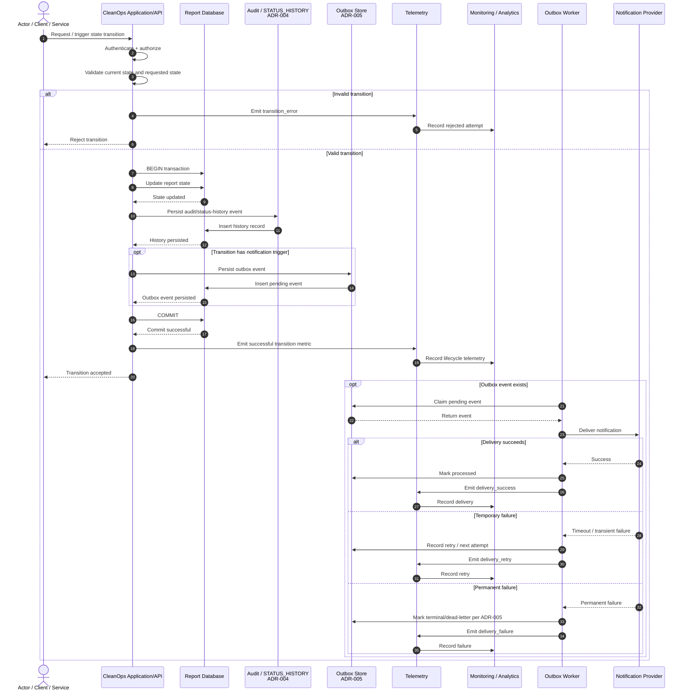

# CleanOps — Report Lifecycle Operational Integration

> **Project:** CleanOps — AI-Powered Application for Waste Reporting & Smart Cleaning Management  
> **Document:** Report Lifecycle — End-to-End Operational Integration  
> **Path:** `docs/requirements/report-lifecycle/report-lifecycle-operational-integration.md`  
> **Role focus:** Data Analysis / operational telemetry  
> **Dependencies:** `T_fcd59f`, `T_659630`, `T_2c19ca`  
> **Related architecture decisions:** ADR-004 (Audit Trail), ADR-005 (Asynchronous Outbox Notifications)

---

## 1. Purpose

This document defines the end-to-end operational integration of the CleanOps report lifecycle.

For every accepted report-state transition, it specifies how the transition is connected to:

1. the authoritative report state;
2. the audit trail required by ADR-004;
3. telemetry and operational metrics;
4. the asynchronous outbox notification mechanism required by ADR-005;
5. retries, failures, idempotency, and correlation across components.

The objective is to make every lifecycle transition **traceable, measurable, and operationally observable** without coupling the user-facing request path to external notification delivery.

> **Dependency-alignment rule:** The three dependency tasks named in the task description are authoritative for their respective contracts. Where their canonical state names, event schemas, retry rules, or notification triggers differ from this integration document, those dependency definitions must be used and this document updated accordingly.

---

## 2. Scope

### In scope

- report lifecycle state transitions;
- validation of state transitions;
- audit event creation;
- transition telemetry;
- asynchronous outbox creation and processing;
- notification delivery, retry, and failure handling;
- correlation and idempotency;
- lifecycle KPIs and analytical timestamps;
- consistency and acceptance criteria.

### Out of scope

- AI/computer-vision model internals;
- notification-provider implementation details;
- UI design;
- authentication implementation details;
- complete database schema design;
- notification-template copy.

---

## 3. Canonical Lifecycle Integration

The currently documented CleanOps workflow establishes these important states and transitions:

```text
Report submission
      ↓
   SUBMITTED
      ↓
 UNDER_REVIEW
      ↓
   ASSIGNED
      ↓
 IN_PROGRESS
      ↓
  COMPLETED
      ↓
EVIDENCE_SUBMITTED
      ↓
 UNDER_REVIEW
      ↓
 ┌───────────────┐
 │ Operator      │
 │ decision      │
 └───────┬───────┘
     Approved / Rejected
       /          \
      ↓            ↓
 RESOLVED    RETURNED_FOR_REWORK
                   ↓
              IN_PROGRESS
                   ↓
                COMPLETED
                   ↓
          EVIDENCE_SUBMITTED
                   ↓
              UNDER_REVIEW
                   ↓
          repeat decision loop
```

The rework workflow is repeatable and preserves the same `report_id`; rejection does not create a duplicate report. The existing workflow also records status changes through `STATUS_HISTORY`. 

> **Important:** If `T_fcd59f`, `T_659630`, or `T_2c19ca` defines a canonical state/event vocabulary different from the workflow artifacts currently available, use the dependency vocabulary as the implementation contract.

---

## 4. Operational Integration Principle

A valid state transition is treated as one logical lifecycle operation with three persistence responsibilities:

```text
                 VALID TRANSITION
                       │
                       ▼
              ┌─────────────────┐
              │ DB TRANSACTION  │
              │                 │
              │ 1. State change │
              │ 2. Audit event  │
              │ 3. Outbox event │
              └────────┬────────┘
                       │
                    COMMIT
                       │
             ┌─────────┴─────────┐
             │                   │
             ▼                   ▼
        Telemetry          Outbox Worker
                                 │
                                 ▼
                         Notification Provider
```

The critical consistency boundary is:

> **Report state change + required audit record + required outbox record must commit atomically.**

Notification delivery itself remains asynchronous and therefore occurs after the transaction has committed.

Telemetry must not be allowed to roll back an already successful business transaction.

---

## 5. Transition Contract

For every valid transition, the application should perform the following logical steps:

1. Receive the transition request/event.
2. Authenticate and authorize the actor or service where applicable.
3. Validate that the requested transition is allowed from the current state.
4. Generate or propagate a stable `transition_id`.
5. Start a database transaction.
6. Update the report state.
7. Persist the required audit/status-history record according to ADR-004 and the canonical history model.
8. If the transition has a notification trigger, persist an outbox event according to ADR-005.
9. Commit the transaction.
10. Emit/record transition telemetry.
11. Return success to the caller.
12. Allow the asynchronous outbox worker to process the notification independently.

### Invalid transition

An invalid transition must:

- leave the report state unchanged;
- create no successful-transition audit record;
- create no successful-transition outbox event;
- emit an appropriate error/rejection metric;
- produce structured operational logging with the attempted transition.

---

## 6. Transition-to-Integration Matrix

The table below is the integration contract at the lifecycle level. Exact event names and notification eligibility should be synchronized with ADR-004, ADR-005, and the three dependency tasks before implementation.

| Lifecycle transition | Audit / history | Telemetry | Outbox notification | Analytical meaning |
|---|---|---|---|---|
| Report created → `SUBMITTED` | Required | Submission count | If configured | Intake volume |
| `SUBMITTED` → `UNDER_REVIEW` | Required | Review-start count + wait time | If configured | Review workload |
| `UNDER_REVIEW` → `ASSIGNED` | Required | Assignment count + assignment latency | If configured | Allocation efficiency |
| `ASSIGNED` → `IN_PROGRESS` | Required | Work-start count + response wait | If configured | Operational response |
| `IN_PROGRESS` → `COMPLETED` | Required | Completion count + work duration | If configured | Cleaning execution |
| `COMPLETED` → `EVIDENCE_SUBMITTED` | Required | Evidence-submission count | If configured | Evidence throughput |
| `EVIDENCE_SUBMITTED` → `UNDER_REVIEW` | Required | Review-queue count | If configured | Operator workload |
| `UNDER_REVIEW` → `RESOLVED` | Required | Resolution count + total resolution time | If configured | Successful resolution |
| `UNDER_REVIEW` → `RETURNED_FOR_REWORK` | Required | Rework/rejection count | If configured | Rework workload |
| `RETURNED_FOR_REWORK` → `IN_PROGRESS` | Required | Rework-start count | If configured | Rework execution |
| Rework `IN_PROGRESS` → `COMPLETED` | Required | Rework completion | If configured | Corrective work |
| Rework `COMPLETED` → `EVIDENCE_SUBMITTED` | Required | Resubmission count | If configured | Rework evidence |
| Rework `EVIDENCE_SUBMITTED` → `UNDER_REVIEW` | Required | Review re-entry count | If configured | Repeat review workload |

### Rejection/rework invariant

The available CleanOps workflow explicitly describes the rejection loop as repeatable:

```text
UNDER_REVIEW
     ↓ rejected
RETURNED_FOR_REWORK
     ↓
IN_PROGRESS
     ↓
COMPLETED
     ↓
EVIDENCE_SUBMITTED
     ↓
UNDER_REVIEW
     ↓
(repeat if rejected again)
```

The same report identity is preserved throughout the loop.

---

## 7. Audit Trail Integration — ADR-004

Every committed lifecycle transition must produce the audit information required by ADR-004 and the project's canonical status-history mechanism.

### 7.1 Minimum logical audit context

The integration should make the following information traceable:

| Field | Purpose |
|---|---|
| `audit_event_id` | Unique audit record identity |
| `transition_id` | Correlates one logical transition across components |
| `report_id` | Identifies the affected report |
| `from_state` | State before the transition |
| `to_state` | State after the transition |
| `actor_id` | Human/system actor where applicable |
| `actor_type` | Citizen, operator, cleaning team, service, worker, etc. |
| `reason` | Business reason when the transition requires one |
| `occurred_at` | Time at which the transition occurred |
| `correlation_id` | Request/workflow correlation |
| `metadata` | Additional structured context allowed by ADR-004 |

The exact schema remains owned by ADR-004.

### 7.2 Audit invariant

For a successful transition:

```text
ONE committed state transition
        ↕
ONE corresponding audit/history event
```

A transition must not be considered successfully committed if a mandatory audit/history record cannot be persisted.

---

## 8. Telemetry and Metrics

The data-analysis responsibility is to ensure that lifecycle behavior can be measured without turning business identifiers into high-cardinality metric labels.

### 8.1 Transition counter

Recommended metric:

```text
cleanops_report_state_transitions_total
```

Recommended low-cardinality dimensions:

- `from_state`
- `to_state`
- `actor_type`
- `result`

Example:

```text
cleanops_report_state_transitions_total{
  from_state="ASSIGNED",
  to_state="IN_PROGRESS",
  actor_type="cleaning_team",
  result="success"
}
```

### 8.2 Transition errors

Recommended metric:

```text
cleanops_report_transition_errors_total
```

Possible dimensions:

- `from_state`;
- `requested_to_state`;
- `error_type`;
- `actor_type`.

### 8.3 Lifecycle latency

Recommended metric:

```text
cleanops_report_transition_duration_seconds
```

Where a transition-specific duration is meaningful, the metric can measure processing latency. For business lifecycle analysis, durable timestamps should also be retained so analysts can calculate end-to-end durations from historical events.

### 8.4 Outbox metrics

Recommended operational metrics:

```text
cleanops_outbox_events_created_total
cleanops_outbox_events_processed_total
cleanops_outbox_events_failed_total
cleanops_outbox_events_retried_total
cleanops_outbox_pending
cleanops_outbox_processing_latency_seconds
```

### 8.5 Notification metrics

Recommended metrics:

```text
cleanops_notification_delivery_total
cleanops_notification_delivery_failures_total
cleanops_notification_delivery_duration_seconds
```

Possible dimensions:

- `notification_type`;
- `channel`;
- `result`;
- `retry_count` only if bounded and appropriate for the metrics system.

### 8.6 Cardinality rule

Do **not** use the following as metric labels:

- `report_id`;
- `user_id`;
- `transition_id`;
- raw notification destination;
- free-text rejection reason.

These belong in audit records, structured logs, event payloads, or traces where appropriate.

---

## 9. Outbox Integration — ADR-005

The outbox pattern separates **notification intent** from **notification delivery**.

For a transition that triggers a notification, the system persists the outbox record in the same database transaction as the report state change.

### 9.1 Transactional write

Logical sequence:

```sql
BEGIN;

UPDATE reports
SET status = :to_state
WHERE report_id = :report_id;

INSERT INTO status_history (...);

INSERT INTO outbox_events (...);

COMMIT;
```

No external notification-provider call should be required for the transaction to commit.

### 9.2 Why this matters

Without an outbox, this failure is possible:

```text
DB state update succeeds
        ↓
notification call fails
        ↓
state changed but notification intent is lost
```

With the outbox:

```text
state update + audit/history + outbox insert
                    ↓
                  COMMIT
                    ↓
              worker processes
                    ↓
              notification delivery
```

A temporary external-service failure therefore does not erase the durable intent to send the notification.

---

## 10. Outbox Event Contract

A lifecycle notification event should carry enough information for downstream processing and correlation.

Example logical envelope:

```json
{
  "event_id": "evt-...",
  "event_type": "REPORT_STATE_CHANGED",
  "aggregate_type": "REPORT",
  "aggregate_id": "report-...",
  "report_id": "report-...",
  "transition_id": "tr-...",
  "from_state": "ASSIGNED",
  "to_state": "IN_PROGRESS",
  "occurred_at": "2026-10-02T00:00:00Z",
  "correlation_id": "corr-...",
  "notification_type": "REPORT_STATUS_UPDATE"
}
```

This is an **illustrative integration shape**, not a replacement for the canonical ADR-005 schema.

---

## 11. End-to-End Sequence Diagram



---

## 12. Component Responsibilities

| Component | Responsibility |
|---|---|
| **Client / Actor** | Requests or causes a valid lifecycle action. |
| **Application/API** | Validates transition, controls transaction, creates audit/history and outbox records. |
| **Report Database** | Authoritative persistence for report state, history, and outbox records. |
| **Audit / STATUS_HISTORY** | Preserves lifecycle traceability. |
| **Telemetry layer** | Emits counters, durations, errors, and notification operational metrics. |
| **Outbox Worker** | Reads pending events, attempts delivery, handles retry/terminal behavior. |
| **Notification Provider** | Performs external notification delivery. |
| **Monitoring / Analytics** | Consumes telemetry and lifecycle data for operational visibility and KPI analysis. |

---

## 13. Failure and Consistency Handling

### 13.1 State update fails

If the state update fails:

- no successful state transition is committed;
- no successful audit/history event is committed;
- no notification-triggering outbox event is committed;
- an error can be recorded in telemetry/logging.

### 13.2 Audit/history persistence fails

For a mandatory audit/history record:

```text
State update
    ↓
Audit insert fails
    ↓
ROLLBACK
```

The system must not leave a committed state change without the required audit/history record.

### 13.3 Outbox persistence fails

For a transition whose notification trigger is mandatory under ADR-005:

```text
State update
    ↓
Audit/history insert
    ↓
Outbox insert fails
    ↓
ROLLBACK
```

This preserves the transactional guarantee that notification intent cannot silently disappear.

### 13.4 Telemetry failure

Telemetry/monitoring failure must not undo a successfully committed lifecycle transition.

The business transaction remains authoritative.

### 13.5 Notification-provider failure

Provider failure happens after the database transaction has committed.

The worker should:

1. retain the outbox event;
2. classify the failure according to ADR-005;
3. retry transient failures according to the configured policy;
4. mark permanently failed events according to the configured terminal/dead-letter policy;
5. emit the corresponding operational metrics.

---

## 14. Idempotency

Asynchronous workers can retry the same event. Therefore, duplicate delivery/processing must be considered part of the design.

### Transition idempotency

A retried request must not accidentally apply the same state change multiple times.

Use the canonical idempotency mechanism defined by the application architecture, with `transition_id` as the logical correlation identity where appropriate.

### Outbox idempotency

Each logical notification event should have a stable `event_id`.

A retry should process the same event rather than creating a new logical event.

### Audit idempotency

Audit/history records must remain associated with the committed transition identity so that application retries cannot create duplicate logical lifecycle transitions.

---

## 15. Correlation and Traceability

The integration should propagate a correlation chain similar to:

```text
correlation_id
      │
      ├── transition_id
      │
      ├── report_id
      │
      ├── audit_event_id
      │
      └── outbox_event_id
```

This allows an operator or analyst to answer:

- What happened to the report?
- Which state did it move from and to?
- Who/system initiated the change?
- Was the transition recorded in history/audit?
- Was a notification trigger created?
- Was the notification delivered, retried, or failed?

---

## 16. Data-Analysis Requirements

The lifecycle integration must preserve enough event information to derive operational KPIs without reconstructing the lifecycle from unreliable logs.

### 16.1 Required lifecycle timestamps

The historical event stream should make these moments measurable where they apply:

- submission time;
- review-start time;
- assignment time;
- work-start time;
- completion time;
- evidence-submission time;
- resolution time;
- return-for-rework time;
- rework-start time.

The exact storage approach may use `STATUS_HISTORY`/audit events rather than adding one column per timestamp.

### 16.2 Derived KPIs

#### Review waiting time

```text
review_started_at - submitted_at
```

#### Assignment latency

```text
assigned_at - review_started_at
```

#### Initial response time

```text
work_started_at - assigned_at
```

#### Cleaning duration

```text
completed_at - work_started_at
```

#### Evidence turnaround

```text
evidence_submitted_at - completed_at
```

#### End-to-end resolution time

```text
resolved_at - submitted_at
```

#### Rework rate

```text
reports_returned_for_rework / reports_entering_review
```

#### Rework cycles per report

```text
number_of_RETURNED_FOR_REWORK_events / report
```

#### Rejection-to-resolution cycle time

Measure from each `RETURNED_FOR_REWORK` event to the subsequent successful `RESOLVED` event for the same report.

> KPI denominators and reporting windows must be explicitly defined by the analytics/reporting layer before dashboards are implemented.

---

## 17. Operational Monitoring

### Lifecycle health

Monitor at least:

- reports entering the lifecycle;
- reports currently awaiting review;
- reports assigned;
- reports in progress;
- reports awaiting evidence/review;
- reports resolved;
- reports returned for rework.

### Processing performance

Monitor:

- review latency;
- assignment latency;
- response time;
- cleaning duration;
- evidence turnaround;
- end-to-end resolution time.

### Notification health

Monitor:

- pending outbox count;
- age of oldest pending event;
- successful deliveries;
- retries;
- failures;
- terminal/dead-letter events.

### Data integrity

Monitor:

- invalid transition attempts;
- duplicate transition attempts;
- state/history inconsistencies;
- outbox events that cannot be processed;
- unexpected lifecycle states.

---

## 18. Security and Privacy

Lifecycle telemetry must not become an accidental data-exfiltration channel.

Do not place passwords, authentication tokens, raw private message content, or unnecessary personal data into:

- metric labels;
- structured logs;
- notification payloads;
- audit metadata.

Use identifiers only where required for traceability and according to the project's authorization and retention rules.

---

## 19. Acceptance Criteria

### State transitions

- [ ] Every valid lifecycle transition is validated against the canonical state machine.
- [ ] Invalid transitions do not modify report state.
- [ ] Every accepted transition has a stable transition identity.

### Audit / history — ADR-004

- [ ] Every committed transition produces the required audit/history event.
- [ ] Before/after states are traceable.
- [ ] Actor/system information is traceable where required.
- [ ] Timestamp and correlation information are retained.
- [ ] State change and mandatory audit/history persistence are transactionally consistent.

### Telemetry

- [ ] Successful lifecycle transitions are measurable.
- [ ] Invalid/failed transitions are measurable.
- [ ] Lifecycle latency can be calculated.
- [ ] Outbox backlog and processing behavior are measurable.
- [ ] Notification success/retry/failure are measurable.
- [ ] High-cardinality business identifiers are excluded from metric labels.

### Outbox — ADR-005

- [ ] Every notification-triggering transition creates the required durable outbox event.
- [ ] State change and outbox insertion are atomic.
- [ ] External notification delivery is asynchronous.
- [ ] Transient delivery failures can be retried.
- [ ] Duplicate processing is handled idempotently.
- [ ] Permanent failures follow the canonical ADR-005 terminal/dead-letter policy.

### End-to-end traceability

- [ ] A report transition can be correlated to its audit/history event.
- [ ] A notification-triggering transition can be correlated to its outbox event.
- [ ] Notification delivery outcome can be traced without changing the authoritative report state.
- [ ] Lifecycle data is sufficient for operational KPI calculation.

---

## 20. Definition of Done

The integration is complete when the following chain is implemented and testable:

```text
                 REPORT LIFECYCLE ACTION
                          ↓
                 Validate transition
                          ↓
                 Update report state
                          ↓
               Persist audit/history
                          ↓
            Persist outbox event if required
                          ↓
                       COMMIT
                          ↓
                 Emit lifecycle telemetry
                          ↓
                  Return transition result
                          ↓
                 Async outbox processing
                          ↓
                Notification delivery
                    ↙          ↘
                 success     retry/failure
                    ↓          ↓
                 metrics   metrics + retry/terminal handling
```

The central invariant is:

> **A valid report transition, its required audit/history record, and its required outbox notification trigger are durably committed as one database transaction. Notification delivery itself is asynchronous.**

---

## 21. Dependency Verification Checklist

Before merge, compare this document against the three dependency tasks named in the assignment.

### `T_fcd59f`

Verify:

- canonical report states;
- valid transitions;
- transition initiators;
- validation rules.

### `T_659630`

Verify:

- ADR-004 audit schema;
- mandatory fields;
- event naming;
- immutability/retention requirements;
- actor/timestamp semantics.

### `T_2c19ca`

Verify:

- ADR-005 outbox schema;
- notification-triggering transitions;
- retry policy;
- idempotency policy;
- terminal/dead-letter behavior.

If a dependency contains a more specific rule, that rule is authoritative.

---

## 22. Traceability Summary

| Concern | Authoritative mechanism | This document defines |
|---|---|---|
| Current report state | Report state persistence | When the state participates in the lifecycle integration |
| Historical state changes | ADR-004 / `STATUS_HISTORY` | How transitions connect to auditability |
| Operational measurements | Telemetry/metrics | What lifecycle and outbox behavior should be measurable |
| Notification intent | ADR-005 / outbox | When notification work becomes durable |
| Notification delivery | Outbox worker + provider | Async processing, retry, and outcome observability |
| Data analysis | Lifecycle timestamps + events | KPI derivation and analytical requirements |

---

## 23. Final End-to-End Summary

CleanOps should treat each report state transition as a traceable operational event rather than an isolated database update:

```text
State transition
      │
      ├──────────────► Audit / STATUS_HISTORY
      │
      ├──────────────► Transition telemetry
      │
      └──────────────► Outbox trigger (when applicable)
                              │
                              ▼
                       Async worker
                              │
                              ▼
                     Notification delivery
                              │
                    ┌─────────┴─────────┐
                    ▼                   ▼
                 Success             Retry/Failure
                    │                   │
                    └─────────┬─────────┘
                              ▼
                       Operational metrics
```

This separation gives CleanOps four complementary guarantees:

1. **State correctness** — the report's current lifecycle state remains authoritative.
2. **Traceability** — lifecycle changes remain historically auditable.
3. **Observability** — transition and notification behavior can be measured.
4. **Reliable notification intent** — notification work is durably recorded before asynchronous delivery.
