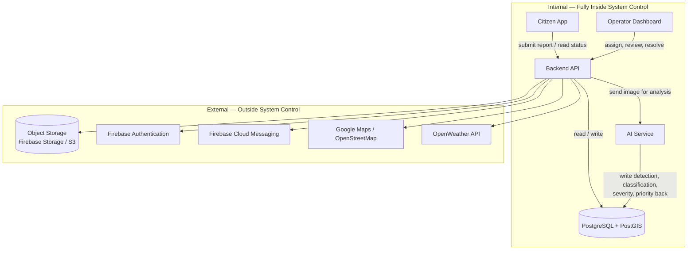

# Internal Component Boundary — Requirements Specification

### CleanStreet AI — System Boundaries

---

## 1. Purpose

This document defines every component that is fully inside CleanStreet AI's system control, and states each component's responsibility in one line. It answers the question: *what do we build and operate ourselves, versus what do we call as an external, already-existing service?*

This document extends Section 14 (Proposed Technology and Methodology) and Section 15 (Data Architecture) of the graduation project proposal into an explicit system boundary.

---

## 2. Boundary Diagram

The internal boundary matches the four application-level components plus the database shown in Figure 4 (Data Flow) and Figure 5 (Entity-Relationship Diagram) of the proposal. Everything in the external box is a managed third-party service the backend calls through an API; the team does not build, host, or control its internal logic.

---

## 3. Internal Components

| # | Component | Responsibility (one line) | Technology (proposal ref.) |
|---|---|---|---|
| 1 | **Citizen App** | Lets a citizen register, submit a report with photo, GPS location, category, and description, and track that report's status. | Flutter or native Android (§14) |
| 2 | **Operator Dashboard** | Lets an operator review incoming reports and AI results, assign them to cleaning teams, monitor progress, and resolve or reject completion evidence. | Web dashboard, consumes Backend API (§10, §16.2) |
| 3 | **Backend API** | Owns all business logic: authentication/authorisation, report and assignment management, orchestrating calls to the AI Service, and reading/writing the database — the single point every other internal component goes through. | REST APIs (§14) |
| 4 | **AI Service** | Reads a report's image, runs waste detection and classification, computes severity and priority, and writes the results back into the report record. | YOLOv8 detection + classifier, rule-based scoring (§11) |
| 5 | **PostgreSQL + PostGIS Database** | Stores all structured data — users, reports, images metadata, status history, cleaning teams, and assignments — and provides the spatial queries hotspot and duplicate detection depend on. | PostgreSQL + PostGIS (§14, §15) |

### 3.1 Why each is "fully inside system control"

- **Citizen App, Operator Dashboard, Backend API, AI Service** — all four are built by the project team from scratch; their internal logic, code, and behaviour are entirely ours to define.
- **PostgreSQL + PostGIS** — the schema (Section 15.2), indexing (Section 15.3), and every table are designed and owned by the team. The database engine itself is open-source software the team deploys and configures, not a third-party managed API.

---

## 4. Explicitly Out of Boundary

These are used by the system but are **not** part of the internal boundary, because their internal behaviour is owned and operated by an external provider, not by the project team:

| Service | Used for | Why it's external |
|---|---|---|
| Object Storage (Firebase Storage / Amazon S3) | Storing before/after report images; the database keeps only `storage_url` (§15.1) | Managed cloud storage; team only calls its API |
| Firebase Authentication | User authentication | Managed identity provider |
| Firebase Cloud Messaging | Push notifications | Managed notification delivery |
| Google Maps Routes API / OpenStreetMap | Maps, routing, distance calculations | Third-party mapping data and services |
| OpenWeather API | Weather context for planning/analytics | Third-party data provider |

The Backend API is the only internal component permitted to call these external services directly; the Citizen App, Operator Dashboard, and AI Service reach them only indirectly, through the Backend API.

---

## 5. Interfaces Between Internal Components

| From | To | Interface |
|---|---|---|
| Citizen App | Backend API | REST calls: submit report, fetch status, view history |
| Operator Dashboard | Backend API | REST calls: list/filter reports, assign, update status, resolve/reject |
| Backend API | PostgreSQL + PostGIS | Direct database connection (reads and writes) |
| Backend API | AI Service | Triggers analysis after report submission; passes the image reference |
| AI Service | PostgreSQL + PostGIS | Writes detection, classification, severity, and priority results back into the report record |

This mirrors the four-step flow described in Section 15.1 of the proposal: the app submits, the backend persists and stores the image, the AI service analyses and writes results back, and the dashboard reads the ranked, updated reports.

---

## 6. Notes

- This boundary is deliberately limited to the components a team member can name and diagram today; it does not include future-phase items from Section 22 (e.g. IoT/smart-bin integration, fleet tracking), which would sit entirely outside this boundary if added later.
- Any new external dependency introduced during development (e.g. a different map provider) should be added to Section 4 rather than folded into an internal component's responsibility.
