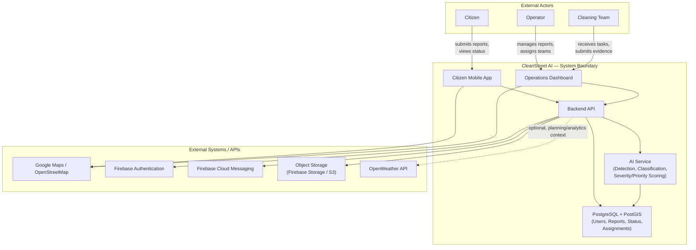

# System Boundary Diagram (Consolidated) — CleanStreet AI

## Purpose

Every other System Boundaries task (Internal Components, External Actors, External Systems/APIs, Data Boundary) defines one slice of where CleanStreet AI's responsibility starts and stops. This document pulls all of those slices together into a single, consolidated picture — one diagram and its accompanying explanation — so that anyone looking at it, in one glance, can tell what CleanStreet AI actually owns versus what it merely talks to.

This matters for a very practical reason: as the team builds the AI service, the backend, the dashboard, and the mobile app in parallel, it's easy for someone to assume the system is responsible for something it isn't (e.g., guaranteeing Google Maps' location accuracy) or to forget that something genuinely is the system's responsibility (e.g., validating that a photo was actually uploaded before writing to IMAGES). A single boundary diagram removes that ambiguity.

---

## 1. What "System Boundary" Means Here

The system boundary is the line separating:
- **Inside** — components CleanStreet AI's own team builds, owns, deploys, and is responsible for the correctness of.
- **Outside** — everything else the system interacts with but does not control: the people who use it, and the third-party services it depends on.

Anything inside the boundary is something a bug report, a design decision, or a requirement in this proposal can meaningfully be about. Anything outside the boundary is something CleanStreet AI can only send data to, receive data from, or fail gracefully if it's unavailable — it is never something the project team can fix directly.

---

## 2. The Consolidated Diagram

---

## 3. Reading the Diagram, Layer by Layer

### 3.1 External Actors (top layer)

These are people, not software. They are outside the boundary because CleanStreet AI cannot control their behavior — only the interface it presents to them.

- **Citizen** — interacts exclusively through the Citizen Mobile App. Never has any path to the backend, database, or AI service except through that app.
- **Operator** — interacts exclusively through the Operations Dashboard.
- **Cleaning Team** — also interacts through the Operations Dashboard (or a dedicated team-facing view within it), receiving tasks and submitting completion evidence.

The key rule here: **no external actor ever has a direct line to the Backend API, the database, or the AI service.** Every action a person takes is mediated by an application (Citizen App or Dashboard), which is itself inside the boundary and therefore built, tested, and secured by the team.

### 3.2 Internal Components (the boundary itself)

These five components are what CleanStreet AI's team is actually building and is responsible for:

| Component | Responsibility |
|---|---|
| **Citizen Mobile App** | Report submission, status tracking, notifications display, viewing completion evidence |
| **Operations Dashboard** | Report management, AI-result review, assignment, status updates, analytics views — used by both operators and cleaning teams |
| **Backend API** | All business logic: authentication routing, report CRUD, orchestration between the app/dashboard and the database/AI service, triggering notifications |
| **AI Service** | Waste detection, classification, severity/priority scoring, duplicate/related-report detection |
| **PostgreSQL + PostGIS Database** | The single source of truth for all structured data — users, reports, images metadata, status history, teams, assignments |

Every arrow *within* this subgraph (Citizen App → Backend, Dashboard → Backend, Backend → DB, Backend → AI Service, AI Service → DB) represents a connection the team fully controls on both ends. If something breaks here, it's a bug in the system, not a third-party outage.

### 3.3 External Systems / APIs (bottom layer)

These are services CleanStreet AI depends on to function, but does not own, build, or control the internals of:

| Service | What Crosses the Boundary |
|---|---|
| **Google Maps / OpenStreetMap** | The system sends coordinates for display; receives back rendered maps, place names, and (in later phases) routing data |
| **Firebase Authentication** | The system sends login credentials; receives back a verified identity/token |
| **Firebase Cloud Messaging** | The system sends a notification payload; the service handles delivery to the citizen's or team's device |
| **Object Storage (Firebase Storage / S3)** | The system sends image files for upload; receives back a storage URL, which is what actually gets written into the IMAGES table |
| **OpenWeather API** | The system sends a location query; receives back weather data used only for planning/analytics context — shown with a dashed line in the diagram because it is optional and non-critical: if this service is unavailable, no core reporting or cleaning function is affected |

Every arrow crossing *into* this bottom layer represents a dependency the team must handle failure for gracefully (e.g., if Firebase Storage is briefly down, report submission should queue or retry, not crash), because the team cannot fix these services directly if something goes wrong on their end.

---

## 4. The Key Boundary Rule

**No external actor and no external system ever touches the database or the AI service directly.** Every interaction, in either direction, routes through the Backend API. This single rule is what gives the architecture two important properties:

1. **Swappability** — because external systems only ever talk to the Backend API (never directly to the database), a service like Object Storage can be swapped from Firebase Storage to Amazon S3 (as the proposal itself keeps as an open option) without external actors, the Citizen App, or the Dashboard needing to know or change anything. The change is contained entirely within the Backend API's integration code.
2. **Security and validation control** — because citizens and cleaning teams can never reach the database directly, every write to the database passes through the Backend API's validation, authentication, and authorization logic first. There is no path for an external actor to bypass this and write directly to REPORTS, IMAGES, or any other table.

---

## 5. How This Diagram Relates to the Other System Boundaries Tasks

This document is deliberately the **consolidated view** — it doesn't replace the other three System Boundaries tasks, it combines their conclusions into one picture:

- The **Internal Component Boundary** task defines the five components shown inside the box here, in more depth (what each is responsible for, internally).
- The **External Actor Boundary** task defines exactly what each person (Citizen, Operator, Cleaning Team) can and cannot do at their entry point — this diagram shows *that* they connect only through the app/dashboard, but the other document defines the specifics of what each actor is allowed to do once inside.
- The **External System/API Boundary** task goes deeper into exactly what data crosses each external-service boundary, in both directions — this diagram shows *which* services exist and roughly what flows, but the dedicated document is the authoritative source for the exact payloads.
- The **Data Boundary** task classifies specific data types (e.g., a photo, a computed priority score) as external input vs. internally derived — this diagram shows *where* data enters and is generated, but doesn't itself classify every data type.

If any of those four documents changes in a way that affects what's inside vs. outside the boundary, this diagram should be updated to match — it is meant to always reflect the current, agreed system boundary, not a one-time snapshot.

---

## 6. Summary

- The system boundary separates what CleanStreet AI's team builds and owns (five internal components) from what it merely interacts with (external actors and external systems).
- External actors — citizens, operators, cleaning teams — never have a direct line to the backend, database, or AI service; they always go through the Citizen App or the Operations Dashboard.
- External systems — Maps, Firebase Auth, FCM, Object Storage, OpenWeather — are dependencies the Backend API integrates with, not components the team controls internally; OpenWeather specifically is optional and non-critical.
- The rule that all external traffic routes through the Backend API is what keeps the system both swappable (services can be replaced) and secure (no external actor can bypass validation).
- This diagram is the consolidated summary of the other three System Boundaries tasks and should be kept in sync with them as the project evolves.
